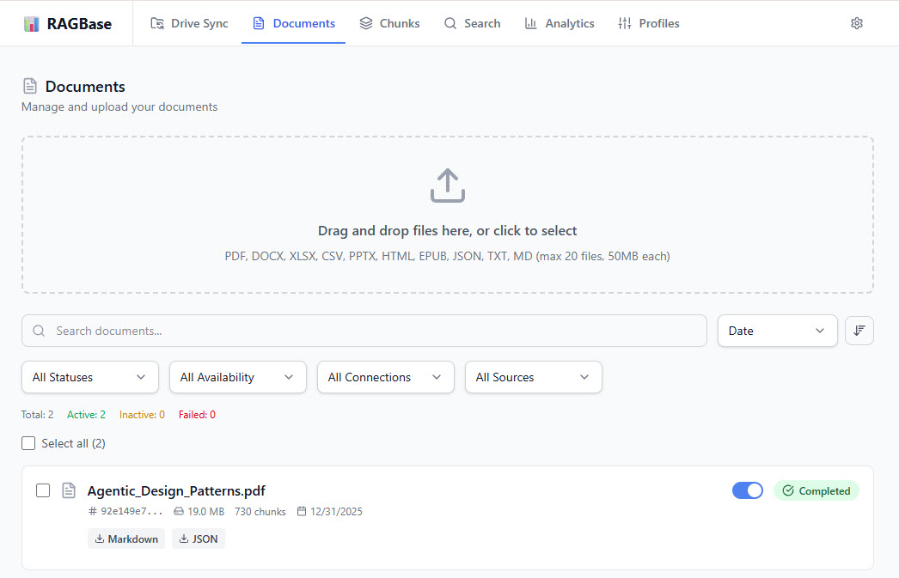

# RAGBase

**The "Set & Forget" Data Pipeline for Enterprise RAG**
Open Source | Self-Hosted | Structure-Aware | Production-Ready



---

RAGBase is a next-generation ETL system designed to transform opaque document dumps into precision-engineered vector knowledge. Unlike generic ingestion scripts, RAGBase treats data processing as a scientific pipeline with measurable quality assurance.

## Why RAGBase?

### 🎯 Metric-Driven Data Funnel
Replaces opaque "black-box" processing with a transparent pipeline. The system tracks granular metrics at every stage—from OCR to Sanitization, Chunking, and Embedding—quantifying noise ratios and identifying bottlenecks to guarantee the highest quality vector output.

### 🧪 Native A/B Testing Framework
Seamlessly integrates Processing Profiles with the Analytics Dashboard to facilitate direct A/B testing. Users can run parallel configurations (e.g., Chunk Size 512 vs. 1024, Slide-based vs. Text-based) to empirically determine the optimal parameters for their specific data domain.

### 🔄 Closed-Loop Optimization Engine
Establishes a continuous feedback loop: **Measure** (via Analytics) → **Tune** (via Settings) → **Validate** (via RAG Quality). This transforms knowledge management from a static store into a dynamic system that constantly adapts to evolving input data.

### ⚡ Hybrid Search with RRF
Leverages **Qdrant** to execute parallel searches using **Dense Vectors** (semantic/bge-small) and **Sparse Vectors** (keyword/SPLADE). Results are combined via Reciprocal Rank Fusion (RRF) to achieve superior retrieval accuracy compared to standard cosine similarity.

### 🦎 Adaptive Polyglot Pipeline
Implements a "Best-in-Class Routing" strategy instead of generic processing. The system intelligently selects the right tool for the job—using high-speed parsers (PyMuPDF) for digital files and heavy-duty OCR (Docling) for scanned documents—to balance maximum throughput with semantic precision.

---

## Supported Formats
| Category | Formats | Processor |
|----------|---------|-----------|
| **Document** | PDF, DOCX, EPUB, TXT, MD | Docling, EbookLib |
| **Presentation** | PPTX | Docling (Slide-aware) |
| **Tabular** | XLSX, CSV, JSON | Pandas, OpenPyXL |
| **Web** | HTML | BeautifulSoup |

---

## Quick Start

### Prerequisites
- Docker & Docker Compose
- Node.js 20+ (for local logic)
- Python 3.11+ (for AI worker)

### Installation

```bash
# 1. Install dependencies
pnpm install

# 2. Configure environment
cp .env.example .env
# Edit .env: Set QDRANT_URL, QDRANT_API_KEY, and encryption keys

# 3. Start services (Postgres, Redis, Qdrant*)
# *If not using Qdrant Cloud
docker compose up -d

# 4. Push database schema
pnpm --filter @ragbase/backend db:push

# 5. Start development servers
pnpm dev
# Frontend: http://localhost:5173
# Backend: http://localhost:3000
```

### Verification
```bash
curl http://localhost:3000/health
# {"status":"ok", "version":"1.0.0"}
```

---

## Technology Stack

- **Orchestration**: Node.js 20 + Fastify (High-throughput dispatch)
- **AI Worker**: Python 3.11 + FastAPI (Heavy processing lane)
- **Vector DB**: Qdrant (Hybrid Search: Dense + Sparse)
- **Database**: PostgreSQL 16 (Relational metadata)
- **Queue**: BullMQ + Redis (Robust job reliability)
- **Encryption**: AES-256-GCM (Military-grade credential security)
- **Frontend**: React 18 + Tailwind v4 + React Query

---

## Documentation

- **[Product Overview](docs/product.md)**: Features and philosophy.
- **[Architecture](docs/architecture.md)**: System design and data flow.
- **[API Reference](docs/api.md)**: Endpoints and contracts.
- **[Analytics](docs/analytics-dashboard.md)**: Monitoring funnel metrics.
- **[Roadmap](docs/roadmap.md)**: Future plans.

---

## License

MIT © 2026 RAGBase
