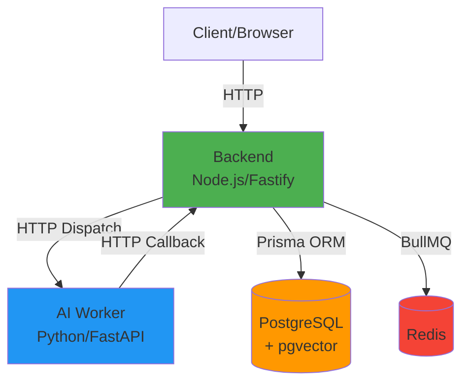
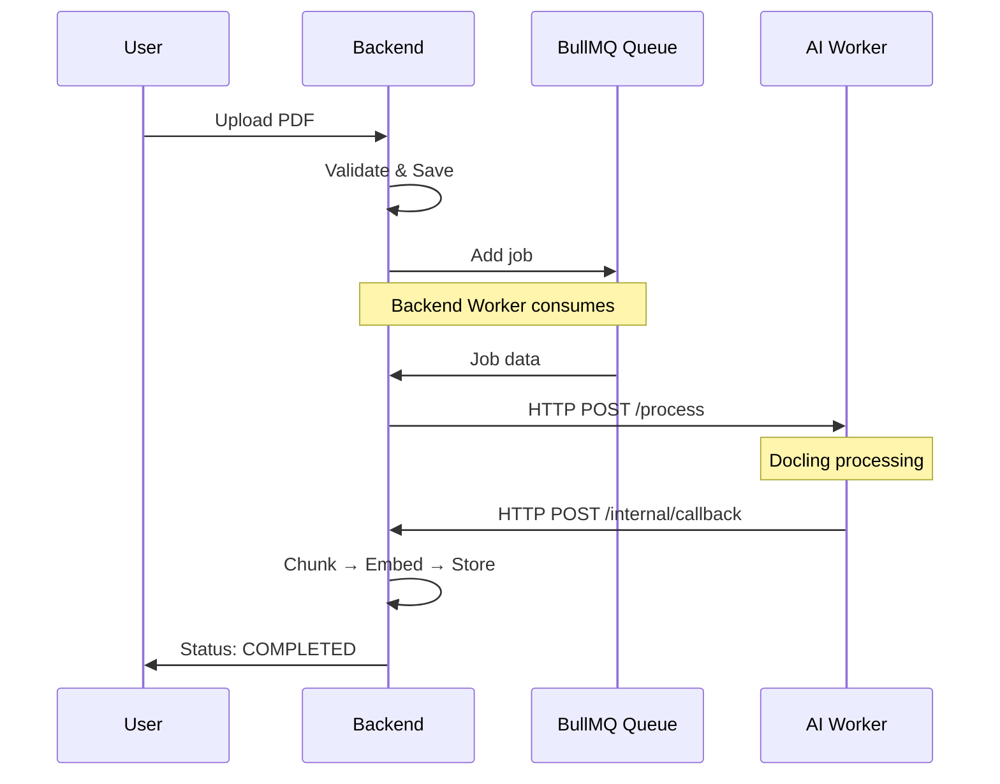
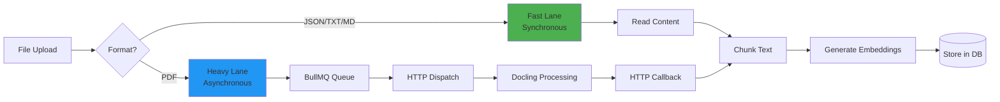
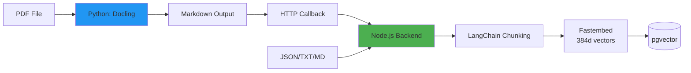
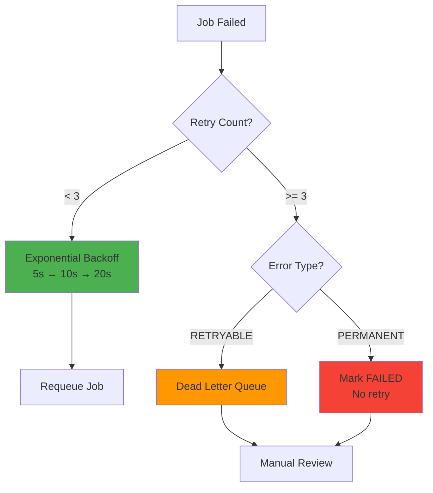
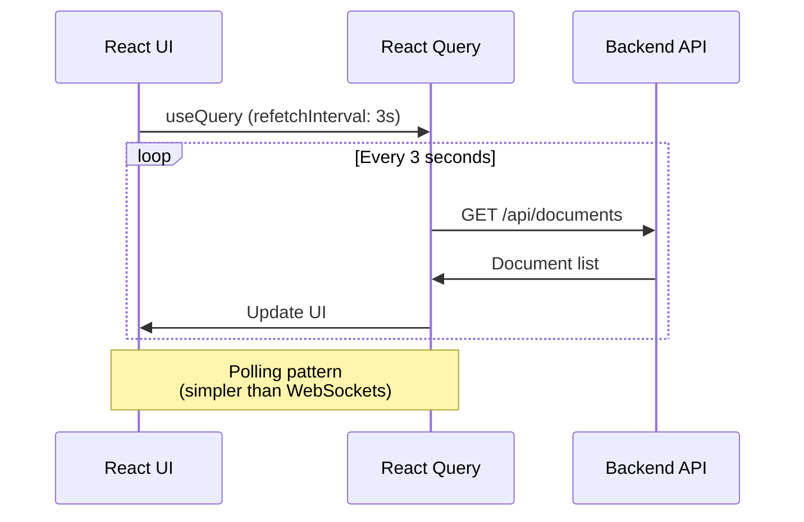

# RAGBase Architecture

**Phase 1 MVP - Complete** | **Last Updated:** 2025-12-21

High-level system design & key architectural decisions.

---

## 1. System Overview

### 1.1 Container Architecture



**Components:**

| Container | Technology | Purpose |
|-----------|------------|---------|
| **backend** | Node.js 20 + Fastify 4.29 | API server, validation, queue, fast lane processing |
| **ai-worker** | Python 3.11 + FastAPI 0.126 | PDF processing (Docling), HTTP callbacks |
| **postgres** | PostgreSQL 16 + pgvector | Documents, chunks, vector embeddings |
| **redis** | Redis 7 | BullMQ job queue |

---

## 2. HTTP Dispatch Pattern

### 2.1 The Problem: Race Conditions

**Initial approach (failed):**
- Node.js backend consumes queue → processes fast formats
- Python AI worker consumes queue → processes PDFs
- **Issue:** Both consume same queue → race conditions, duplicate processing

### 2.2 The Solution: HTTP Dispatch



**Key Points:**
- Backend owns the queue (single consumer)
- Backend HTTP dispatches to AI worker
- AI worker sends callback when done
- **Trade-off:** AI worker must be running, but eliminates race conditions

---

## 3. Dual-Lane Processing

### 3.1 Architecture



### 3.2 Comparison

| Aspect | Fast Lane | Heavy Lane |
|--------|-----------|------------|
| **Formats** | JSON, TXT, MD | PDF |
| **Processing** | Synchronous | Asynchronous |
| **Time** | Seconds | Minutes |
| **Flow** | Upload → Process → Complete | Upload → Queue → Process → Callback → Complete |
| **Status** | PENDING → COMPLETED | PENDING → PROCESSING → COMPLETED |

**Why Dual-Lane?**
- Fast formats don't need OCR/complex parsing → process immediately
- PDFs require heavy processing → queue for background

---

## 4. Embedding Pipeline

### 4.1 Architecture Decision

**Embedding in Node.js (not Python):**



**Why Node.js?**
- Single embedding implementation (consistent for all formats)
- No Python embedding dependencies
- Self-hosted (Fastembed) - no external API calls

**Technology:**
- **Library:** Fastembed 2.0 (ONNX-based)
- **Model:** all-MiniLM-L6-v2
- **Dimensions:** 384
- **Performance:** ~10ms per text, batch processing support

---

## 5. Database Architecture

### 5.1 Prisma Client Singleton

**Problem:** Multiple `PrismaClient` instances exhaust PostgreSQL connection pool.

**Solution:** Singleton pattern ensures single connection pool across entire app.

**Benefits:**
- Prevents connection pool exhaustion
- Clean shutdown handling
- Environment-aware logging (dev vs prod)

### 5.2 Vector Storage (pgvector)

**Schema:**
- Documents table: metadata (filename, status, format, etc.)
- Chunks table: text content + 384d vector embeddings
- Relationship: 1 document → many chunks

**Vector Search:**
- Operator: `<=>` (cosine distance)
- Index: HNSW for fast similarity search
- Query: Top-K nearest neighbors

---

## 6. Security Architecture

### 6.1 Key Patterns

| Pattern | Implementation | Purpose |
|---------|----------------|---------|
| **Timing-Safe Auth** | `crypto.timingSafeEqual()` | Prevent timing attacks on API key |
| **Path Traversal Protection** | `basename()` + MD5 hash storage | Prevent directory escape attacks |
| **SQL Injection Prevention** | Prisma parameterized queries | Auto-escape user input |
| **Input Validation** | Zod SafeParse | Type-safe validation with proper error codes |
| **File I/O Consistency** | Cleanup on DB failure | Prevent orphaned files |

### 6.2 HTTP Status Codes

| Code | Meaning | Example |
|------|---------|---------|
| 200 | Success | Query results |
| 201 | Created | Document uploaded |
| 400 | Validation error | Invalid file format |
| 401 | Auth error | Missing API key |
| 404 | Not found | Document doesn't exist |
| 409 | Conflict | Duplicate file |
| 500 | Server error | Storage failure |
| 503 | Service unavailable | Embedding service down |

---

## 7. Production Features

### 7.1 Observability Stack

```mermaid
graph TB
    App[Application] --> Logs[Structured Logging<br/>Pino/structlog]
    App --> Metrics[Prometheus Metrics]
    App --> Health[Health Checks]
    
    Logs --> JSON[JSON Output<br/>Production]
    Logs --> Pretty[Pretty Print<br/>Development]
    
    Metrics --> Scrape[/metrics endpoint]
    Scrape --> Prometheus[Prometheus Server]
    
    Health --> Basic[/health - Basic]
    Health --> Ready[/ready - DB + Redis]
    Health --> Live[/live - Process alive]
    
    style Logs fill:#4CAF50
    style Metrics fill:#2196F3
    style Health fill:#FF9800
```

### 7.2 Features

| Feature | Technology | Purpose |
|---------|------------|---------|
| **Structured Logging** | Pino (Node), structlog (Python) | JSON logs for production debugging |
| **Metrics** | Prometheus (prom-client) | Custom + default metrics |
| **Health Checks** | /health, /ready, /live | Kubernetes/Docker health probes |
| **Security Headers** | Helmet.js | XSS, clickjacking protection |
| **Rate Limiting** | @fastify/rate-limit | 100 req/min per IP |
| **CORS** | @fastify/cors | Configurable allowed origins |
| **Graceful Shutdown** | SIGTERM handler | Clean resource cleanup |

---

## 8. Error Handling & Retry

### 8.1 Retry Strategy



### 8.2 Error Categories

| Category | Examples | Action |
|----------|----------|--------|
| **RETRYABLE** | Network timeout, temporary service down | Retry 3x with backoff |
| **PERMANENT** | Password-protected PDF, corrupt file | Mark FAILED immediately |
| **RESOURCE** | OOM, disk full | Alert + pause queue |

### 8.3 AI Worker Error Codes

- `PASSWORD_PROTECTED` - PDF requires password
- `CORRUPT_FILE` - File cannot be read
- `UNSUPPORTED_FORMAT` - Format not supported
- `OCR_FAILED` - OCR processing failed
- `TIMEOUT` - Processing exceeded time limit
- `INTERNAL_ERROR` - Unexpected error

---

## 9. Quality Gate

**Purpose:** Reject low-quality extractions before processing.

**Rules:**

| Condition | Action | Reason |
|-----------|--------|--------|
| Text length < 50 chars | Reject | Too little content |
| Noise ratio > 80% | Reject | Mostly non-alphanumeric |

**Noise Calculation:**
```
Noise = (non-alphanumeric chars) / (total chars) × 100%
```

**Example:**
- `"Hello World"` → 9% noise (1 space / 11 chars)
- `"@#$%^&*()"` → 100% noise (reject)

---

## 10. Frontend Architecture

### 10.1 Real-Time Updates



**Tech Stack:**
- React 18 + TypeScript 5
- Vite 7 (build tool)
- Tailwind CSS v4 (styling)
- React Query (data fetching + polling)

**Why Polling (not WebSockets)?**
- Simpler implementation
- No persistent connections
- Works with load balancers
- Sufficient for MVP (2-3s refresh)

---

## 11. Deployment Architecture

### 11.1 Resource Requirements

| Tier | Files/day | RAM | CPU | Storage |
|------|-----------|-----|-----|---------|
| Small | 50 | 4GB | 2 cores | 50GB |
| Medium | 500 | 8GB | 4 cores | 200GB |
| Large | 2000+ | 16GB+ | 8+ cores | 1TB+ |

### 11.2 Docker Compose

**Development:**
- Hot reload enabled
- Verbose logging
- Exposed ports for debugging

**Production:**
- Health checks configured
- Resource limits set
- Restart policies enabled
- Volumes for persistence

---

## 12. Key Design Decisions

| Decision | Rationale | Trade-off |
|----------|-----------|-----------|
| **HTTP Dispatch Pattern** | Avoids race conditions with dual consumers | AI worker must be running |
| **Dual-Lane Processing** | Optimize for different file types | More complex routing logic |
| **Fastembed (not OpenAI)** | Self-hosted, no external API, cost-free | Limited to one model |
| **Embedding in Node.js** | Single implementation, consistent | Python can't generate embeddings |
| **Prisma Singleton** | Prevent connection pool exhaustion | Global state management |
| **React Query Polling** | Simpler than WebSockets | Higher network overhead |
| **Pino + structlog** | Structured JSON logs | Requires log aggregation tool |
| **BullMQ (not Kafka)** | Simpler for MVP, Redis-based | Less scalable than Kafka |

---

## 13. Configuration

### 13.1 Environment Variables

**Backend:**
- `DATABASE_URL` - PostgreSQL connection
- `REDIS_HOST`, `REDIS_PORT` - Redis connection
- `API_KEY` - Authentication secret
- `UPLOAD_DIR` - File storage path
- `AI_WORKER_URL` - AI worker endpoint
- `CALLBACK_URL` - Callback endpoint
- `NODE_ENV` - Environment (development/production)

**AI Worker:**
- `PORT` - Server port
- `CALLBACK_URL` - Backend callback endpoint
- `OCR_MODE` - OCR behavior (auto/force/never)

> See `.env.example` for complete list

---

**Phase 1 MVP Status:** ✅ **COMPLETE** (2025-12-21)

**Documentation:**
- [PRODUCT.md](./PRODUCT.md) - Product overview
- [API.md](./API.md) - API contracts
- [ROADMAP.md](./ROADMAP.md) - Future features
