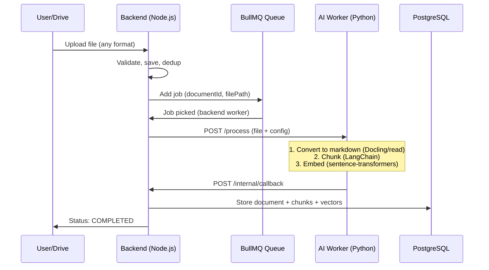
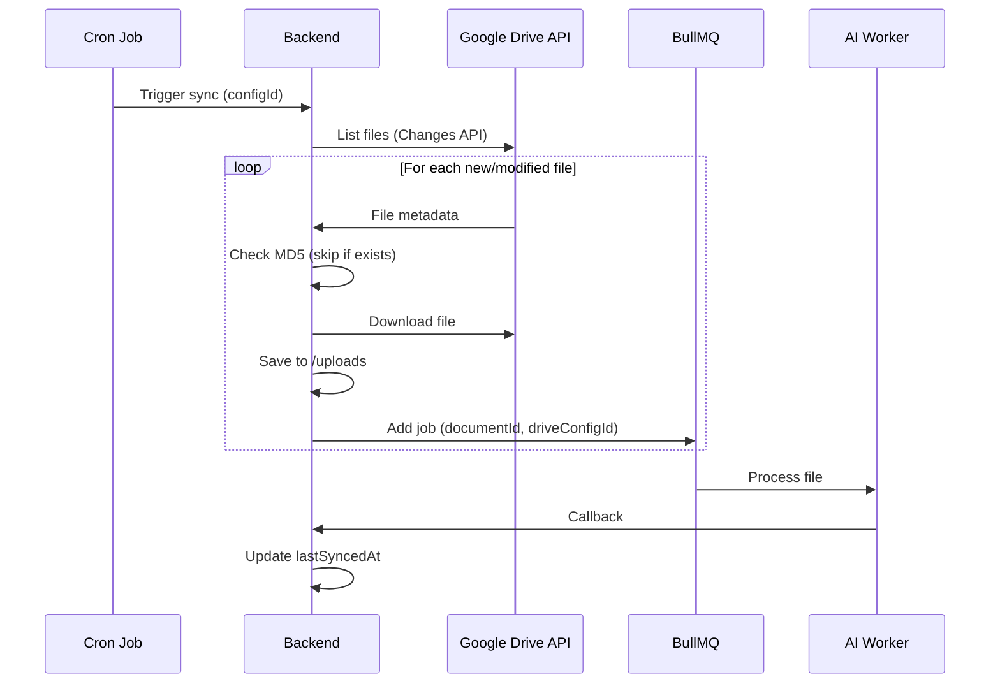

# Phase 2 Technical Specifications

**Python-First + Drive Sync** | **All-in-One Implementation Reference**

---

## 1. Architecture

### 1.1 Overview Change

**Phase 1 (Dual Path):**
```
Fast Lane: JSON/TXT/MD → Node.js (embed + chunk) → DB
Heavy Lane: PDF → Queue → Python → Callback → Node.js (embed) → DB
```

**Phase 2 (Unified Path):**
```
All files → Queue → Python (process + chunk + embed) → Callback → Node.js → DB
```

**Key Difference:** Python worker now owns embedding + chunking. Node.js only stores results.

---

### 1.2 Data Flow



---

### 1.3 Internal Contracts (Python → Node.js)

#### 1.3.1 Dispatch Request: `POST /process`

Backend sends to AI worker:

```typescript
interface ProcessRequest {
  documentId: string;
  filePath: string;          // /uploads/{uuid}.{ext}
  format: 'pdf' | 'json' | 'txt' | 'md';
  config: {
    ocrMode: 'auto' | 'force' | 'never';
    ocrLanguages: string[];  // Default: ['en']
    chunkSize: number;       // Default: 1000
    chunkOverlap: number;    // Default: 200
  };
}
```

#### 1.3.2 Callback Payload: `POST /internal/callback`

AI worker returns (updated from Phase 1):

```typescript
interface ProcessingCallback {
  documentId: string;
  success: boolean;
  result?: ProcessingResult;
  error?: ProcessingError;
}

interface ProcessingResult {
  // === NEW in Phase 2 ===
  processedContent: string;  // Full markdown output
  chunks: ChunkData[];       // Pre-chunked + embedded
  
  // === Same as Phase 1 ===
  pageCount: number;
  ocrApplied: boolean;
  processingTimeMs: number;
}

interface ChunkData {
  content: string;
  index: number;
  embedding: number[];       // 384d vector (NEW: computed in Python)
  metadata: {
    charStart: number;
    charEnd: number;
    heading?: string;
    page?: number;           // PDF only
  };
}

interface ProcessingError {
  code: ErrorCode;
  message: string;
}

type ErrorCode =
  | 'PASSWORD_PROTECTED'
  | 'CORRUPT_FILE'
  | 'UNSUPPORTED_FORMAT'
  | 'OCR_FAILED'
  | 'TIMEOUT'
  | 'INTERNAL_ERROR';
```

**Backend Callback Handler Changes:**
1. Remove embedding logic (no more Fastembed)
2. Accept `chunks[].embedding` directly from Python
3. Store `processedContent` in Document table
4. Write chunks + vectors to DB in single transaction

---

### 1.4 Google Drive Sync Flow



**Sync Strategies:**
- **Initial:** Full folder scan (recursive if enabled)
- **Incremental:** Changes API with `pageToken` (stored per DriveConfig)
- **Dedup:** MD5 hash check before download
- **Deleted files:** Set `status = 'ARCHIVED'` (soft delete)

---

## 2. API Endpoints

### 2.1 New Endpoints

#### `GET /api/documents/:id/content`

Download processed markdown or structured JSON.

**Query Params:**
```typescript
interface ContentQuery {
  format: 'markdown' | 'json';  // Required
}
```

**Response (200):**
```typescript
// format=markdown
Content-Type: text/markdown
Body: <raw markdown string>

// format=json
interface ContentJsonResponse {
  documentId: string;
  filename: string;
  processedContent: string;
  chunks: {
    index: number;
    content: string;
    charStart: number;
    charEnd: number;
    heading?: string;
  }[];
  processingMetadata: {
    pageCount?: number;
    ocrApplied?: boolean;
    processingTimeMs: number;
  };
}
```

**Errors:**
- `400`: Invalid format
- `404`: Document not found
- `409`: Document not yet processed (status != COMPLETED)

---

#### `POST /api/drive/configs`

Add a Google Drive folder to sync.

**Request:**
```typescript
interface CreateDriveConfigRequest {
  folderId: string;          // Google Drive folder ID
  folderName?: string;       // Optional display name (fetch from API if not provided)
  syncCron?: string;         // Default: "0 */6 * * *" (every 6h)
  recursive?: boolean;       // Default: true
  enabled?: boolean;         // Default: true
}
```

**Response (201):**
```typescript
interface DriveConfigResponse {
  id: string;
  folderId: string;
  folderName: string;
  syncCron: string;
  recursive: boolean;
  enabled: boolean;
  lastSyncedAt: string | null;
  createdAt: string;
}
```

**Errors:**
- `400`: Invalid folderId
- `401`: Service account cannot access folder
- `409`: Folder already configured

---

#### `GET /api/drive/configs`

List all synced folders.

**Response (200):**
```typescript
interface DriveConfigsListResponse {
  configs: DriveConfigResponse[];
  total: number;
}
```

---

#### `PATCH /api/drive/configs/:id`

Update folder settings.

**Request:**
```typescript
interface UpdateDriveConfigRequest {
  syncCron?: string;
  recursive?: boolean;
  enabled?: boolean;
}
```

**Response (200):** `DriveConfigResponse`

---

#### `DELETE /api/drive/configs/:id`

Remove folder from sync (soft delete documents).

**Response (204):** No content

**Side Effect (Application Logic):**
1. Find all documents with `driveConfigId = :id`
2. Update their `status` to `'ARCHIVED'` and `driveConfigId` to `null`
3. Delete the DriveConfig record

*Note: DB constraint is `ON DELETE SET NULL` as a safety net.*

---

#### `POST /api/drive/sync/:configId/trigger`

Manually trigger sync for a folder (bypass cron).

**Request:** Empty body

**Response (202):**
```typescript
interface SyncTriggerResponse {
  message: 'Sync started';
  configId: string;
  estimatedFiles?: number;  // From Changes API
}
```

**Errors:**
- `404`: Config not found
- `409`: Sync already in progress
- `503`: Drive API unavailable

---

### 2.2 Modified Endpoints

#### `POST /internal/callback` (Updated)

Accept pre-computed embeddings + processed content.

**New Fields in Request:**
```typescript
interface ProcessingCallback {
  // ... existing fields ...
  result?: {
    processedContent: string;    // NEW: Full markdown
    chunks: {
      content: string;
      index: number;
      embedding: number[];       // NEW: 384d vector
      metadata: { ... };
    }[];
    // ... existing fields ...
  };
}
```

---

#### `GET /api/documents/:id` (Updated Response)

Add new fields:

```typescript
interface DocumentStatusResponse {
  // ... existing fields ...
  sourceType: 'MANUAL' | 'DRIVE';       // NEW
  driveFileId?: string;                  // NEW
  driveConfigId?: string;                // NEW
  hasProcessedContent: boolean;          // NEW: true if downloadable
}
```

---

#### `GET /api/documents` (Updated Query)

Add filter options:

```typescript
interface ListQueryParams {
  // ... existing ...
  sourceType?: 'MANUAL' | 'DRIVE';       // NEW
  driveConfigId?: string;                // NEW: filter by folder
}
```

---

## 3. Database Schema

### 3.1 Document Model (Updated)

```prisma
model Document {
  id                  String    @id @default(uuid())
  filename            String
  mimeType            String
  fileSize            Int
  format              String
  lane                String    // Keep for backwards compat, always 'heavy' in Phase 2
  status              String    @default("PENDING")
  filePath            String
  md5Hash             String    @unique
  retryCount          Int       @default(0)
  failReason          String?
  
  // === NEW Phase 2 Fields ===
  processedContent    String?   @db.Text   // Full markdown for download
  processingMetadata  Json?                // { pageCount, ocrApplied, processingTimeMs }
  sourceType          String    @default("MANUAL")  // MANUAL | DRIVE
  driveFileId         String?   @unique    // Google Drive file ID
  driveConfigId       String?              // FK to DriveConfig
  lastSyncedAt        DateTime?            // Last sync timestamp
  
  createdAt           DateTime  @default(now())
  updatedAt           DateTime  @updatedAt
  
  // Relations
  chunks              Chunk[]
  driveConfig         DriveConfig? @relation(fields: [driveConfigId], references: [id])
  
  // Indexes
  @@index([status])
  @@index([sourceType])
  @@index([driveConfigId])
}
```

---

### 3.2 DriveConfig Model (New)

```prisma
model DriveConfig {
  id            String    @id @default(uuid())
  folderId      String    @unique      // Google Drive folder ID
  folderName    String                 // Display name
  syncCron      String    @default("0 */6 * * *")  // Every 6 hours
  recursive     Boolean   @default(true)
  enabled       Boolean   @default(true)
  
  // Sync state
  lastSyncedAt  DateTime?
  pageToken     String?               // Changes API cursor
  syncStatus    String    @default("IDLE")  // IDLE | SYNCING | FAILED
  syncError     String?               // Last error message
  
  createdAt     DateTime  @default(now())
  updatedAt     DateTime  @updatedAt
  
  // Relations
  documents     Document[]
  
  @@index([enabled])
}
```

---

### 3.3 Migration Notes

**Step 1: Add columns to Document**
```sql
ALTER TABLE "Document" 
  ADD COLUMN "processedContent" TEXT,
  ADD COLUMN "processingMetadata" JSONB,
  ADD COLUMN "sourceType" VARCHAR(10) DEFAULT 'MANUAL',
  ADD COLUMN "driveFileId" VARCHAR(255) UNIQUE,
  ADD COLUMN "driveConfigId" UUID,
  ADD COLUMN "lastSyncedAt" TIMESTAMP;

CREATE INDEX "Document_sourceType_idx" ON "Document"("sourceType");
CREATE INDEX "Document_driveConfigId_idx" ON "Document"("driveConfigId");
```

**Step 2: Create DriveConfig table**
```sql
CREATE TABLE "DriveConfig" (
  "id" UUID PRIMARY KEY DEFAULT gen_random_uuid(),
  "folderId" VARCHAR(255) UNIQUE NOT NULL,
  "folderName" VARCHAR(255) NOT NULL,
  "syncCron" VARCHAR(50) DEFAULT '0 */6 * * *',
  "recursive" BOOLEAN DEFAULT true,
  "enabled" BOOLEAN DEFAULT true,
  "lastSyncedAt" TIMESTAMP,
  "pageToken" TEXT,
  "syncStatus" VARCHAR(20) DEFAULT 'IDLE',
  "syncError" TEXT,
  "createdAt" TIMESTAMP DEFAULT NOW(),
  "updatedAt" TIMESTAMP DEFAULT NOW()
);

CREATE INDEX "DriveConfig_enabled_idx" ON "DriveConfig"("enabled");
```

**Step 3: Add foreign key**
```sql
ALTER TABLE "Document" 
  ADD CONSTRAINT "Document_driveConfigId_fkey" 
  FOREIGN KEY ("driveConfigId") REFERENCES "DriveConfig"("id") 
  ON DELETE SET NULL; 
-- Note: "SET NULL" is DB safety net. App logic should soft/delete (ARCHIVE) documents first.
```

---

## 4. Configuration

### 4.1 New Environment Variables

**Backend (.env):**
```bash
# Google Drive
DRIVE_SERVICE_ACCOUNT_KEY=/path/to/service-account.json
DRIVE_SYNC_CRON=0 */6 * * *    # Default schedule
DRIVE_MAX_FILE_SIZE_MB=100
DRIVE_RECURSIVE=true
```

**AI Worker (.env):**
```bash
# Embedding (moved from Node.js)
EMBEDDING_MODEL=BAAI/bge-small-en-v1.5
EMBEDDING_DIMENSION=384

# Chunking
CHUNK_SIZE=1000
CHUNK_OVERLAP=200
```

### 4.2 Python Dependencies

Add to `requirements.txt`:
```
sentence-transformers>=2.3.0
torch>=2.0.0  # CPU version
langchain>=0.3.0
langchain-text-splitters>=0.3.0
```

Remove from Node.js:
```
fastembed  # No longer needed
```

---

## 5. Validation Schemas (Zod)

### 5.1 Content Export

```typescript
export const ContentQuerySchema = z.object({
  format: z.enum(['markdown', 'json']),
});
```

### 5.2 Drive Config

```typescript
export const CreateDriveConfigSchema = z.object({
  folderId: z.string().min(10).max(100),
  folderName: z.string().max(255).optional(),
  syncCron: z.string().regex(/^[\d*\/,\-\s]+$/).optional(),
  recursive: z.boolean().optional(),
  enabled: z.boolean().optional(),
});

export const UpdateDriveConfigSchema = z.object({
  syncCron: z.string().regex(/^[\d*\/,\-\s]+$/).optional(),
  recursive: z.boolean().optional(),
  enabled: z.boolean().optional(),
});
```

### 5.3 Updated Callback Schema

```typescript
export const CallbackChunkSchema = z.object({
  content: z.string(),
  index: z.number().int().nonnegative(),
  embedding: z.array(z.number()).length(384),  // NEW
  metadata: z.object({
    charStart: z.number().int().nonnegative(),
    charEnd: z.number().int().positive(),
    heading: z.string().optional(),
    page: z.number().int().positive().optional(),
  }),
});

export const CallbackResultSchema = z.object({
  processedContent: z.string(),  // NEW
  chunks: z.array(CallbackChunkSchema),  // NEW structure
  pageCount: z.number().int().nonnegative(),
  ocrApplied: z.boolean(),
  processingTimeMs: z.number().positive(),
});
```

---

## 6. Summary: Breaking Changes

| Component | Change | Migration Action |
|-----------|--------|------------------|
| **Callback** | New `processedContent` + `chunks[].embedding` | Update handler to accept new payload |
| **Embedding** | Fastembed → sentence-transformers | Remove Node.js embedding, add Python |
| **Model** | all-MiniLM-L6-v2 → bge-small-en-v1.5 | Re-embed ALL existing documents |
| **Fast Lane** | Removed | Route all files through queue |
| **Document** | 6 new columns | Run Prisma migration |
| **DriveConfig** | New table | Run Prisma migration |

---

**Phase 2 implementation can begin after this spec is approved.**
