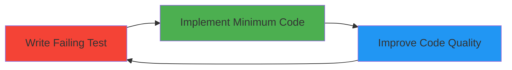
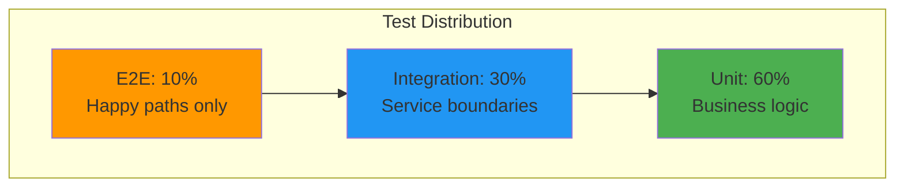

# RAGBase Testing Strategy

**Phase 1 MVP - Complete** | **TDD Methodology**

---

## 1. TDD Philosophy

### RED → GREEN → REFACTOR



**Why TDD?**
- Design-first thinking - forces clear interfaces
- Regression safety - changes don't break behavior
- Living documentation - tests show how code works
- Refactor confidence - change without fear

**Phase 1 Results:**
- **3,688 lines of tests** (79% coverage)
- **Test-to-Code Ratio:** 79% (3,688 / 4,668)

---

## 2. Test Pyramid



| Layer | Speed | Dependencies | What to Test |
|-------|-------|--------------|--------------|
| **Unit** | Fast (~ms) | None | Pure functions, validators, business logic |
| **Integration** | Medium (~100ms) | Testcontainers | API routes, DB, Queue |
| **E2E** | Slow (~seconds) | Docker Compose | Full pipeline, critical flows |

**Why 60-30-10?**
- Unit tests: Fast feedback, easy debug
- Integration: Verify service boundaries
- E2E: Expensive, only critical paths

---

## 3. Test Boundaries

### Unit Tests (No I/O)

**Test:** Pure functions, validators, business logic  
**Mock:** Database, Redis, file system, HTTP requests

### Integration Tests (Real DB, Mocked External)

**Test:** API routes, DB interactions, queue behavior  
**Mock:** Python AI worker, embedding generation

**Use Testcontainers for:**
- PostgreSQL + pgvector
- Redis

### E2E Tests (Full Pipeline)

**Test:** Upload → Queue → Callback → Chunks → Query  
**Real:** All services (or mock AI worker for speed)

---

## 4. Mock Strategy

### When to Mock

**Mock:**
- External APIs (Python AI worker)
- Slow operations (embedding generation)
- Non-deterministic behavior

**Don't Mock:**
- Database (use Testcontainers)
- Your own code
- Third-party libraries (trust them)

### Mock Principles

- **Deterministic** - same input → same output
- **Realistic** - match actual API contracts
- **Maintainable** - centralized, reusable

---

## 5. Test Infrastructure

### Testcontainers

**Why?**
- Real PostgreSQL + pgvector
- Real Redis for BullMQ
- Isolated environment
- Automatic cleanup

### Test Isolation

**Between tests:**
- Clean database tables
- Reset Redis queues
- Clear file uploads

**Why:** Tests don't affect each other, parallel execution safe

---

## 6. Coverage Requirements

| Area | Target | Rationale |
|------|--------|-----------|
| Validation | 100% | Critical - user input |
| Business Logic | 90% | Core functionality |
| API Routes | 80% | Happy + error paths |
| Utils | 70% | Edge cases optional |

**Phase 1 Achievement:** 79% overall

---

## 7. Test Organization

```
apps/backend/tests/
├── unit/           # Validators, services
├── integration/    # Routes, queue
└── e2e/            # Full pipeline

apps/ai-worker/tests/
└── test_*.py       # Pytest tests
```

**Naming:**
- `*.test.ts` - Unit/Integration
- `*.e2e.test.ts` - E2E
- `test_*.py` - Python (pytest)

---

## 8. Test Commands

**Backend:**
```bash
pnpm --filter @ragbase/backend test:unit        # Fast
pnpm --filter @ragbase/backend test:integration # Needs Docker
pnpm --filter @ragbase/backend test:e2e         # Full stack
pnpm --filter @ragbase/backend test:coverage    # Coverage report
```

**AI Worker:**
```bash
cd apps/ai-worker
pytest                              # All tests
pytest --cov=src --cov-report=html  # With coverage
```

---

## 9. Testing Anti-Patterns (Avoid)

### Don't Test Implementation Details

**❌ Bad:** Testing internal function calls  
**✅ Good:** Testing behavior/output

### Don't Test Third-Party Libraries

**❌ Bad:** Testing Prisma/Zod behavior  
**✅ Good:** Testing your business logic

### Don't Over-Mock

**❌ Bad:** Mocking everything (testing nothing)  
**✅ Good:** Use real services (Testcontainers)

---

## 10. Key Decisions

| Decision | Rationale | Trade-off |
|----------|-----------|-----------|
| **Testcontainers** | Real DB/Redis | Slower than mocks |
| **Vitest** | Fast, native ESM | Smaller ecosystem |
| **Mock AI worker** | Fast, deterministic | Not testing real Docling |
| **79% coverage** | Balance speed/quality | Not 100% (diminishing returns) |

---

**Documentation:**
- [ARCHITECTURE.md](./ARCHITECTURE.md) - System design
- [API.md](./API.md) - API contracts
- [PRODUCT.md](./PRODUCT.md) - Product overview
