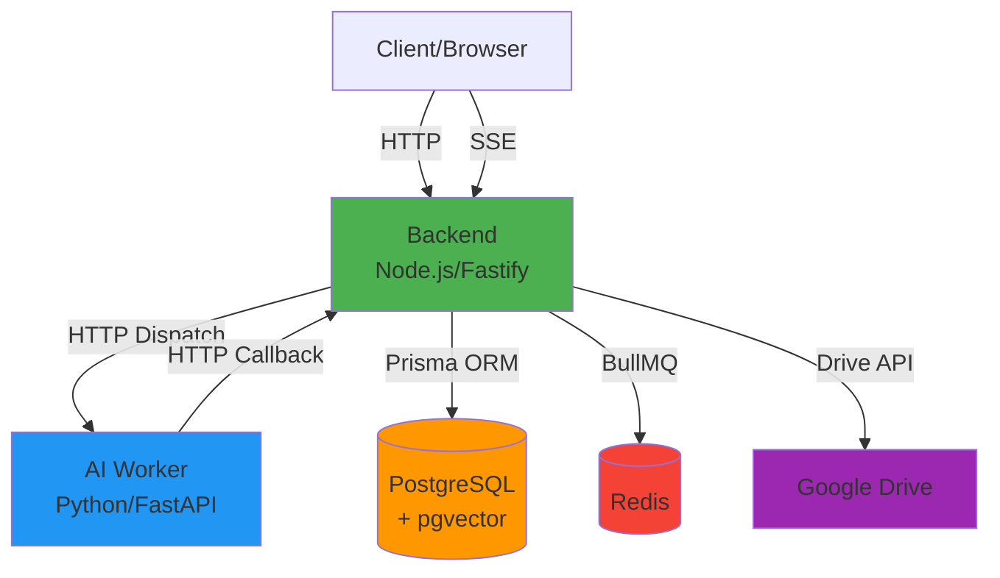
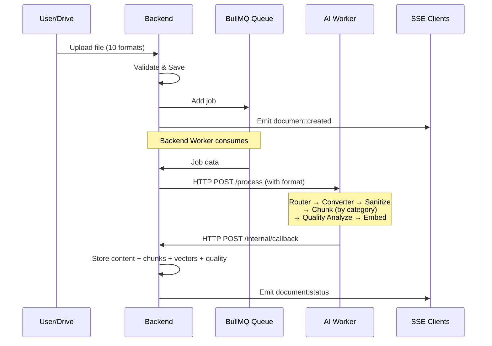
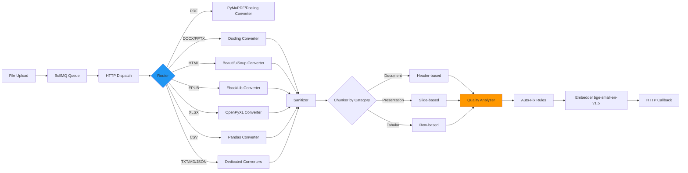
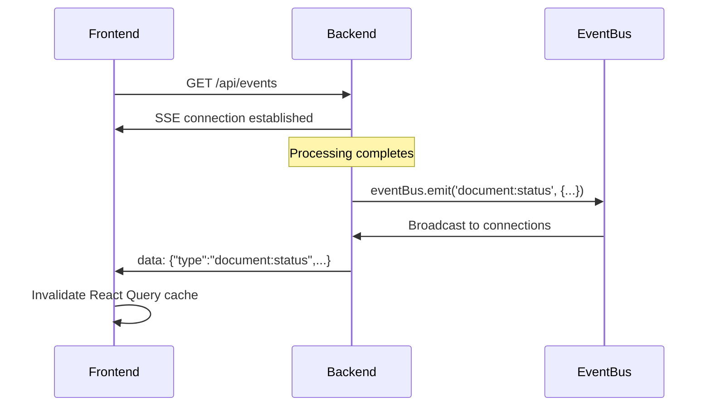
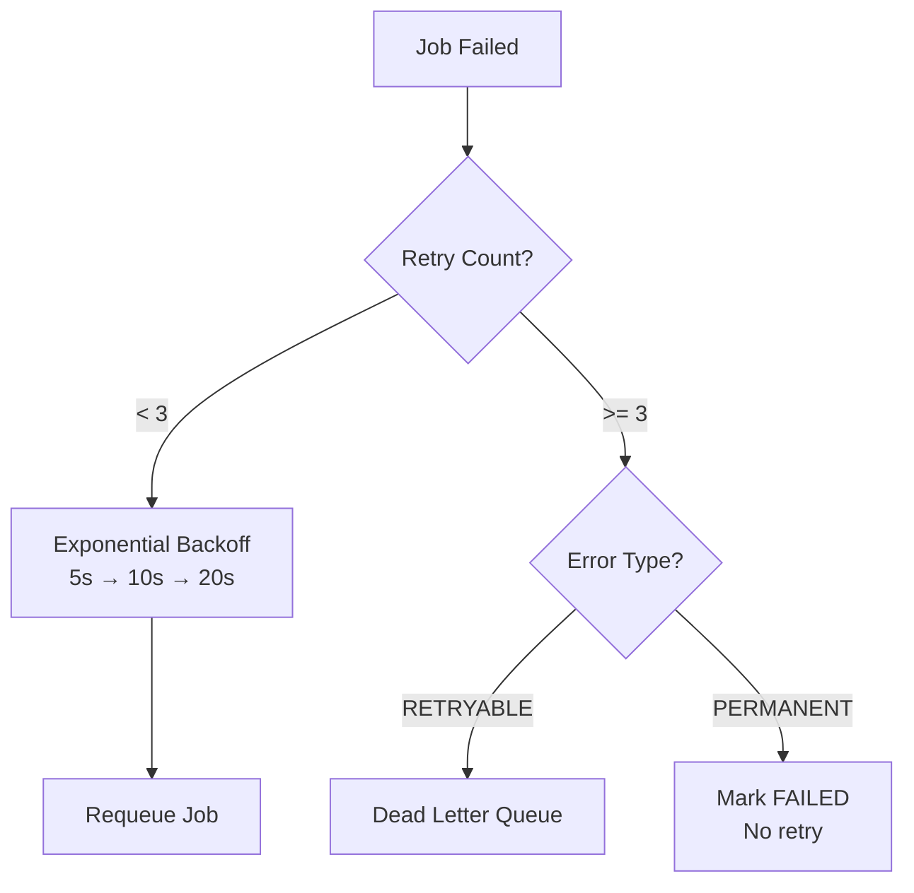
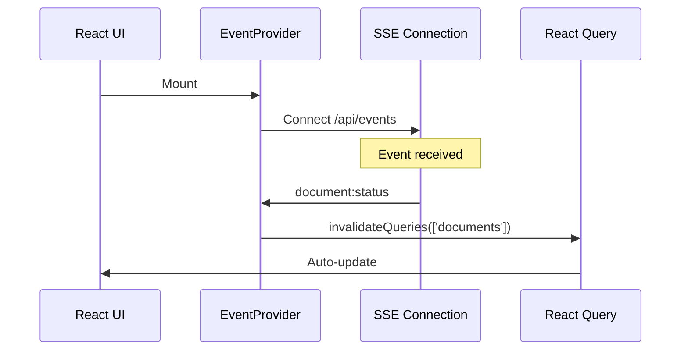

# RAGBase Architecture

**Phase 5 Complete** | **Last Updated:** 2025-12-31

High-level system design & key architectural decisions.

---

## 1. System Overview

### 1.1 Container Architecture

**Components:**

| Container | Technology | Purpose |
|-----------|------------|---------|
| **backend** | Node.js 20 + Fastify 4.29 | API server, queue consumer, SSE events, Drive sync |
| **ai-worker** | Python 3.11 + FastAPI 0.126 | 10 format converters, chunking, quality, hybrid embedding |
| **postgres** | PostgreSQL 16 + pgvector | Documents, chunks, staging vectors, quality metadata |
| **redis** | Redis 7 | BullMQ job queue |
| **qdrant** | Qdrant Cloud | Hybrid vector search (dense + sparse) |

---

## 2. HTTP Dispatch Pattern

### 2.1 Unified Processing Pipeline (Phase 4)

**Key Points:**
- Backend owns the queue (single consumer)
- 10 formats: PDF, DOCX, PPTX, HTML, EPUB, XLSX, CSV, TXT, MD, JSON
- Strategy pattern: Router → Converter → Pipeline
- SSE real-time updates to frontend

---

## 3. Processing Pipeline

### 3.1 Strategy Pattern Architecture (Phase 4)

### 3.2 Format Categories

| Category | Formats | Chunking Strategy |
|----------|---------|-------------------|
| **Document** | PDF, DOCX, TXT, MD, HTML, EPUB, JSON | Header-based with breadcrumbs |
| **Presentation** | PPTX | Slide-based with grouping |
| **Tabular** | XLSX, CSV | Row-based or table format |

### 3.3 Quality Pipeline

| Stage | Purpose |
|-------|--------|
| **Analyzer** | Detect flags: TOO_SHORT, TOO_LONG, NO_CONTEXT, FRAGMENT, EMPTY |
| **Auto-Fix** | Merge short, split long, inject context, skip empty |
| **Scoring** | Base 1.0, -0.15 per flag |

**Embedding Model:**
- **Library:** sentence-transformers 2.3+
- **Model:** BAAI/bge-small-en-v1.5
- **Dimensions:** 384

---

## 4. Real-time Updates (SSE)

### 4.1 Architecture

**Events:**
- `document:created` - New document uploaded
- `document:status` - Processing completed/failed
- `document:deleted` - Document hard deleted (Phase 3)
- `document:availability` - Availability toggled (Phase 3)
- `sync:start` - Drive sync started
- `sync:complete` - Drive sync finished
- `sync:error` - Drive sync failed
- `bulk:completed` - Bulk operation finished (Phase 3)

**Implementation:**
- Backend: In-memory EventEmitter (`EventBus`)
- Auth: In-memory connection tracking (demo mode)
- Heartbeat: 30s to keep connection alive
- Frontend: Auto-reconnect with exponential backoff

---

## 5. Google Drive Sync

### 5.1 Architecture

**Key Features:**
- Multi-folder support (DriveFolder model)
- Incremental sync with Changes API + pageToken
- MD5 deduplication before download
- Cron-based scheduling (configurable per folder)
- Soft delete for removed files (status: ARCHIVED)
- OAuth 2.0 with AES-256-GCM encrypted tokens

---

## 6. Database Architecture

### 6.1 Schema Overview

**Document:** File metadata + processed content
- `processedContent`, `sourceType`, `driveFileId`, `driveConfigId`
- `isActive`, `connectionState`, `processingProfileId`
- Phase 4: `formatCategory` (document/presentation/tabular)

**Chunk:** Text content + 384d vector + quality metadata
- Phase 4: `qualityScore`, `qualityFlags[]`, `chunkType`, `breadcrumbs[]`, `tokenCount`, `location`
- Phase 5: `syncStatus` (PENDING/SYNCED/FAILED), `denseVector`, `sparseIndices`, `sparseValues`

**DriveOAuth:** OAuth credentials (AES-256-GCM encrypted)

**DriveFolder:** Folder sync configuration + `processingProfileId`

**ProcessingProfile:** Configurable pipeline settings
- Conversion: `pdfConverter`, `pdfOcrMode`, `conversionTableRows/Cols`
- Chunking: `documentChunkSize`, `documentChunkOverlap`, `documentHeaderLevels`
- Quality: `qualityMinChars`, `qualityMaxChars`, `autoFixEnabled`
- Immutable after creation, duplicate to modify

**ProcessingMetrics:** Analytics data (1:1 with Document)
- Timing: `conversionTimeMs`, `chunkingTimeMs`, `embeddingTimeMs`, `queueTimeMs`
- Quality: `avgQualityScore`, aggregated `qualityFlags`

### 6.2 Vector Storage (Qdrant Hybrid)

- **Dense Vector:** 384d via `bge-small-en-v1.5`
- **Sparse Vector:** BM25 via `fastembed`
- **Hybrid Search:** Qdrant RRF fusion (prefetch sparse → fuse with dense)
- **Outbox Pattern:** PostgreSQL staging → Qdrant → nullify local vectors

---

## 7. Security Architecture

| Pattern | Implementation | Purpose |
|---------|----------------|---------|
| **Timing-Safe Auth** | `crypto.timingSafeEqual()` | Prevent timing attacks |
| **Path Traversal Protection** | `basename()` + MD5 hash | Prevent directory escape |
| **SQL Injection Prevention** | Prisma parameterized queries | Auto-escape input |

---

## 8. Observability Stack

| Feature | Technology | Purpose |
|---------|------------|---------|
| **Structured Logging** | Pino (Node), structlog (Python) | JSON logs |
| **Metrics** | Prometheus (prom-client) | Custom + default metrics |
| **Health Checks** | /health, /ready, /live | K8s/Docker health probes |
| **Security Headers** | Helmet.js | XSS, clickjacking protection |
| **Rate Limiting** | @fastify/rate-limit | 100 req/min per IP |

---

## 9. Error Handling & Retry

### 9.1 Retry Strategy

### 9.2 AI Worker Error Codes

- `PASSWORD_PROTECTED` - PDF requires password
- `CORRUPT_FILE` - File cannot be read
- `UNSUPPORTED_FORMAT` - Format not supported
- `OCR_FAILED` - OCR processing failed
- `EMPTY_CONTENT` - No extractable content
- `TIMEOUT` - Processing exceeded time limit
- `INTERNAL_ERROR` - Unexpected error

---

## 10. Frontend Architecture

### 10.1 Real-Time Updates (SSE)

**Tech Stack:**
- React 18 + TypeScript 5
- Vite 7 (build tool)
- Tailwind CSS v4 (styling)
- React Query (data fetching)
- SSE for real-time updates (replaced polling)

---

## 11. Key Design Decisions

| Decision | Rationale | Trade-off |
|----------|-----------|-----------|
| **Strategy Pattern** | Clean converter architecture, easy to add formats | More files to maintain |
| **Category-Based Chunking** | Optimal chunking per content type | Complexity in routing |
| **Quality Analysis** | Better RAG retrieval, auto-fix issues | Processing overhead (~5%) |
| **Python-First Embedding** | Single source of truth, ML ecosystem | All files queued (1-2s latency) |
| **SSE (not WebSockets)** | Simpler, one-way communication | Auth via query param |
| **HTTP Dispatch Pattern** | Avoids race conditions | AI worker must be running |
| **Auto-Delete Source Files** | Save disk space after processing | No re-processing without re-upload |

---

## 12. Configuration

### 12.1 Processing Profile (UI Configurable)

All processing settings now in `ProcessingProfile` model:
- **Conversion:** `pdfConverter` (pymupdf/docling), `pdfOcrMode`, table limits
- **Chunking:** chunk size/overlap, header levels, presentation/tabular settings
- **Quality:** min/max chars, penalty per flag, auto-fix passes

Manual uploads use active profile. Drive sync uses per-folder profile.

### 12.2 Environment Variables

**Backend:**
- `DATABASE_URL`, `REDIS_HOST`, `REDIS_PORT`
- `UPLOAD_DIR`, `AI_WORKER_URL`, `CALLBACK_URL`
- `DRIVE_SERVICE_ACCOUNT_KEY`, `DRIVE_SYNC_CRON`
- `PDF_CONCURRENCY` - Controls BullMQ + AI worker concurrency

**AI Worker:**
- `PORT`, `CALLBACK_URL`
- `EMBEDDING_MODEL` - Fixed: BAAI/bge-small-en-v1.5

---

**Phase 5 Status:** ✅ COMPLETE (2025-12-31)

**Documentation:**
- [product.md](./product.md) - Product overview
- [api.md](./api.md) - API contracts
- [processing-settings.md](./processing-settings.md) - Configuration reference
- [extension-processing-profile.md](./extension-processing-profile.md) - Processing profiles
- [extension-analytics-dashboard.md](./extension-analytics-dashboard.md) - Analytics
- [roadmap-phase5.md](./roadmap-phase5.md) - Qdrant + OAuth implementation
- [detailed-plan-phase5.md](./detailed-plan-phase5.md) - Phase 5 detailed plan
