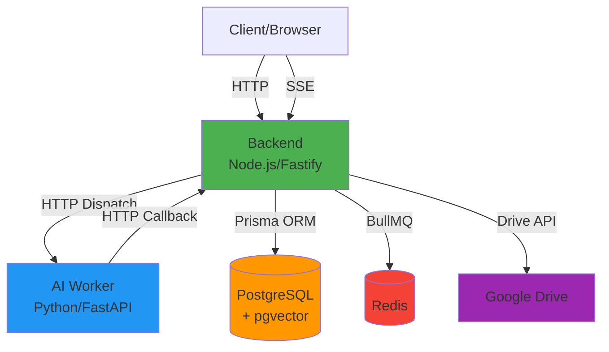
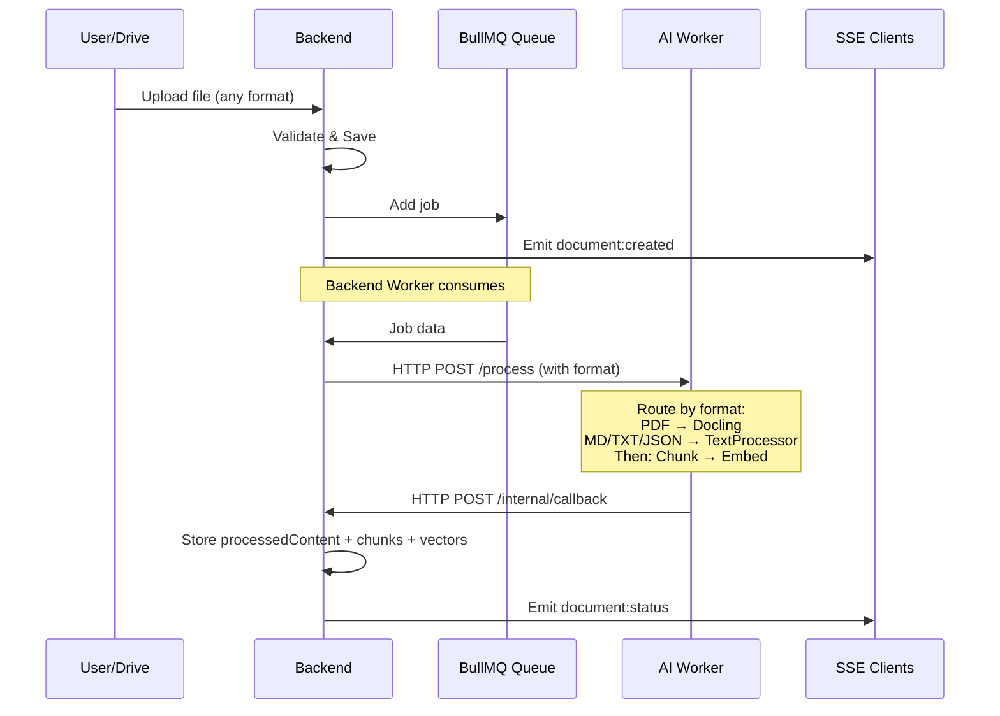
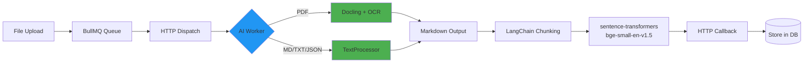
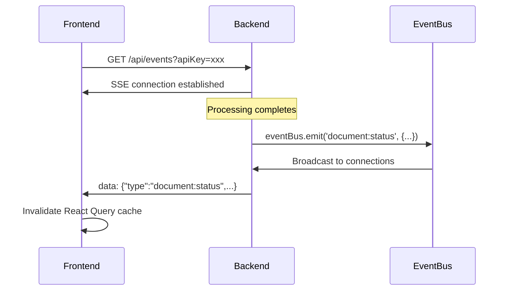
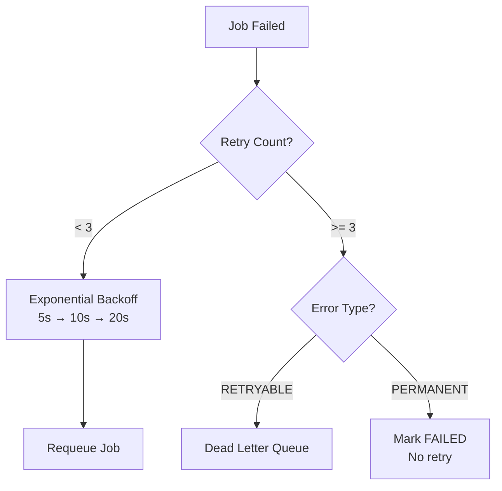
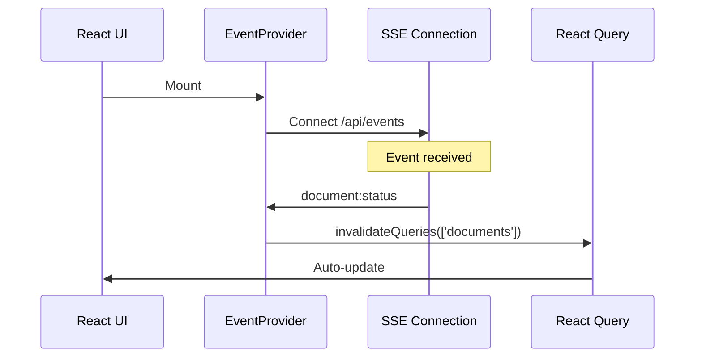

# RAGBase Architecture

**Phase 3 Complete** | **Last Updated:** 2025-12-24

High-level system design & key architectural decisions.

---

## 1. System Overview

### 1.1 Container Architecture

**Components:**

| Container | Technology | Purpose |
|-----------|------------|---------|
| **backend** | Node.js 20 + Fastify 4.29 | API server, queue consumer, SSE events, Drive sync |
| **ai-worker** | Python 3.11 + FastAPI 0.126 | PDF/text processing, embedding, chunking |
| **postgres** | PostgreSQL 16 + pgvector | Documents, chunks, vectors, DriveConfig |
| **redis** | Redis 7 | BullMQ job queue |

---

## 2. HTTP Dispatch Pattern

### 2.1 Unified Processing Pipeline (Phase 2)

**Key Points:**
- Backend owns the queue (single consumer)
- All formats (PDF, JSON, TXT, MD) go through queue
- AI Worker handles processing + embedding + chunking
- SSE real-time updates to frontend

---

## 3. Processing Pipeline

### 3.1 Python-First Architecture (Phase 2)

**Why Python-First?**
- Single source of truth for embedding/chunking
- Better ML ecosystem (sentence-transformers, LangChain)
- Eliminates code duplication (was dual-path in Phase 1)

**Embedding Model:**
- **Library:** sentence-transformers 2.3+
- **Model:** BAAI/bge-small-en-v1.5
- **Dimensions:** 384
- **Upgrade from Phase 1:** all-MiniLM-L6-v2 → bge-small-en-v1.5 (~10% better retrieval)

---

## 4. Real-time Updates (SSE)

### 4.1 Architecture

**Events:**
- `document:created` - New document uploaded
- `document:status` - Processing completed/failed
- `document:deleted` - Document hard deleted (Phase 3)
- `document:availability` - Availability toggled (Phase 3)
- `sync:start` - Drive sync started
- `sync:complete` - Drive sync finished
- `sync:error` - Drive sync failed
- `bulk:completed` - Bulk operation finished (Phase 3)

**Implementation:**
- Backend: In-memory EventEmitter (`EventBus`)
- Auth: Query param (EventSource doesn't support headers)
- Heartbeat: 30s to keep connection alive
- Frontend: Auto-reconnect with exponential backoff

---

## 5. Google Drive Sync

### 5.1 Architecture

**Key Features:**
- Multi-folder support (DriveConfig model)
- Incremental sync with Changes API + pageToken
- MD5 deduplication before download
- Cron-based scheduling (configurable per folder)
- Soft delete for removed files (status: ARCHIVED)
- Service Account auth (no user OAuth)

---

## 6. Database Architecture

### 6.1 Schema Overview

**Document:** Stores file metadata + processed content
- Phase 2: `processedContent`, `sourceType`, `driveFileId`, `driveConfigId`
- Phase 3: `isActive`, `connectionState`

**Chunk:** Text content + 384d vector embeddings

**DriveConfig (NEW):** Folder sync configuration

### 6.2 Vector Storage (pgvector)

- Operator: `<=>` (cosine distance)
- Index: HNSW for fast similarity search
- Query: Top-K nearest neighbors

---

## 7. Security Architecture

| Pattern | Implementation | Purpose |
|---------|----------------|---------|
| **Timing-Safe Auth** | `crypto.timingSafeEqual()` | Prevent timing attacks |
| **Path Traversal Protection** | `basename()` + MD5 hash | Prevent directory escape |
| **SQL Injection Prevention** | Prisma parameterized queries | Auto-escape input |
| **Input Validation** | Zod SafeParse | Type-safe validation |
| **SSE Auth** | Query param API key | EventSource limitation |

---

## 8. Observability Stack

| Feature | Technology | Purpose |
|---------|------------|---------|
| **Structured Logging** | Pino (Node), structlog (Python) | JSON logs |
| **Metrics** | Prometheus (prom-client) | Custom + default metrics |
| **Health Checks** | /health, /ready, /live | K8s/Docker health probes |
| **Security Headers** | Helmet.js | XSS, clickjacking protection |
| **Rate Limiting** | @fastify/rate-limit | 100 req/min per IP |

---

## 9. Error Handling & Retry

### 9.1 Retry Strategy

### 9.2 AI Worker Error Codes

- `PASSWORD_PROTECTED` - PDF requires password
- `CORRUPT_FILE` - File cannot be read
- `UNSUPPORTED_FORMAT` - Format not supported
- `OCR_FAILED` - OCR processing failed
- `TIMEOUT` - Processing exceeded time limit
- `INTERNAL_ERROR` - Unexpected error

---

## 10. Frontend Architecture

### 10.1 Real-Time Updates (SSE)

**Tech Stack:**
- React 18 + TypeScript 5
- Vite 7 (build tool)
- Tailwind CSS v4 (styling)
- React Query (data fetching)
- SSE for real-time updates (replaced polling)

---

## 11. Key Design Decisions

| Decision | Rationale | Trade-off |
|----------|-----------|-----------|
| **Python-First Embedding** | Single source of truth, ML ecosystem | All files queued (1-2s latency) |
| **SSE (not WebSockets)** | Simpler, one-way communication | Auth via query param |
| **HTTP Dispatch Pattern** | Avoids race conditions | AI worker must be running |
| **Drive Service Account** | No user OAuth, server-to-server | Shared access only |
| **Soft Delete** | Preserve history for Drive files | Cleanup needed |
| **Multi-format TextProcessor** | Consistent processing for all | More Python code |

---

## 12. Configuration

### 12.1 Environment Variables

**Backend:**
- `DATABASE_URL` - PostgreSQL connection
- `REDIS_HOST`, `REDIS_PORT` - Redis connection
- `API_KEY` - Authentication secret
- `UPLOAD_DIR` - File storage path
- `AI_WORKER_URL` - AI worker endpoint
- `CALLBACK_URL` - Callback endpoint
- `DRIVE_SERVICE_ACCOUNT_KEY` - Google Drive auth
- `DRIVE_SYNC_CRON` - Default sync schedule

**AI Worker:**
- `PORT` - Server port
- `CALLBACK_URL` - Backend callback endpoint
- `EMBEDDING_MODEL` - BAAI/bge-small-en-v1.5
- `CHUNK_SIZE`, `CHUNK_OVERLAP` - Chunking params

---

**Phase 3 Status:** ✅ COMPLETE (2025-12-24)

**Documentation:**
- [product.md](./product.md) - Product overview
- [api.md](./api.md) - API contracts
- [roadmap-phase3.md](./roadmap-phase3.md) - Phase 3 details

