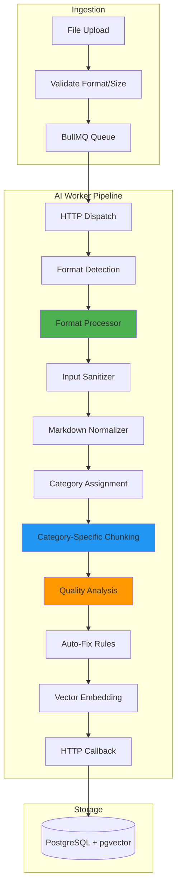
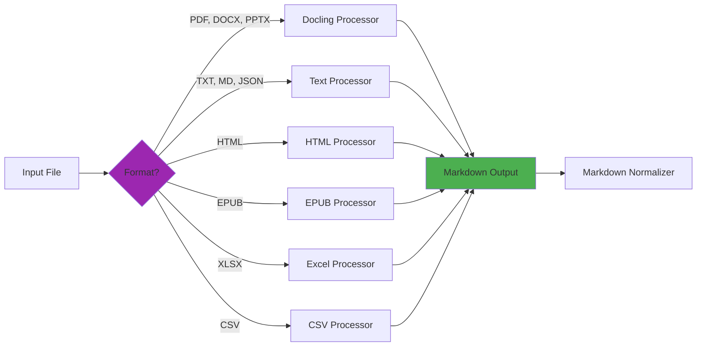
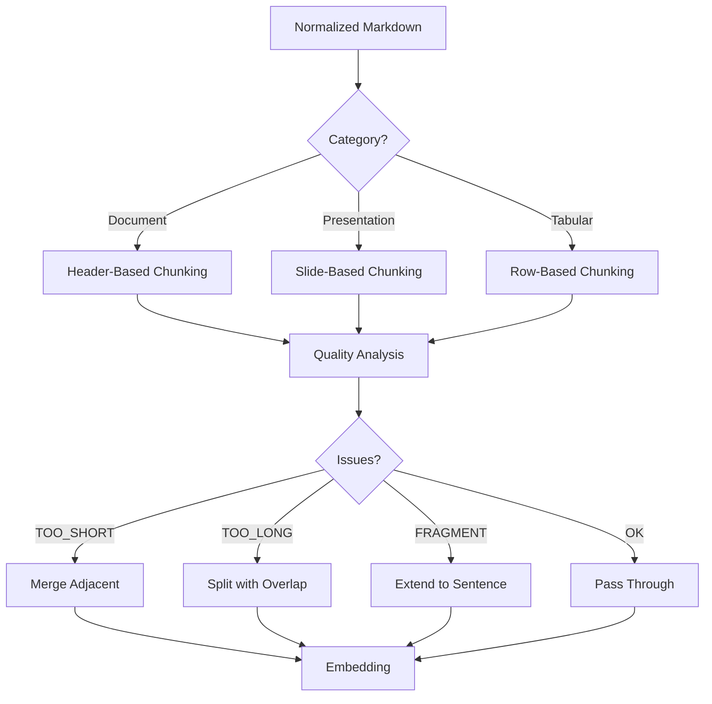

# RAGBase Phase 4 Specifications

**Format Expansion + Chunking Optimization** | **TDD Reference & Integration Spec**

---

## 1. Overview

### 1.1 Goals

- Support 6 new document formats: DOCX, XLSX, CSV, PPTX, HTML, EPUB
- Implement markdown-first processing pipeline
- Category-based chunking strategies (Document, Presentation, Tabular)
- Quality-aware post-processing with auto-fix rules
- Enhanced metadata storage for hierarchical filtering

### 1.2 Supported Formats

| Format | MIME Type | Category | Processor | Max Size |
|--------|-----------|----------|-----------|----------|
| `.pdf` | `application/pdf` | Document | Docling | 50MB |
| `.docx` | `application/vnd.openxmlformats-officedocument.wordprocessingml.document` | Document | Docling | 50MB |
| `.txt` | `text/plain` | Document | TextProcessor | 50MB |
| `.md` | `text/markdown` | Document | TextProcessor | 50MB |
| `.html` | `text/html` | Document | HtmlProcessor | 50MB |
| `.epub` | `application/epub+zip` | Document | EpubProcessor | 50MB |
| `.pptx` | `application/vnd.openxmlformats-officedocument.presentationml.presentation` | Presentation | Docling | 50MB |
| `.xlsx` | `application/vnd.openxmlformats-officedocument.spreadsheetml.sheet` | Tabular | ExcelProcessor | 50MB |
| `.csv` | `text/csv` | Tabular | CsvProcessor | 50MB |
| `.json` | `application/json` | Tabular* | TextProcessor | 50MB |

*JSON treated as Tabular only if array structure detected, else Document.

---

## 2. Architecture

### 2.1 Processing Pipeline



### 2.2 Format Processor Routing



### 2.3 Category-Based Chunking



---

## 3. Core Entities

### 3.1 Document (Extended)

```typescript
type FileFormat = 
  | 'pdf' | 'json' | 'txt' | 'md'           // Phase 1-3
  | 'docx' | 'xlsx' | 'csv' | 'pptx'        // Phase 4 NEW
  | 'html' | 'epub';                         // Phase 4 NEW

type FormatCategory = 'DOCUMENT' | 'PRESENTATION' | 'TABULAR';

interface Document {
  // Existing fields (Phase 1-3)
  id: string;
  filename: string;
  mimeType: string;
  fileSize: number;
  format: FileFormat;
  status: DocumentStatus;
  filePath?: string;
  md5Hash: string;
  retryCount: number;
  failReason?: string;
  processedContent?: string;
  processingMetadata?: Json;
  sourceType: SourceType;
  driveFileId?: string;
  driveConfigId?: string;
  lastSyncedAt?: Date;
  isActive: boolean;
  connectionState: 'STANDALONE' | 'LINKED';
  createdAt: Date;
  updatedAt: Date;

  // Phase 4 NEW
  formatCategory?: FormatCategory;          // Document/Presentation/Tabular
  driveWebViewLink?: string;                // Clickable Drive URL
  driveModifiedTime?: Date;                 // Version tracking
}
```

### 3.2 Chunk (Extended)

```typescript
type ChunkType = 'section' | 'table' | 'slide' | 'chapter' | 'header' | 'paragraph';
type Completeness = 'full' | 'partial' | 'fragment';
type QualityFlag = 'TOO_SHORT' | 'TOO_LONG' | 'NO_CONTEXT' | 'FRAGMENT' | 'EMPTY';

interface Chunk {
  // Existing fields (Phase 1-3)
  id: string;
  documentId: string;
  content: string;
  chunkIndex: number;
  embedding: number[];           // 384d vector
  charStart: number;
  charEnd: number;
  page?: number;                 // DEPRECATED: Use location.page
  heading?: string;
  createdAt: Date;

  // Phase 4 NEW
  location?: LocationSchema;     // Flexible location metadata
  qualityScore?: number;         // 0.0-1.0 composite score
  qualityFlags?: QualityFlag[];  // Issue flags
  chunkType?: ChunkType;         // Semantic chunk type
  completeness?: Completeness;   // full/partial/fragment
  hasTitle?: boolean;            // Chunk starts with heading?
  breadcrumbs?: string[];        // Hierarchy path for filtering
  tokenCount?: number;           // Exact token count for LLM context
}

// Flexible location schema per format
type LocationSchema =
  | { page: number }                                    // PDF
  | { slide: number; type?: 'content' | 'notes' }      // PPTX
  | { sheet: string; row?: number; col?: number }      // XLSX
  | { chapter: number; title?: string }                // EPUB
  | { section?: string; element?: string }             // HTML
  | { line: number };                                  // TXT/MD/CSV
```

### 3.3 Processing Types (Extended)

```typescript
interface ProcessingConfig {
  // Existing
  ocrMode: 'auto' | 'force' | 'never';
  ocrLanguages: string[];
  chunkSize: number;
  chunkOverlap: number;

  // Phase 4 NEW
  useTokenBasedChunking?: boolean;     // Default: true
  maxTokens?: number;                   // Default: 400
  overlapTokens?: number;               // Default: 50
  qualityAnalysisEnabled?: boolean;     // Default: true
  autoFixEnabled?: boolean;             // Default: true
}

interface ProcessingResult {
  // Existing
  processedContent: string;
  chunks: ChunkData[];
  pageCount: number;
  ocrApplied: boolean;
  processingTimeMs: number;

  // Phase 4 NEW
  formatCategory: FormatCategory;
  qualityMetrics: QualityMetrics;
  normalizationApplied: boolean;
}

interface ChunkData {
  content: string;
  index: number;
  embedding: number[];
  metadata: {
    charStart: number;
    charEnd: number;
    heading?: string;
    page?: number;               // Backward compat

    // Phase 4 NEW
    location?: LocationSchema;
    breadcrumbs?: string[];
    tokenCount?: number;
    qualityScore?: number;
    qualityFlags?: QualityFlag[];
    chunkType?: ChunkType;
    completeness?: Completeness;
    hasTitle?: boolean;
  };
}

interface QualityMetrics {
  totalChunks: number;
  avgQualityScore: number;
  avgTokenCount: number;
  issuesFixed: {
    tooShort: number;
    tooLong: number;
    noContext: number;
    fragment: number;
  };
}
```

---

## 4. API Contracts

### 4.1 Upload (Extended)

```typescript
// POST /api/documents
// Content-Type: multipart/form-data

// Body: file (binary), ocrMode? (string)
// NEW: Accepts formats: pdf, json, txt, md, docx, xlsx, csv, pptx, html, epub

interface UploadResponse {
  id: string;
  filename: string;
  status: 'PENDING';
  format: FileFormat;
  formatCategory: FormatCategory;     // NEW
}

// Errors
// 400: { error: 'INVALID_FORMAT', message: '...' }
// 400: { error: 'FILE_TOO_LARGE', message: '...' }
// 401: { error: 'UNAUTHORIZED' }
// 409: { error: 'DUPLICATE_FILE' }
```

### 4.2 Document Status (Extended)

```typescript
// GET /api/documents/:id

interface DocumentStatusResponse {
  id: string;
  filename: string;
  status: DocumentStatus;
  format: FileFormat;
  formatCategory?: FormatCategory;    // NEW
  retryCount: number;
  failReason?: string;
  chunkCount?: number;
  sourceType: SourceType;
  
  // NEW: Quality summary
  qualityMetrics?: {
    avgQualityScore: number;
    avgTokenCount: number;
  };
  
  createdAt: string;
  updatedAt: string;
}
```

### 4.3 Query (Enhanced)

```typescript
// POST /api/query

interface QueryRequest {
  query: string;                     // 1-1000 chars
  topK?: number;                     // 1-100, default 5
  
  // Phase 4 NEW: Filtering
  filters?: {
    formatCategory?: FormatCategory;
    formats?: FileFormat[];
    breadcrumbsContain?: string[];    // Hierarchical filter
    minQualityScore?: number;         // 0.0-1.0
    chunkTypes?: ChunkType[];
  };
}

interface QueryResult {
  content: string;
  score: number;
  documentId: string;
  documentFilename: string;           // NEW: Include filename
  metadata: {
    charStart: number;
    charEnd: number;
    page?: number;
    heading?: string;
    
    // Phase 4 NEW
    location?: LocationSchema;
    breadcrumbs?: string[];
    chunkType?: ChunkType;
    qualityScore?: number;
    tokenCount?: number;
    driveWebViewLink?: string;        // Direct link to Drive file
  };
}
```

### 4.4 Document List (Extended)

```typescript
// GET /api/documents?...

interface ListQueryParams {
  // Existing
  status?: DocumentStatus;
  driveConfigId?: string;
  limit?: number;
  offset?: number;
  isActive?: boolean;
  connectionState?: 'STANDALONE' | 'LINKED';
  sourceType?: 'MANUAL' | 'DRIVE';
  search?: string;
  sortBy?: 'createdAt' | 'filename' | 'fileSize';
  sortOrder?: 'asc' | 'desc';
  
  // Phase 4 NEW
  format?: FileFormat;
  formatCategory?: FormatCategory;
}

interface ListResponse {
  documents: DocumentSummary[];
  total: number;
  counts: {
    // Existing
    active: number;
    inactive: number;
    failed: number;
    pending: number;
    processing: number;
    completed: number;
    
    // Phase 4 NEW: Category counts
    byCategory: {
      document: number;
      presentation: number;
      tabular: number;
    };
  };
}

interface DocumentSummary {
  // Existing
  id: string;
  filename: string;
  status: DocumentStatus;
  sourceType: SourceType;
  chunkCount?: number;
  fileSize: number;
  isActive: boolean;
  connectionState: 'STANDALONE' | 'LINKED';
  createdAt: string;
  
  // Phase 4 NEW
  format: FileFormat;
  formatCategory?: FormatCategory;
  avgQualityScore?: number;
}
```

### 4.5 Content Export (Extended)

```typescript
// GET /api/documents/:id/content?format=markdown|json

interface ContentJsonResponse {
  id: string;
  filename: string;
  format: FileFormat;
  formatCategory: FormatCategory;      // NEW
  processedContent: string;
  chunks: {
    id: string;
    content: string;
    index: number;
    metadata: {
      charStart: number;
      charEnd: number;
      heading?: string;
      
      // Phase 4 NEW
      location?: LocationSchema;
      breadcrumbs?: string[];
      tokenCount?: number;
      qualityScore?: number;
      chunkType?: ChunkType;
    };
  }[];
  processingMetadata: {
    pageCount?: number;
    ocrApplied?: boolean;
    processingTimeMs: number;
    
    // Phase 4 NEW
    qualityMetrics: QualityMetrics;
    normalizationApplied: boolean;
  };
}
```

### 4.6 Chunk Quality Endpoint (NEW)

```typescript
// GET /api/documents/:id/chunks?includeQuality=true&chunkType=section

interface ChunkListParams {
  includeQuality?: boolean;           // Include quality metrics
  chunkType?: ChunkType;              // Filter by type
  minQualityScore?: number;           // Filter by quality
  breadcrumbsContain?: string;        // Hierarchical filter
}

interface ChunkListResponse {
  documentId: string;
  totalChunks: number;
  chunks: {
    id: string;
    index: number;
    content: string;
    location?: LocationSchema;
    breadcrumbs?: string[];
    tokenCount?: number;
    qualityScore?: number;
    qualityFlags?: QualityFlag[];
    chunkType?: ChunkType;
    completeness?: Completeness;
  }[];
  
  qualitySummary?: {
    avgScore: number;
    distribution: {
      excellent: number;    // >= 0.9
      good: number;         // >= 0.7
      fair: number;         // >= 0.5
      poor: number;         // < 0.5
    };
    flagCounts: Record<QualityFlag, number>;
  };
}
```

---

## 5. Internal API Contracts

### 5.1 AI Worker Process Endpoint

```typescript
// POST /process (AI Worker)

interface ProcessRequest {
  documentId: string;
  filePath: string;
  format: FileFormat;
  config: ProcessingConfig;
}

interface ProcessResponse {
  success: true;
  message: string;
  details: {
    format: FileFormat;
    formatCategory: FormatCategory;
    estimatedChunks: number;
  };
}
```

### 5.2 Callback Contract (Extended)

```typescript
// POST /internal/callback

interface ProcessingCallback {
  documentId: string;
  success: boolean;
  result?: ProcessingResult;
  error?: ProcessingError;
}

type ErrorCode =
  // Existing
  | 'PASSWORD_PROTECTED'
  | 'CORRUPT_FILE'
  | 'UNSUPPORTED_FORMAT'
  | 'OCR_FAILED'
  | 'TIMEOUT'
  | 'INTERNAL_ERROR'
  // Phase 4 NEW
  | 'ENCODING_ERROR'           // Mojibake / bad encoding
  | 'EMPTY_CONTENT'            // No extractable content
  | 'MALFORMED_STRUCTURE'      // Invalid format structure
  | 'QUALITY_BELOW_THRESHOLD'; // All chunks below quality threshold
```

---

## 6. Database Schema

### 6.1 Prisma Schema Changes

```prisma
// Document model additions
model Document {
  // Existing fields...
  
  // Phase 4 NEW
  formatCategory      String?   @map("format_category")    // DOCUMENT/PRESENTATION/TABULAR
  driveWebViewLink    String?   @map("drive_web_view_link")
  driveModifiedTime   DateTime? @map("drive_modified_time")
}

// Chunk model additions
model Chunk {
  // Existing fields...
  
  // Phase 4 NEW: Flexible location (replaces page)
  location       Json?      @db.JsonB
  
  // Quality metrics
  qualityScore   Float?     @map("quality_score")
  qualityFlags   String[]   @map("quality_flags")
  chunkType      String?    @map("chunk_type")
  completeness   String?
  hasTitle       Boolean?   @map("has_title")
  
  // Hierarchical filtering
  breadcrumbs    String[]
  
  // Context optimization
  tokenCount     Int?       @map("token_count")
  
  // Indexes
  @@index([qualityScore])
  @@index([chunkType])
  @@index([breadcrumbs], type: Gin)
}
```

### 6.2 Migration Strategy

```sql
-- Add new columns (all nullable for backward compat)
ALTER TABLE "Document" ADD COLUMN "format_category" TEXT;
ALTER TABLE "Document" ADD COLUMN "drive_web_view_link" TEXT;
ALTER TABLE "Document" ADD COLUMN "drive_modified_time" TIMESTAMPTZ;

ALTER TABLE "Chunk" ADD COLUMN "location" JSONB;
ALTER TABLE "Chunk" ADD COLUMN "quality_score" DOUBLE PRECISION;
ALTER TABLE "Chunk" ADD COLUMN "quality_flags" TEXT[] DEFAULT '{}';
ALTER TABLE "Chunk" ADD COLUMN "chunk_type" TEXT;
ALTER TABLE "Chunk" ADD COLUMN "completeness" TEXT;
ALTER TABLE "Chunk" ADD COLUMN "has_title" BOOLEAN;
ALTER TABLE "Chunk" ADD COLUMN "breadcrumbs" TEXT[] DEFAULT '{}';
ALTER TABLE "Chunk" ADD COLUMN "token_count" INTEGER;

-- Migrate existing page field to location
UPDATE "Chunk" SET location = jsonb_build_object('page', page) WHERE page IS NOT NULL;

-- Indexes for performance
CREATE INDEX "Chunk_quality_score_idx" ON "Chunk"("quality_score");
CREATE INDEX "Chunk_chunk_type_idx" ON "Chunk"("chunk_type");
CREATE INDEX "Chunk_breadcrumbs_idx" ON "Chunk" USING GIN("breadcrumbs");
```

---

## 7. Processing Contracts

### 7.1 Format Processors

```typescript
interface FormatProcessor {
  supportedFormats: FileFormat[];
  category: FormatCategory;
  
  process(filePath: string, config: ProcessingConfig): Promise<ProcessorOutput>;
}

interface ProcessorOutput {
  markdown: string;              // Raw markdown output
  metadata: {
    pageCount?: number;
    slideCount?: number;
    sheetCount?: number;
    chapterCount?: number;
    ocrApplied?: boolean;
  };
}
```

### 7.2 Chunking Strategies

| Strategy | Input | Configuration | Output |
|----------|-------|---------------|--------|
| **HeaderChunker** | Document category | `maxTokens`, `overlap`, `sentenceBoundary` | Section-based chunks with breadcrumbs |
| **SlideChunker** | PPTX markdown | `groupSmallSlides`, `minSlideChars` | Slide-based chunks |
| **TableChunker** | XLSX/CSV | `smallTableThreshold`, `sentenceTemplate` | Row or table chunks |

### 7.3 Quality Rules

```typescript
interface QualityRule {
  flag: QualityFlag;
  threshold: number | string;
  action: 'merge' | 'split' | 'inject' | 'extend' | 'skip';
}

const QUALITY_RULES: QualityRule[] = [
  { flag: 'TOO_SHORT', threshold: 50, action: 'merge' },
  { flag: 'TOO_LONG', threshold: 2000, action: 'split' },
  { flag: 'NO_CONTEXT', threshold: 'no_heading', action: 'inject' },
  { flag: 'FRAGMENT', threshold: 'mid_sentence', action: 'extend' },
  { flag: 'EMPTY', threshold: 'whitespace_only', action: 'skip' },
];
```

---

## 8. Configuration

### 8.1 Environment Variables

```bash
# Format-specific chunking
CHUNK_SIZE_DEFAULT=1000
CHUNK_OVERLAP_DEFAULT=200
EXCEL_MAX_ROWS_PER_CHUNK=35
EXCEL_SMALL_TABLE_THRESHOLD=35
CSV_ROWS_PER_CHUNK=20
PPTX_MIN_SLIDE_CHARS=200
EPUB_MAX_CHAPTER_SIZE=2000

# Token-based limits
CHUNK_MAX_TOKENS=400
CHUNK_OVERLAP_TOKENS=50
USE_TOKEN_BASED_CHUNKING=true

# Quality thresholds
CHUNK_MIN_CHARS=50
CHUNK_MAX_CHARS=2000
QUALITY_ANALYSIS_ENABLED=true
AUTO_FIX_ENABLED=true

# Drive storage
DRIVE_CLEANUP_TEMP_FILES=true
DRIVE_ORPHAN_STRATEGY=delete    # delete|keep|mark

# Embedding (unchanged)
EMBEDDING_MODEL=BAAI/bge-small-en-v1.5
EMBEDDING_DIMENSION=384
```

### 8.2 File Routing

```typescript
const FORMAT_ROUTING = {
  // Document category
  pdf: { processor: 'DoclingProcessor', category: 'DOCUMENT' },
  docx: { processor: 'DoclingProcessor', category: 'DOCUMENT' },
  txt: { processor: 'TextProcessor', category: 'DOCUMENT' },
  md: { processor: 'TextProcessor', category: 'DOCUMENT' },
  html: { processor: 'HtmlProcessor', category: 'DOCUMENT' },
  epub: { processor: 'EpubProcessor', category: 'DOCUMENT' },
  
  // Presentation category
  pptx: { processor: 'DoclingProcessor', category: 'PRESENTATION' },
  
  // Tabular category
  xlsx: { processor: 'ExcelProcessor', category: 'TABULAR' },
  csv: { processor: 'CsvProcessor', category: 'TABULAR' },
  json: { processor: 'TextProcessor', category: 'TABULAR' },  // If array structure
};

const REJECTION_RULES = {
  maxFileSizeMB: 50,
  maxDriveFileSizeMB: 100,
  allowedFormats: [
    'pdf', 'json', 'txt', 'md',           // Phase 1-3
    'docx', 'xlsx', 'csv', 'pptx',        // Phase 4
    'html', 'epub',                        // Phase 4
  ],
  minTextLength: 50,
  maxNoiseRatio: 0.8,
};
```

---

## 9. SSE Events (Extended)

```typescript
// Additional Phase 4 events
interface SSEEvents {
  // Existing
  'document:created': DocumentCreatedPayload;
  'document:status': DocumentStatusPayload;
  'document:deleted': DocumentDeletedPayload;
  'document:availability': AvailabilityPayload;
  'sync:start': SyncStartPayload;
  'sync:complete': SyncCompletePayload;
  'sync:error': SyncErrorPayload;
  'bulk:completed': BulkCompletedPayload;
  
  // Phase 4 NEW
  'processing:progress': ProcessingProgressPayload;
}

interface ProcessingProgressPayload {
  documentId: string;
  stage: 'extracting' | 'normalizing' | 'chunking' | 'analyzing' | 'embedding';
  progress: number;        // 0-100
  details?: string;
}

interface DocumentStatusPayload {
  // Existing
  id: string;
  status: DocumentStatus;
  chunkCount?: number;
  error?: string;
  
  // Phase 4 NEW
  formatCategory?: FormatCategory;
  qualityMetrics?: {
    avgQualityScore: number;
    avgTokenCount: number;
    issuesFixed: number;
  };
}
```

---

## 10. Python Dependencies

```txt
# Existing
sentence-transformers>=2.3.0
torch>=2.0.0
langchain>=1.0.0
docling>=2.15.0
ftfy>=6.1.0

# Phase 4 NEW
openpyxl>=3.1.2           # Excel parsing
beautifulsoup4>=4.12.3    # HTML parsing
lxml>=5.1.0               # HTML/XML backend
ebooklib>=0.18            # EPUB parsing
pandas>=2.2.0             # CSV/tabular data
```

---

## 11. Backward Compatibility

| Aspect | Guarantee |
|--------|-----------|
| Existing formats | PDF, TXT, JSON, MD continue working |
| Existing API endpoints | No breaking changes |
| Existing chunk `page` field | Populated alongside `location` |
| Database schema | All new fields nullable |
| Embedding model | Same BAAI/bge-small-en-v1.5 |
| Query results | Same structure + optional new fields |

---

## 12. Success Metrics

| Metric | Target |
|--------|--------|
| Format coverage | 10 formats (100%) |
| Avg quality score | >= 0.7 |
| Processing time (non-PDF) | < 5s per file |
| Chunking consistency | Zero mid-sentence cuts |
| Regression tests | 100% pass |
| API compatibility | 100% backward compat |

---

**Status:** DRAFT | **Target:** Q1 2025
