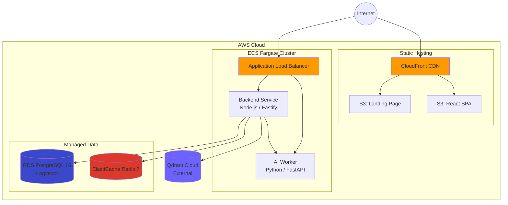

# RAGBase → AWS: Complete Demo-Ready Deployment Plan

> Turn RAGBase into a polished, customer-facing demo running on AWS.

---

## 1. Target Architecture (AWS)



### Why This Stack

| Decision | Rationale |
|----------|-----------|
| **ECS Fargate** (not EC2) | Zero server mgmt, pay-per-use, fast scale. Perfect for demo. |
| **S3 + CloudFront** (frontend) | Static SPA → no compute needed, global CDN, HTTPS free. |
| **RDS PostgreSQL** (not self-hosted) | Managed backups, pgvector extension supported, multi-AZ optional. |
| **ElastiCache Redis** (not self-hosted) | Managed, persistent, BullMQ-compatible. |
| **Qdrant Cloud** (keep external) | Already integrated. No need to self-host vectors. |
| **ALB** (not API Gateway) | WebSocket/SSE-friendly, cheaper for persistent connections. |

---

## 2. AWS Services Required

| Service | Purpose | Estimated Cost (demo) |
|---------|---------|----------------------|
| **ECR** | Docker image registry | ~$1/mo |
| **ECS Fargate** | Run backend + ai-worker | ~$30-50/mo (0.5 vCPU, 1-4GB each) |
| **RDS PostgreSQL** (db.t3.micro) | Metadata + pgvector | ~$15/mo (free tier eligible) |
| **ElastiCache Redis** (cache.t3.micro) | BullMQ queue | ~$12/mo |
| **S3** | Frontend + landing page hosting | ~$1/mo |
| **CloudFront** | CDN + HTTPS | ~$1/mo |
| **ALB** | Load balancer for API | ~$16/mo |
| **Route 53** | DNS (optional) | ~$0.50/mo |
| **ACM** | Free SSL certificates | Free |
| **Secrets Manager** | Store env vars securely | ~$2/mo |
| **CloudWatch** | Logs + monitoring | ~$3/mo |
| **Qdrant Cloud** | Vector DB (external) | Existing plan |

**Total estimated: ~$80-100/mo** for a demo-grade setup.

---

## 3. Implementation Phases

### Phase A: Prepare Containers & CI/CD (Day 1-2)

#### A1. Create ECR Repositories
```bash
aws ecr create-repository --repository-name ragbase/backend
aws ecr create-repository --repository-name ragbase/ai-worker
```

#### A2. Build & Push Images
```bash
# Login to ECR
aws ecr get-login-password --region us-east-1 | \
  docker login --username AWS --password-stdin <ACCOUNT_ID>.dkr.ecr.us-east-1.amazonaws.com

# Build from existing Dockerfiles (already multi-stage)
docker build -t ragbase/backend -f apps/backend/Dockerfile .
docker build -t ragbase/ai-worker -f apps/ai-worker/Dockerfile .

# Tag & push
docker tag ragbase/backend:latest <ACCOUNT_ID>.dkr.ecr.us-east-1.amazonaws.com/ragbase/backend:latest
docker push <ACCOUNT_ID>.dkr.ecr.us-east-1.amazonaws.com/ragbase/backend:latest
# (same for ai-worker)
```

#### A3. GitHub Actions Deployment Workflow (NEW)
Add `.github/workflows/deploy.yml`:
- Trigger: push to `main` or manual dispatch
- Steps: build → push to ECR → update ECS services
- Use existing `docker-build.yml` as base, extend with deploy step

---

### Phase B: Provision Infrastructure (Day 2-3)

#### B1. Networking (VPC)
```
VPC: 10.0.0.0/16
├── Public Subnets (2 AZs): ALB, NAT Gateway
├── Private Subnets (2 AZs): ECS tasks, RDS, ElastiCache
└── Security Groups:
    ├── sg-alb: 80/443 from 0.0.0.0/0
    ├── sg-backend: 3000 from sg-alb
    ├── sg-ai-worker: 8000 from sg-backend
    ├── sg-rds: 5432 from sg-backend
    └── sg-redis: 6379 from sg-backend
```

#### B2. RDS PostgreSQL
```
Engine: PostgreSQL 16
Instance: db.t3.micro (demo) → db.t3.medium (production)
Storage: 20GB gp3
Extensions: pgvector (pre-install via init script)
Multi-AZ: No (demo) → Yes (production)
Backup: 7 days automated
```

> [!IMPORTANT]
> Run `pnpm --filter @ragbase/backend db:push` after RDS is up to apply Prisma schema.

#### B3. ElastiCache Redis
```
Engine: Redis 7
Node: cache.t3.micro
Cluster Mode: Disabled (single node for demo)
Encryption: In-transit enabled
```

#### B4. Secrets Manager
Store all env vars from `.env.example`:
```
ragbase/prod/database    → DATABASE_URL
ragbase/prod/redis       → REDIS_URL
ragbase/prod/qdrant      → QDRANT_URL, QDRANT_API_KEY
ragbase/prod/encryption  → APP_ENCRYPTION_KEY
ragbase/prod/google      → GOOGLE_CLIENT_ID, GOOGLE_CLIENT_SECRET
ragbase/prod/api         → API_KEY
```

---

### Phase C: Deploy Backend Services (Day 3-4)

#### C1. ECS Cluster
```
Cluster: ragbase-demo
Capacity: Fargate (serverless)
```

#### C2. Task Definitions

**Backend Task:**
```json
{
  "family": "ragbase-backend",
  "cpu": "512",
  "memory": "1024",
  "containerDefinitions": [{
    "name": "backend",
    "image": "<ECR>/ragbase/backend:latest",
    "portMappings": [{"containerPort": 3000}],
    "healthCheck": {
      "command": ["CMD-SHELL", "curl -f http://localhost:3000/health || exit 1"]
    },
    "environment": [
      {"name": "NODE_ENV", "value": "production"},
      {"name": "AI_WORKER_URL", "value": "http://ai-worker.ragbase.local:8000"}
    ],
    "secrets": [
      {"name": "DATABASE_URL", "valueFrom": "arn:aws:secretsmanager:..."}
    ],
    "logConfiguration": {
      "logDriver": "awslogs",
      "options": {
        "awslogs-group": "/ecs/ragbase-backend",
        "awslogs-region": "us-east-1"
      }
    }
  }]
}
```

**AI Worker Task:**
```json
{
  "family": "ragbase-ai-worker",
  "cpu": "1024",
  "memory": "4096",
  "containerDefinitions": [{
    "name": "ai-worker",
    "image": "<ECR>/ragbase/ai-worker:latest",
    "portMappings": [{"containerPort": 8000}],
    "healthCheck": {
      "command": ["CMD-SHELL", "curl -f http://localhost:8000/health || exit 1"]
    },
    "environment": [
      {"name": "CALLBACK_URL", "value": "http://backend.ragbase.local:3000/internal/callback"},
      {"name": "MAX_WORKERS", "value": "1"}
    ]
  }]
}
```

> [!WARNING]
> AI Worker needs **4GB RAM minimum** for embedding models (fastembed). `cpu: 1024` = 1 vCPU.

#### C3. ECS Services + Service Discovery
```
Service: ragbase-backend
  - Desired: 1 (demo) → 2+ (production)
  - Service Discovery: backend.ragbase.local (Cloud Map)
  - Load Balancer: ALB target group on port 3000

Service: ragbase-ai-worker
  - Desired: 1
  - Service Discovery: ai-worker.ragbase.local (Cloud Map)
  - No ALB (internal only, called by backend)
```

#### C4. ALB Configuration
```
Listener 443 (HTTPS):
  Rule: /api/*        → backend target group
  Rule: /health       → backend target group
  Rule: /internal/*   → DENY (block external access)
  Rule: /metrics      → DENY (or restrict to monitoring IP)

  # SSE support:
  Idle timeout: 3600s (1 hour, for long-lived SSE connections)
```

---

### Phase D: Deploy Frontend (Day 4)

#### D1. Build React App

Modify `apps/frontend/.env.production`:
```
VITE_API_URL=https://api.ragbase.demo.com
```

```bash
cd apps/frontend
pnpm build  # outputs to dist/
```

#### D2. S3 + CloudFront

```bash
# Create S3 bucket
aws s3 mb s3://ragbase-frontend-demo

# Upload built files
aws s3 sync apps/frontend/dist/ s3://ragbase-frontend-demo/ --delete

# Create CloudFront distribution
# Origin: S3 bucket
# Behaviors:
#   /api/* → ALB origin (proxy API requests)
#   /*     → S3 origin (SPA)
# Custom error: 403/404 → /index.html (SPA routing)
# SSL: ACM certificate for ragbase.demo.com
```

#### D3. Landing Page (Optional)
```bash
aws s3 sync apps/landing-page/ s3://ragbase-landing-demo/ --delete
# Separate CloudFront distribution or subdomain
```

---

### Phase E: DNS + SSL (Day 4)

#### E1. Route 53
```
ragbase.demo.com       → CloudFront (frontend)
api.ragbase.demo.com   → ALB (backend)
www.ragbase.demo.com   → CloudFront (landing page)
```

#### E2. ACM Certificates
```bash
# Request wildcard cert (us-east-1 for CloudFront)
aws acm request-certificate \
  --domain-name "*.ragbase.demo.com" \
  --validation-method DNS
```

---

### Phase F: Production Hardening (Day 5)

#### F1. Monitoring & Alerts
```
CloudWatch Alarms:
  - ECS CPU > 80% → SNS notification
  - RDS connections > 80% → scale warning
  - ALB 5xx rate > 5% → PagerDuty/Slack
  - AI Worker memory > 90% → scale alert

CloudWatch Dashboards:
  - Request rate, latency (p50/p95/p99)
  - ECS task health
  - RDS metrics
  - Queue depth (if BullMQ metrics exposed via /metrics)
```

#### F2. Security Checklist
- [ ] Security groups: minimal access, no 0.0.0.0/0 on data layer
- [ ] RDS: not publicly accessible, encrypted at rest
- [ ] ElastiCache: in-transit encryption enabled
- [ ] Secrets Manager: rotation policy
- [ ] ALB: WAF rules (optional, blocks common exploits)
- [ ] CloudFront: HTTPS only, TLS 1.2+
- [ ] `/internal/*` routes blocked at ALB level
- [ ] API_KEY set and enforced

#### F3. Backup Strategy
```
RDS: Automated daily snapshots, 7-day retention
Redis: Appendonly persistence (already configured)
S3: Versioning enabled on frontend bucket
Qdrant: Managed by Qdrant Cloud
```

---

## 4. Code Changes Required

### 4.1 Frontend: API URL Config
Ensure `VITE_API_URL` is used consistently. The SPA must point to the ALB domain for API calls.

### 4.2 Backend: CORS
Update CORS origins to include the CloudFront domain:
```typescript
// src/server.ts or equivalent
cors: {
  origin: [
    'https://ragbase.demo.com',
    'https://www.ragbase.demo.com',
    process.env.CORS_ORIGIN
  ]
}
```

### 4.3 Docker: Health Check Dependency
Add `curl` to AI Worker Dockerfile (if not present) for ECS health checks:
```dockerfile
RUN apt-get update && apt-get install -y curl && rm -rf /var/lib/apt/lists/*
```

### 4.4 GitHub Actions: Deploy Workflow
New workflow file `.github/workflows/deploy.yml`:
- Build images → Push to ECR → Force new ECS deployment
- Triggered by push to `main` or manual `workflow_dispatch`

---

## 5. Demo Preparation Checklist

- [ ] Upload 5-10 sample documents (PDF, DOCX, XLSX, CSV) pre-loaded
- [ ] Configure a Processing Profile with optimal settings
- [ ] Google Drive OAuth set up with test account
- [ ] Landing page accessible at root domain
- [ ] Health check endpoint verified: `curl https://api.ragbase.demo.com/health`
- [ ] SSE events working through ALB (test real-time updates)
- [ ] Hybrid search returns ranked results
- [ ] Analytics dashboard shows pipeline metrics
- [ ] Error handling: upload a corrupt file → verify graceful failure

---

## 6. Execution Timeline

| Day | Phase | Deliverable |
|-----|-------|-------------|
| 1 | A: Containers | Dockerfiles verified, ECR repos created, images pushed |
| 2 | B: Infrastructure | VPC, RDS, ElastiCache, Secrets Manager provisioned |
| 3 | C: Backend | ECS services running, ALB routing, service discovery |
| 4 | D+E: Frontend + DNS | S3 deployed, CloudFront live, SSL active, DNS configured |
| 5 | F: Hardening | Monitoring, security audit, demo data loaded |

---

## 7. Cost Optimization Tips

| Tip | Savings |
|-----|---------|
| Use Fargate Spot for AI Worker | ~70% on compute |
| RDS db.t3.micro free tier (12 months) | ~$15/mo saved |
| Single-AZ for demo (not production) | ~50% on RDS |
| CloudFront free tier (1TB/mo) | Likely $0 |
| Tear down when not demoing | 100% (stop ECS, RDS) |

---

## 8. Infrastructure-as-Code (Recommended)

For repeatability, codify everything above with **AWS CDK (TypeScript)**:

```
infra/
├── bin/
│   └── ragbase.ts          # CDK app entry
├── lib/
│   ├── network-stack.ts    # VPC, subnets, security groups
│   ├── data-stack.ts       # RDS, ElastiCache
│   ├── compute-stack.ts    # ECS, ALB, task definitions
│   ├── frontend-stack.ts   # S3, CloudFront
│   └── dns-stack.ts        # Route 53, ACM
├── cdk.json
└── package.json
```

> [!TIP]
> AWS CDK uses TypeScript — matches your existing backend stack. One `cdk deploy` provisions everything.

---

## 9. Alternative: Simplified Deploy (Docker Compose on EC2)

If budget or timeline is tight, skip managed services entirely:

```bash
# Launch t3.xlarge EC2 (4 vCPU, 16GB) ~ $50/mo
# Install Docker, clone repo, run production compose
ssh ec2-user@<IP>
git clone <repo>
cp .env.example .env  # fill in secrets
docker compose up -d
```

**Pros:** Fast (1-2 hours), cheapest, matches local dev exactly.  
**Cons:** Single point of failure, manual scaling, no auto-recovery.  

> [!NOTE]
> Good enough for initial demos. Migrate to ECS Fargate when readying for production.
