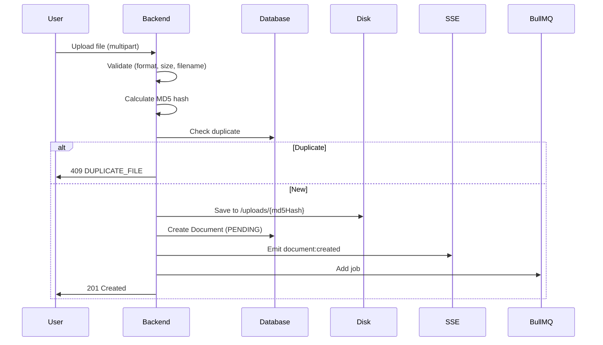
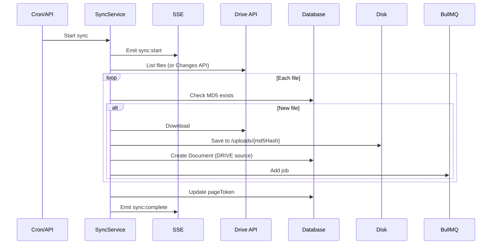
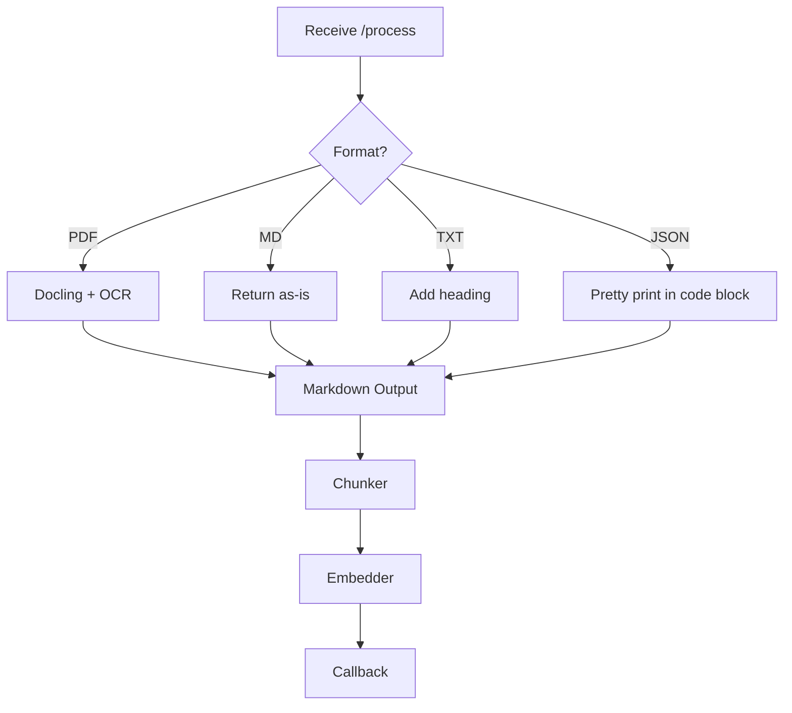
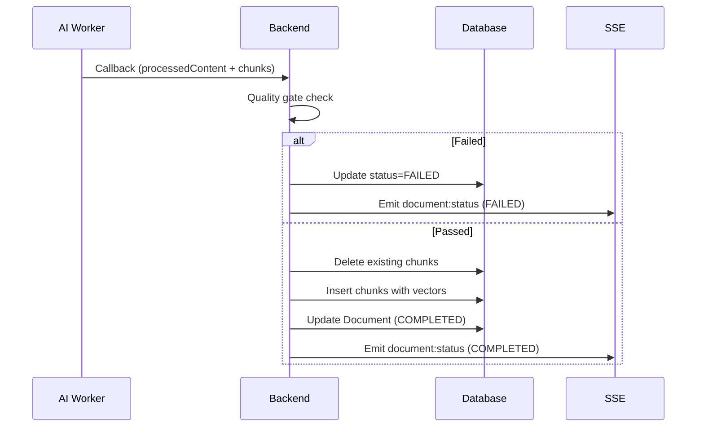
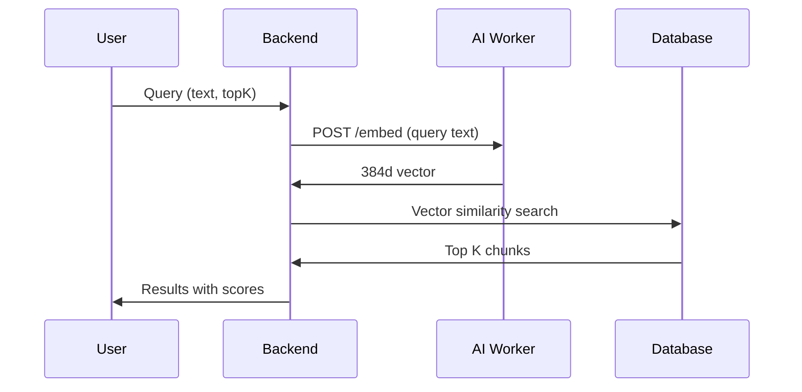

# RAGBase Data Flow

**Complete pipeline: Import → Process → Store → Retrieve → Delete**

---

## Overview


---

## 1. Data Import

### 1.1 Manual Upload

**Endpoint:** `POST /api/documents`



**Validation Rules:**
- Max size: 50MB
- Formats: PDF, JSON, TXT, MD
- Filename: sanitized via `basename()`, max 255 chars

**Storage Path:** `/uploads/{md5Hash}` (no extension, prevents path traversal)

---

### 1.2 Google Drive Sync

**Trigger:** Cron schedule or `POST /api/drive/sync/:configId/trigger`



**Sync Modes:**
- **Full sync:** First run, list all files in folder
- **Incremental:** Subsequent runs, use Changes API + `pageToken`

---

## 2. Processing Pipeline

### 2.1 Job Dispatch

**Job Processor (`job-processor.ts`):**
1. Pick job from BullMQ queue
2. Update Document status → `PROCESSING`
3. HTTP dispatch to AI Worker

```typescript
POST /process
{
  documentId: string,
  filePath: string,
  format: 'pdf' | 'md' | 'txt' | 'json',
  config: { ocrMode, ocrLanguages }
}
```

---

### 2.2 AI Worker Processing



**Format Handling:**

| Format | Conversion |
|--------|------------|
| PDF | Docling (OCR if needed) → Markdown |
| MD | Return as-is |
| TXT | `# filename\n\n{content}` |
| JSON | `# filename\n\n```json\n{pretty}\n``` ` |

---

### 2.3 Chunking

**Library:** LangChain `RecursiveCharacterTextSplitter`

**Config:**
- `chunk_size`: 1000 characters
- `chunk_overlap`: 200 characters
- `separators`: `["\n\n", "\n", " ", ""]`

**Output per chunk:**
```python
{
  "content": str,
  "index": int,
  "metadata": {
    "charStart": int,
    "charEnd": int
  }
}
```

---

### 2.4 Embedding

**Model:** `BAAI/bge-small-en-v1.5` (sentence-transformers)

**Config:**
- Dimensions: 384
- Normalization: enabled (for cosine similarity)

**Process:**
```python
embeddings = model.encode(texts, normalize_embeddings=True)
# Returns List[List[float]] - 384d vectors
```

---

## 3. Storage (Callback)

**Endpoint:** `POST /internal/callback`



**Quality Gate:**
- Reject if text < 50 characters
- Reject if noise ratio > 80% (non-alphanumeric chars)

**Chunk Storage (Raw SQL):**
```sql
INSERT INTO chunks (id, document_id, content, chunk_index, embedding, char_start, char_end, heading, created_at)
VALUES (gen_random_uuid(), $1, $2, $3, $4::vector, $5, $6, null, NOW())
```

---

## 4. Database Schema

### 4.1 Documents Table

| Column | Type | Description |
|--------|------|-------------|
| `id` | UUID | Primary key |
| `filename` | String | Original filename |
| `mime_type` | String | MIME type |
| `file_size` | Int | Bytes |
| `format` | Enum | pdf/json/txt/md |
| `status` | Enum | PENDING/PROCESSING/COMPLETED/FAILED |
| `file_path` | String | `/uploads/{md5Hash}` |
| `md5_hash` | String | Unique, dedup key |
| `processed_content` | Text | Full markdown output |
| `processing_metadata` | JSON | pageCount, ocrApplied, processingTimeMs |
| `source_type` | Enum | MANUAL/DRIVE |
| `drive_file_id` | String? | Google Drive file ID |
| `drive_config_id` | UUID? | FK → DriveConfig |
| `is_active` | Boolean | User visibility toggle (default: true) |
| `connection_state` | String | STANDALONE or LINKED |

---

### 4.2 Chunks Table

| Column | Type | Description |
|--------|------|-------------|
| `id` | UUID | Primary key |
| `document_id` | UUID | FK → Document (cascade delete) |
| `content` | String | Chunk text |
| `chunk_index` | Int | Order in document |
| `embedding` | vector(384) | pgvector embedding |
| `char_start` | Int | Position in source |
| `char_end` | Int | End position |

**Index:** HNSW on `embedding` for fast similarity search

---

### 4.3 DriveConfigs Table

| Column | Type | Description |
|--------|------|-------------|
| `id` | UUID | Primary key |
| `folder_id` | String | Google Drive folder ID |
| `folder_name` | String | Display name |
| `sync_cron` | String | Cron expression |
| `page_token` | String? | Changes API token |
| `sync_status` | Enum | IDLE/SYNCING/ERROR |

---

## 5. Retrieval

### 5.1 Semantic Search

**Endpoint:** `POST /api/query`



**pgvector Query:**
```sql
SELECT c.*, d.filename
FROM chunks c
JOIN documents d ON c.document_id = d.id
WHERE d.status = 'COMPLETED' AND d.is_active = true
ORDER BY c.embedding <=> $queryVector
LIMIT $topK
```

---

### 5.2 Content Export

**Endpoint:** `GET /api/documents/:id/content?format=markdown|json`

| Format | Response |
|--------|----------|
| `markdown` | Raw `processedContent` (text/markdown) |
| `json` | Document + chunks + metadata (application/json) |

**Errors:**
- 404: Document not found
- 409: Document not COMPLETED

---

## 6. Deletion & Availability (Phase 3)

### 6.1 Hard Delete

**Endpoints:**
- `DELETE /api/documents/:id` - Single document
- `POST /api/documents/bulk/delete` - Bulk delete (max 100)

**What gets deleted:**
- Document record
- All chunks (cascade)
- File on disk

**Restrictions:**
- Cannot delete PROCESSING documents (409 Conflict)

---

### 6.2 Availability Toggle

**Endpoint:** `PATCH /api/documents/:id/availability`

- Toggle `isActive` between true/false
- Only COMPLETED documents can be toggled
- `isActive=false` documents excluded from query

---

### 6.3 Drive Sync Removal

When file removed from Google Drive:
- Document `isActive` remains true (content still valid)
- Can be manually set to inactive or deleted

---

### 6.4 DriveConfig Deletion

**Endpoint:** `DELETE /api/drive/configs/:id`

**Behavior:**
- Delete DriveConfig record
- Documents remain, `driveConfigId` → `null`
- `connectionState` → `STANDALONE`

---

## Summary

| Stage | Backend | AI Worker | Storage |
|-------|---------|-----------|---------|
| **Import** | upload-route, sync-service | - | Disk + Document record |
| **Queue** | job-processor | - | BullMQ job |
| **Process** | - | processor, text_processor | - |
| **Chunk** | - | chunker (LangChain) | - |
| **Embed** | - | embedder (bge-small) | - |
| **Store** | callback-route | - | processedContent + chunks + vectors |
| **Query** | query-route | /embed | Vector search |
| **Delete** | config-routes | - | Cascade or soft delete |

