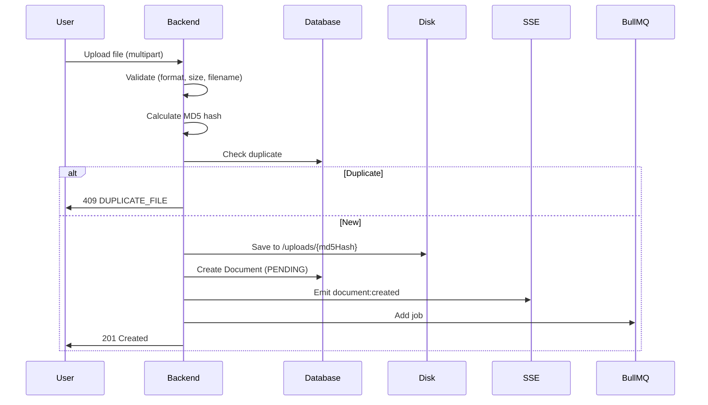
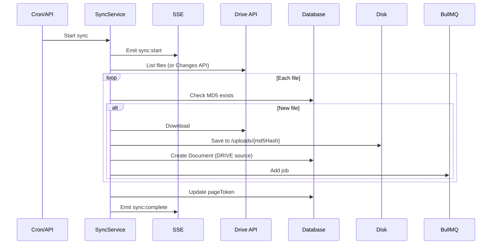
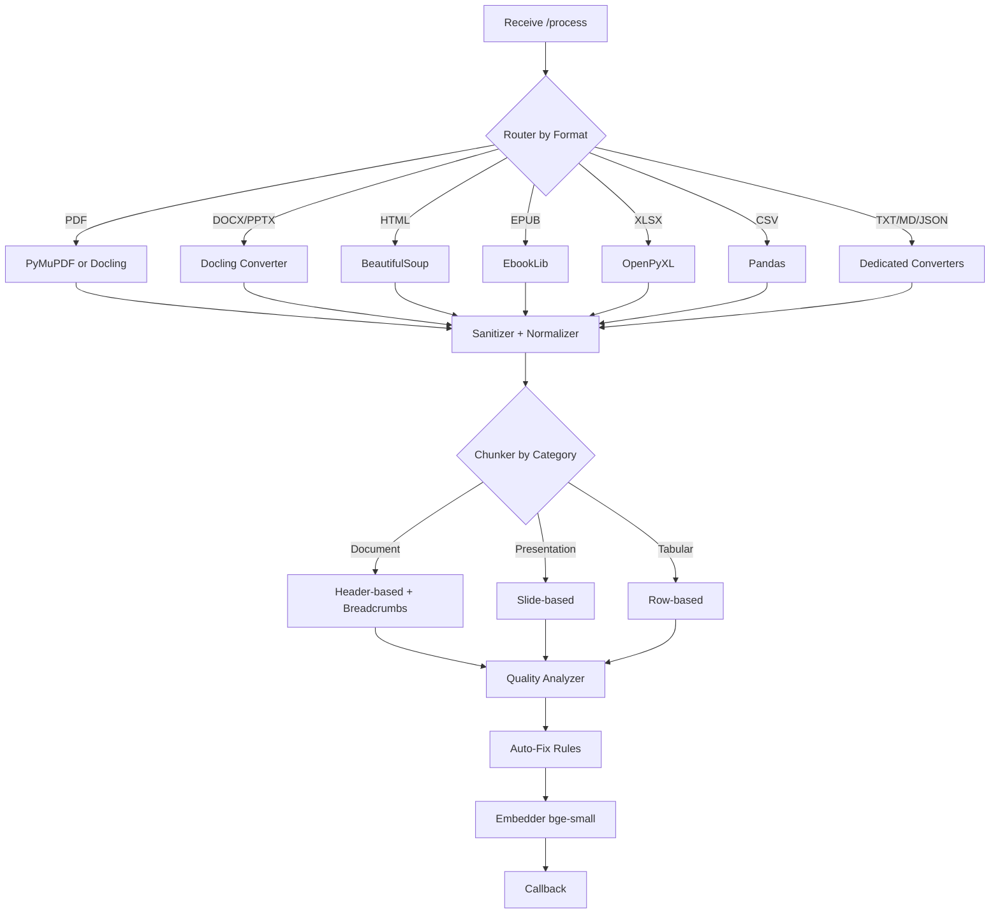
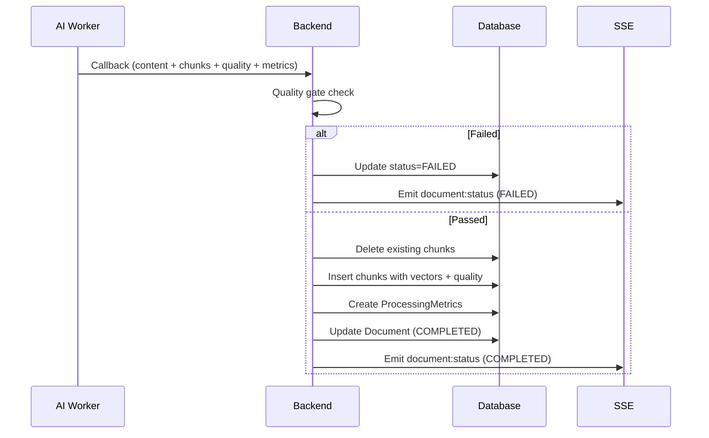

# RAGBase Data Flow

**Complete pipeline: Import → Process → Store → Retrieve → Delete**

---

## Overview


---

## 1. Data Import

### 1.1 Manual Upload

**Endpoint:** `POST /api/documents`



**Validation Rules:**
- Max size: From active ProcessingProfile (`maxFileSizeMb`, default 50MB)
- Formats: PDF, DOCX, PPTX, HTML, EPUB, XLSX, CSV, TXT, MD, JSON
- Filename: sanitized via `basename()`, max 255 chars
- Profile: Active profile ID captured at upload (snapshot)

**Storage Path:** `/uploads/{md5Hash}` (no extension, prevents path traversal)

---

### 1.2 Google Drive Sync

**Trigger:** Cron schedule or `POST /api/drive/sync/:configId/trigger`



**Sync Modes:**
- **Full sync:** First run, list all files in folder
- **Incremental:** Subsequent runs, use Changes API + `pageToken`

---

## 2. Processing Pipeline

### 2.1 Job Dispatch

**Job Processor (`job-processor.ts`):**
1. Pick job from BullMQ queue
2. Update Document status → `PROCESSING`
3. HTTP dispatch to AI Worker

```typescript
POST /process
{
  documentId: string,
  filePath: string,
  format: 'pdf' | 'docx' | 'pptx' | 'html' | 'epub' | 'xlsx' | 'csv' | 'txt' | 'md' | 'json',
  config: ProfileConfig  // From ProcessingProfile
}
```

---

### 2.2 AI Worker Processing



**Format Categories:**

| Category | Formats | Chunking |
|----------|---------|----------|
| Document | PDF, DOCX, TXT, MD, HTML, EPUB, JSON | Header-based with breadcrumbs |
| Presentation | PPTX | Slide-based with grouping |
| Tabular | XLSX, CSV | Row-based |

---

### 2.3 Chunking (Category-Based)

**Document Chunker:**
- `MarkdownHeaderTextSplitter` for H1-H3 headers
- Builds breadcrumbs array from header hierarchy
- Fallback to `RecursiveCharacterTextSplitter`

**Presentation Chunker:**
- Split by `<!-- slide -->` markers
- Group small slides (<200 chars)

**Tabular Chunker:**
- Row-based splitting (`tabularRowsPerChunk`)
- Preserve table format for small datasets

**Config from ProfileConfig:**
- `documentChunkSize`: 1500 (default)
- `documentChunkOverlap`: 200
- `documentHeaderLevels`: 3 (H1-H3)

**Output per chunk:**
```python
{
  "content": str,
  "index": int,
  "metadata": {
    "breadcrumbs": ["Chapter 1", "Section 2"],
    "location": {"page": 1},
    "qualityScore": 0.85,
    "qualityFlags": [],
    "tokenCount": 234,
    "chunkType": "document"
  }
}
```

---

### 2.4 Quality Analysis

| Flag | Condition |
|------|----------|
| `TOO_SHORT` | < `qualityMinChars` (500) |
| `TOO_LONG` | > `qualityMaxChars` (2000) |
| `NO_CONTEXT` | No heading, no breadcrumbs |
| `FRAGMENT` | Mid-sentence cut |
| `EMPTY` | Whitespace only |

**Auto-Fix Rules:**
1. Split TOO_LONG chunks
2. Merge TOO_SHORT chunks
3. Skip EMPTY chunks
4. Inject context for NO_CONTEXT

**Scoring:** Base 1.0, penalty -0.15 per flag

---

### 2.5 Embedding

**Model:** `BAAI/bge-small-en-v1.5` (sentence-transformers)
- Dimensions: 384
- Normalization: enabled
- Token count tracked per chunk

---

## 3. Storage (Callback)

**Endpoint:** `POST /internal/callback`



**Stored per chunk:**
- `content`, `embedding`, `chunkIndex`
- `breadcrumbs[]`, `qualityScore`, `qualityFlags[]`
- `chunkType`, `tokenCount`, `location`
- `searchVector` (tsvector for hybrid search)

---

## 4. Database Schema

### 4.1 Documents Table

| Column | Type | Description |
|--------|------|-------------|
| `id` | UUID | Primary key |
| `filename` | String | Original filename |
| `format` | Enum | pdf/docx/pptx/html/epub/xlsx/csv/txt/md/json |
| `status` | Enum | PENDING/PROCESSING/COMPLETED/FAILED |
| `format_category` | String | document/presentation/tabular |
| `processed_content` | Text | Full markdown output |
| `processing_profile_id` | UUID | FK → ProcessingProfile |
| `source_type` | Enum | MANUAL/DRIVE |
| `is_active` | Boolean | User visibility toggle |

### 4.2 Chunks Table

| Column | Type | Description |
|--------|------|-------------|
| `id` | UUID | Primary key |
| `document_id` | UUID | FK → Document (cascade) |
| `content` | String | Chunk text |
| `embedding` | vector(384) | pgvector embedding |
| `breadcrumbs` | String[] | Header hierarchy |
| `quality_score` | Float | 0-1 score |
| `quality_flags` | String[] | TOO_SHORT, etc |
| `chunk_type` | String | document/presentation/tabular |
| `token_count` | Int | Embedding tokens |
| `search_vector` | tsvector | For BM25 keyword search |

### 4.3 ProcessingProfile Table

| Column | Type | Description |
|--------|------|-------------|
| `id` | UUID | Primary key |
| `name` | String | Unique name |
| `is_active` | Boolean | Active for manual uploads |
| `pdf_converter` | String | pymupdf/docling |
| `document_chunk_size` | Int | Default: 1500 |
| `quality_min_chars` | Int | Default: 500 |
| `auto_fix_enabled` | Boolean | Default: true |

### 4.4 ProcessingMetrics Table (Analytics)

| Column | Type | Description |
|--------|------|-------------|
| `document_id` | UUID | FK → Document (1:1) |
| `conversion_time_ms` | Int | Conversion duration |
| `chunking_time_ms` | Int | Chunking duration |
| `embedding_time_ms` | Int | Embedding duration |
| `queue_time_ms` | Int | Time in queue |
| `avg_quality_score` | Float | Aggregated from chunks |

---

### 4.3 DriveConfigs Table

| Column | Type | Description |
|--------|------|-------------|
| `id` | UUID | Primary key |
| `folder_id` | String | Google Drive folder ID |
| `folder_name` | String | Display name |
| `sync_cron` | String | Cron expression |
| `page_token` | String? | Changes API token |
| `sync_status` | Enum | IDLE/SYNCING/ERROR |

---

## 5. Retrieval

### 5.1 Semantic Search (Default)

**Endpoint:** `POST /api/query` with `mode=semantic`

```sql
SELECT c.*, d.filename
FROM chunks c JOIN documents d ON c.document_id = d.id
WHERE d.status = 'COMPLETED' AND d.is_active = true
ORDER BY c.embedding <=> $queryVector
LIMIT $topK
```

### 5.2 Hybrid Search

**Endpoint:** `POST /api/query` with `mode=hybrid`

**Algorithm (RRF):**
1. Get top-N vector results (cosine similarity)
2. Get top-N keyword results (BM25 via `ts_rank`)
3. Combine using RRF: `score = α*(1/(60+vector_rank)) + (1-α)*(1/(60+keyword_rank))`
4. Return top-K merged results

**Alpha:** 0.0 = pure keyword, 1.0 = pure vector, 0.7 = default

---

### 5.2 Content Export

**Endpoint:** `GET /api/documents/:id/content?format=markdown|json`

| Format | Response |
|--------|----------|
| `markdown` | Raw `processedContent` (text/markdown) |
| `json` | Document + chunks + metadata (application/json) |

**Errors:**
- 404: Document not found
- 409: Document not COMPLETED

---

## 6. Deletion & Availability (Phase 3)

### 6.1 Hard Delete

**Endpoints:**
- `DELETE /api/documents/:id` - Single document
- `POST /api/documents/bulk/delete` - Bulk delete (max 100)

**What gets deleted:**
- Document record
- All chunks (cascade)
- File on disk

**Restrictions:**
- Cannot delete PROCESSING documents (409 Conflict)

---

### 6.2 Availability Toggle

**Endpoint:** `PATCH /api/documents/:id/availability`

- Toggle `isActive` between true/false
- Only COMPLETED documents can be toggled
- `isActive=false` documents excluded from query

---

### 6.3 Drive Sync Removal

When file removed from Google Drive:
- Document `isActive` remains true (content still valid)
- Can be manually set to inactive or deleted

---

### 6.4 DriveConfig Deletion

**Endpoint:** `DELETE /api/drive/configs/:id`

**Behavior:**
- Delete DriveConfig record
- Documents remain, `driveConfigId` → `null`
- `connectionState` → `STANDALONE`

---

## Summary

| Stage | Key Components |
|-------|----------------|
| **Import** | Upload route, Drive sync, ProcessingProfile snapshot |
| **Process** | Router → 10 Converters → Sanitizer → Category Chunker |
| **Quality** | Analyzer → Auto-Fix → Score (0-1) |
| **Embed** | bge-small-en-v1.5, 384d, token count |
| **Store** | Chunks + vectors + quality + ProcessingMetrics |
| **Query** | Semantic (vector) or Hybrid (vector + BM25 RRF) |
| **Analytics** | ProcessingMetrics, Chunks Explorer |
