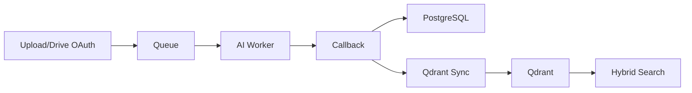
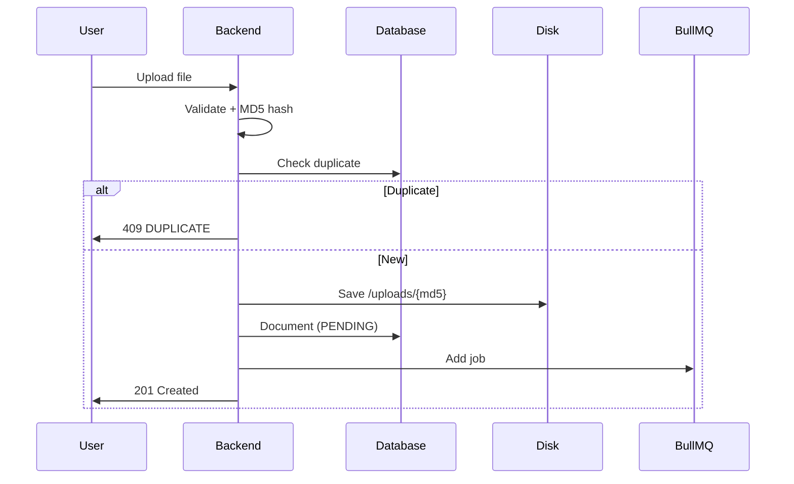
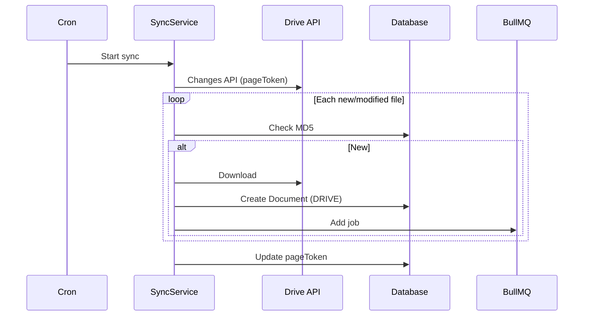
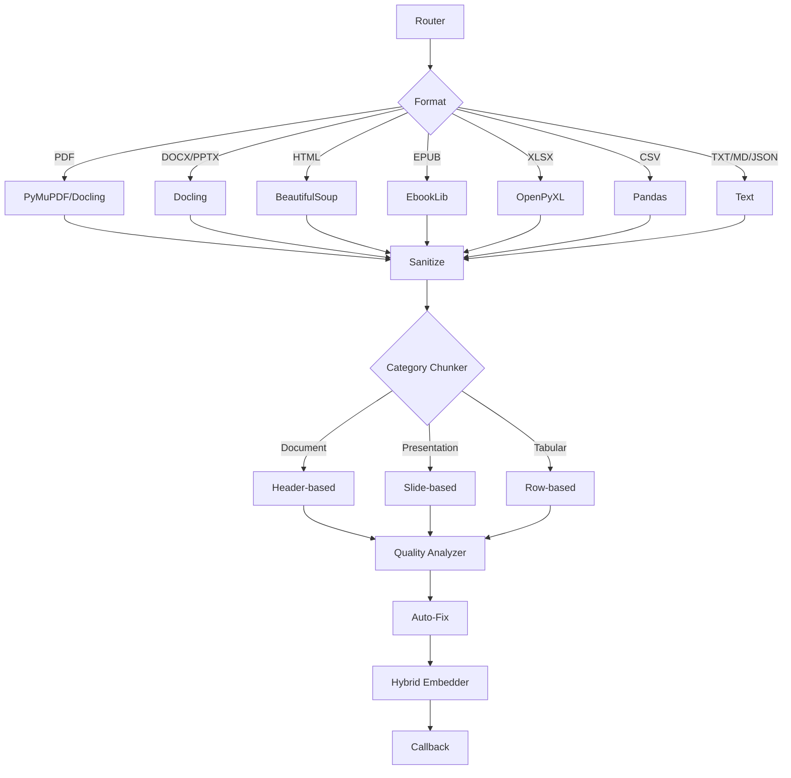
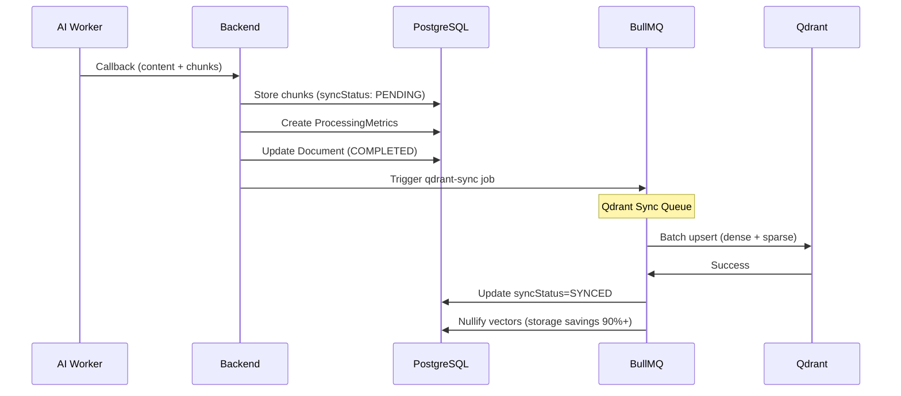

# RAGBase Data Flow

**Phase 5** | Import → Process → Store → Query | **Updated:** 2026-01-01

---

## Overview



---

## 1. Data Import

### 1.1 Manual Upload

**Endpoint:** `POST /api/documents`



**Validation:**
- Max size: From ProcessingProfile (default 50MB)
- Formats: PDF, DOCX, PPTX, HTML, EPUB, XLSX, CSV, TXT, MD, JSON
- Profile: Active profile snapshot

---

### 1.2 Google Drive Sync (Phase 5 - OAuth)

**OAuth Flow:**
1. `GET /api/oauth/google/url` → User consent
2. `GET /api/oauth/google/callback?code=xxx` → Exchange for tokens
3. Refresh token encrypted with AES-256-GCM → PostgreSQL

**Sync Flow:**


**Modes:**
- **Full**: First run (list all)
- **Incremental**: Changes API with pageToken

---

## 2. Processing Pipeline

### 2.1 Job Dispatch

```typescript
// BullMQ → HTTP POST /process
{
  documentId: string,
  filePath: string,
  format: FileFormat,
  config: ProfileConfig  // From ProcessingProfile
}
```

---

### 2.2 AI Worker Processing



**Chunking by Category:**

| Category | Formats | Strategy |
|----------|---------|----------|
| Document | PDF, DOCX, TXT, MD, HTML, EPUB, JSON | Header-based + breadcrumbs |
| Presentation | PPTX | Slide-based grouping |
| Tabular | XLSX, CSV | Row-based |

**Quality Flags:** TOO_SHORT, TOO_LONG, NO_CONTEXT, FRAGMENT, EMPTY  
**Auto-Fix:** Merge short, split long, inject context, skip empty  
**Scoring:** 1.0 - (0.15 × flag count)

---

### 2.3 Hybrid Embedding (Phase 5)

**Library:** `fastembed`  
**Models:**
- Dense: `BAAI/bge-small-en-v1.5` (384d)
- Sparse: `SPLADE` (neural sparse, stateless)

**Output per chunk:**
```python
{
  "content": str,
  "index": int,
  "denseVector": [384 floats],
  "sparseIndices": [int[]],
  "sparseValues": [float[]],
  "metadata": {
    "breadcrumbs": ["Chapter 1"],
    "location": {"page": 1},
    "qualityScore": 0.85,
    "qualityFlags": [],
    "tokenCount": 234,
    "chunkType": "document"
  }
}
```

---

## 3. Storage (Outbox Pattern)

**Endpoint:** `POST /internal/callback`



**Chunk Storage (PostgreSQL):**
- Temporary: `denseVector`, `sparseIndices`, `sparseValues` (PENDING)
- Permanent: `content`, `metadata`, `qualityScore`, `breadcrumbs`
- After sync: Vectors → `NULL`, `syncStatus` → `SYNCED`

---

## 4. Database Schema (Key Tables)

### Documents
- `id`, `filename`, `format`, `status`, `format_category`
- `processed_content`, `processing_profile_id`
- `source_type` (MANUAL/DRIVE), `is_active`

### Chunks
- `id`, `document_id`, `content`, `chunk_index`
- `breadcrumbs[]`, `quality_score`, `quality_flags[]`
- `chunk_type`, `token_count`, `location`
- **Phase 5:** `sync_status`, `dense_vector?`, `sparse_indices?`, `sparse_values?`, `qdrant_id?`

### DriveConfig (Phase 5)
- `id`, `user_id`, `encrypted_refresh_token`, `token_iv`, `token_auth_tag`
- `user_email`, `is_connected`, `page_token`

### DriveFolderMapping
- `id`, `drive_config_id`, `folder_id`, `folder_name`
- `sync_cron`, `enabled`, `sync_status`, `processing_profile_id`

### ProcessingProfile
- `id`, `name`, `is_active`, `is_default`
- Conversion: `pdf_converter`, `pdf_ocr_mode`
- Chunking: `document_chunk_size`, `document_chunk_overlap`
- Quality: `quality_min_chars`, `auto_fix_enabled`

### ProcessingMetrics (Analytics)
- `document_id`, `conversion_time_ms`, `chunking_time_ms`, `embedding_time_ms`
- `queue_time_ms`, `total_chunks`, `avg_quality_score`

---

## 5. Retrieval (Qdrant Hybrid Search)

**Endpoint:** `POST /api/query`

**Flow:**
1. Embed query → AI Worker (dense + sparse)
2. Qdrant RRF hybrid search:
   ```json
   {
     "prefetch": [{ "query": sparseVector, "using": "sparse", "limit": topK * 2 }],
     "query": denseVector,
     "using": "dense",
     "limit": topK
   }
   ```
3. Qdrant returns chunk IDs + RRF scores
4. Backend fetches content from PostgreSQL

**Response:**
- `score` - RRF combined score
- `vectorScore` - Dense component (semantic)
- `keywordScore` - Sparse component (SPLADE)

**Modes:**
- `semantic` - Dense only
- `hybrid` - Dense + Sparse with RRF fusion (default)

---

## 6. Deletion & Availability

### Hard Delete
- `DELETE /api/documents/:id` or `POST /api/documents/bulk/delete`
- Deletes: Document + Chunks (cascade) + Disk file + Qdrant vectors

### Availability Toggle
- `PATCH /api/documents/:id/availability`
- `isActive=false` → Excluded from query
- Only COMPLETED documents can be toggled

### Drive Sync Removal
- File removed from Drive → Document persists
- `connectionState` → `STANDALONE`

---

## 7. Key Data Flows

### Upload → Search
```
Upload → Queue → AI Worker (convert + chunk + embed) 
→ Callback → PostgreSQL (PENDING) → Qdrant Sync → SYNCED 
→ Search (Qdrant hybrid) → Results
```

### Drive Sync → Search
```
OAuth → Changes API → Download → Queue → Process 
→ Store → Qdrant → Search
```

### Vector Lifecycle
```
AI Worker generates → PostgreSQL stores (PENDING) 
→ Qdrant Sync uploads → Qdrant indexed 
→ PostgreSQL nullifies vectors (SYNCED) → Storage saved 90%+
```

---

**Phase 5 Status:** ✅ COMPLETE (2026-01-01)

**Key Features:**
- Per-user Drive OAuth with AES-256-GCM encryption
- Hybrid search: Dense (semantic) + Sparse (SPLADE) via Qdrant RRF
- Outbox pattern: Reliable sync + 90%+ storage savings
- 10 format converters with category-based chunking
- Quality analysis + auto-fix + ProcessingProfiles
