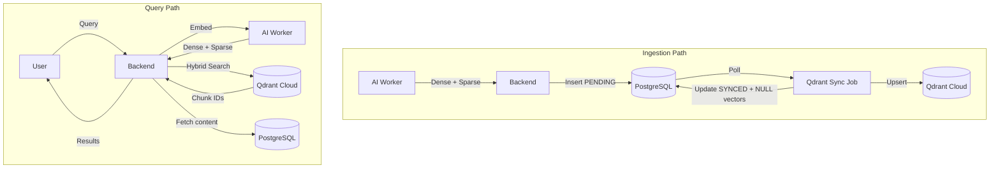

# Phase 5 Detailed Implementation Plan

**Qdrant Hybrid Search + AES-256 Security** | **TDD Approach**

---

## Overview

| Part | Name | Description | Status |
|------|------|-------------|--------|
| **5A** | AES-256-GCM Encryption | Encrypt/decrypt Drive OAuth tokens | ⬜ Planned |
| **5B** | Neural Sparse Embeddings | Add SPLADE sparse vectors to AI Worker | ⬜ Planned |
| **5C** | Qdrant Integration | Collection setup, upsert, hybrid search | ⬜ Planned |
| **5D** | Outbox Pattern | Sync queue, cleanup, retry logic | ⬜ Planned |
| **5E** | Search Migration | Replace pgvector/tsvector with Qdrant | ⬜ Planned |

---

## Architecture (Phase 5)

### Current → Target

```
┌─────────────────────────────────────────────────────────────────────┐
│                          CURRENT (Phase 4)                          │
├─────────────────────────────────────────────────────────────────────┤
│  AI Worker → Dense Vector (384d)                                    │
│  Backend   → Store in PostgreSQL (pgvector)                         │
│  Search    → pgvector + tsvector (BM25)                             │
│  Drive     → Plain text refresh_token                               │
└─────────────────────────────────────────────────────────────────────┘
                                ↓
┌─────────────────────────────────────────────────────────────────────┐
│                          TARGET (Phase 5)                           │
├─────────────────────────────────────────────────────────────────────┤
│  AI Worker → Dense (384d) + Sparse (SPLADE indices/values)          │
│  Backend   → Stage in PostgreSQL → Sync to Qdrant → Cleanup         │
│  Search    → Qdrant Hybrid (RRF fusion)                             │
│  Drive     → AES-256-GCM encrypted refresh_token                    │
└─────────────────────────────────────────────────────────────────────┘
```

### Data Flow



---

## Part 5A: AES-256-GCM Encryption

### 5A.1 EncryptionService Spec

**File:** `apps/backend/src/services/encryption.service.ts`

```typescript
interface EncryptedPayload {
  ciphertext: string;  // Base64 encoded
  iv: string;          // Base64 encoded (12 bytes)
  authTag: string;     // Base64 encoded (16 bytes)
}

class EncryptionService {
  constructor(keyHex: string);  // 32-byte hex (64 chars)
  
  encrypt(plaintext: string): EncryptedPayload;
  decrypt(payload: EncryptedPayload): string;
}
```

**Algorithm:**
- Cipher: AES-256-GCM (AEAD)
- Key: 32 bytes from `APP_ENCRYPTION_KEY` env
- IV: 12 bytes, random per encryption
- Auth Tag: 16 bytes (GCM default)

### 5A.2 Schema Changes

```prisma
model DriveConfig {
  // ... existing fields ...
  
  // NEW: Encrypted OAuth tokens
  encryptedRefreshToken  String?  @map("encrypted_refresh_token")
  tokenIv                String?  @map("token_iv")
  tokenAuthTag           String?  @map("token_auth_tag")
  
  // DEPRECATED (keep for migration)
  refreshToken           String?  @map("refresh_token")
}
```

### 5A.3 TDD Test Cases

```typescript
// apps/backend/tests/unit/encryption.service.test.ts

describe('EncryptionService', () => {
  test('should encrypt and decrypt plaintext correctly');
  test('should produce different ciphertext for same plaintext (random IV)');
  test('should fail with invalid auth tag (tamper detection)');
  test('should fail with invalid key length');
  test('should handle empty string');
  test('should handle unicode characters');
});
```

---

## Part 5B: Neural Sparse Embeddings

### 5B.1 Embedder Updates

**File:** `apps/ai-worker/src/embedder.py`

```python
from fastembed import TextEmbedding, SparseTextEmbedding

class HybridEmbedder:
    def __init__(self):
        self.dense_model = TextEmbedding("BAAI/bge-small-en-v1.5")
        self.sparse_model = SparseTextEmbedding("Qdrant/bm25")
    
    def embed(self, texts: List[str]) -> List[HybridVector]:
        """Return combined dense + sparse vectors."""
        dense = list(self.dense_model.embed(texts))
        sparse = list(self.sparse_model.embed(texts))
        
        return [
            HybridVector(
                dense=d.tolist(),
                sparse=SparseVector(
                    indices=s.indices.tolist(),
                    values=s.values.tolist()
                )
            )
            for d, s in zip(dense, sparse)
        ]
```

### 5B.2 Models Update

```python
# apps/ai-worker/src/models.py

@dataclass
class SparseVector:
    indices: List[int]
    values: List[float]

@dataclass
class HybridVector:
    dense: List[float]       # 384 floats
    sparse: SparseVector     # Variable length

@dataclass
class ChunkOutput:
    content: str
    metadata: Dict[str, Any]
    vector: HybridVector     # Updated from List[float]
```

### 5B.3 API Response Schema

```python
# POST /callback response body
{
  "documentId": "uuid",
  "processedContent": "...",
  "chunks": [
    {
      "content": "...",
      "metadata": {...},
      "vector": {
        "dense": [0.1, 0.2, ...],  # 384 floats
        "sparse": {
          "indices": [123, 456, ...],
          "values": [0.8, 0.5, ...]
        }
      }
    }
  ]
}
```

### 5B.4 TDD Test Cases

```python
# apps/ai-worker/tests/test_hybrid_embedder.py

def test_embed_returns_dense_384_dimensions():
    pass

def test_embed_returns_sparse_indices_and_values():
    pass

def test_sparse_indices_are_sorted():
    pass

def test_embed_batch_returns_correct_count():
    pass

def test_empty_text_returns_valid_vectors():
    pass
```

---

## Part 5C: Qdrant Integration

### 5C.1 QdrantService Spec

**File:** `apps/backend/src/services/qdrant.service.ts`

```typescript
interface QdrantPoint {
  id: string;           // Chunk UUID
  vector: {
    dense: number[];    // 384 floats
    sparse: {
      indices: number[];
      values: number[];
    };
  };
  payload: {
    documentId: string;
    content: string;
    metadata: Record<string, unknown>;
  };
}

interface HybridSearchParams {
  dense: number[];
  sparse: { indices: number[]; values: number[] };
  topK: number;
  filter?: QdrantFilter;
}

class QdrantService {
  // Collection management
  async ensureCollection(): Promise<void>;
  
  // CRUD
  async upsertPoints(points: QdrantPoint[]): Promise<void>;
  async deletePoints(ids: string[]): Promise<void>;
  async deleteByDocumentId(documentId: string): Promise<void>;
  
  // Search
  async hybridSearch(params: HybridSearchParams): Promise<SearchResult[]>;
}
```

### 5C.2 Collection Schema

```javascript
// Qdrant collection configuration
{
  "collection_name": "ragbase_hybrid",
  "vectors": {
    "dense": {
      "size": 384,
      "distance": "Cosine"
    }
  },
  "sparse_vectors": {
    "sparse": {
      "index": {
        "on_disk": true  // Critical for Free tier (1GB)
      }
    }
  }
}
```

> **⚠️ Qdrant Cloud Free Tier Warning:**
> - Free tier = 1GB storage
> - Sparse vectors can grow fast (~5K chunks may fill tier)
> - Monitor via Qdrant Dashboard, upgrade to Starter (4GB) for production
> - `on_disk: true` is already set to save RAM

### 5C.3 Environment Variables

```bash
# .env
# Qdrant Cloud
QDRANT_URL=https://<cluster-id>.us-east4-0.gcp.cloud.qdrant.io:6333
QDRANT_API_KEY=<your-api-key>  # Required for Qdrant Cloud
QDRANT_COLLECTION=ragbase_hybrid
VECTOR_DB_PROVIDER=qdrant  # Feature flag: "pgvector" | "qdrant"
```

**Qdrant Cloud Setup:**
1. Create account at [cloud.qdrant.io](https://cloud.qdrant.io)
2. Create cluster (Free tier: 1GB, Starter: 4GB+)
3. Copy cluster URL and API key to `.env`
4. Collection auto-created by `QdrantService.ensureCollection()`

### 5C.4 Hybrid Search with Query API (Qdrant 1.10+)

**Use Qdrant's Prefetch + Fusion for server-side RRF** (no manual calculation):

```typescript
// QdrantService.hybridSearch - Using Query API
async hybridSearch(params: HybridSearchParams): Promise<SearchResult[]> {
  const response = await this.client.query(COLLECTION_NAME, {
    prefetch: [
      {
        query: params.sparse,  // Sparse vector
        using: 'sparse',
        limit: params.topK * 2
      }
    ],
    query: params.dense,       // Dense vector
    using: 'dense',
    limit: params.topK,
    with_payload: true,        // Returns content directly!
  });
  
  return response.points.map(p => ({
    id: p.id as string,
    score: p.score,
    payload: p.payload as ChunkPayload
  }));
}
```

**Benefits:**
- RRF fusion computed server-side (faster)
- Single round-trip to Qdrant Cloud
- Payload includes content (no PostgreSQL fetch needed)

### 5C.5 TDD Test Cases

```typescript
// apps/backend/tests/integration/qdrant.service.test.ts

describe('QdrantService', () => {
  test('ensureCollection creates collection if not exists');
  test('upsertPoints inserts new points');
  test('upsertPoints updates existing points');
  test('deletePoints removes points by ID');
  test('deleteByDocumentId removes all chunks for document');
  test('hybridSearch returns results sorted by RRF score');
  test('hybridSearch with filter returns filtered results');
});
```

---

## Part 5D: Outbox Pattern (Sync Queue)

### 5D.1 Schema Changes

```prisma
model Chunk {
  // ... existing fields ...
  
  // NEW: Qdrant sync status
  syncStatus     SyncStatus  @default(PENDING) @map("sync_status")
  qdrantId       String?     @map("qdrant_id")
  
  // NEW: Vectors (nullable after sync)
  denseVector    Float[]?    @map("dense_vector")
  sparseIndices  Int[]?      @map("sparse_indices")
  sparseValues   Float[]?    @map("sparse_values")
  
  // DEPRECATED: Will be removed after migration
  embedding      Unsupported("vector(384)")
}

enum SyncStatus {
  PENDING
  SYNCED
  FAILED
}
```

### 5D.2 Sync Job Processor

**File:** `apps/backend/src/queue/qdrant-sync.processor.ts`

```typescript
// Job: qdrant-sync
// Triggered: After document processing callback
// Batch size: 100 chunks

async function processQdrantSync(job: Job) {
  // 1. Fetch PENDING chunks (limit 100)
  const chunks = await prisma.chunk.findMany({
    where: { syncStatus: 'PENDING' },
    take: 100,
    include: { document: true }
  });
  
  // 2. Build Qdrant points
  const points = chunks.map(c => ({
    id: c.id,
    vector: {
      dense: c.denseVector,
      sparse: { indices: c.sparseIndices, values: c.sparseValues }
    },
    payload: { documentId: c.documentId, content: c.content, ... }
  }));
  
  // 3. Upsert to Qdrant
  await qdrantService.upsertPoints(points);
  
  // 4. Update status + nullify vectors
  await prisma.chunk.updateMany({
    where: { id: { in: chunks.map(c => c.id) } },
    data: {
      syncStatus: 'SYNCED',
      denseVector: null,
      sparseIndices: null,
      sparseValues: null
    }
  });
}
```

### 5D.3 Retry Logic

```typescript
// BullMQ job options
{
  attempts: 3,
  backoff: {
    type: 'exponential',
    delay: 5000  // 5s, 10s, 20s
  }
}

// On max retries exceeded
// Mark chunks as FAILED, log error
```

### 5D.4 TDD Test Cases

```typescript
// apps/backend/tests/integration/qdrant-sync.test.ts

describe('QdrantSyncProcessor', () => {
  test('syncs PENDING chunks to Qdrant');
  test('updates syncStatus to SYNCED after success');
  test('nullifies vectors in PostgreSQL after sync');
  test('marks syncStatus as FAILED after max retries');
  test('handles partial batch failure');
  test('skips already SYNCED chunks');
});
```

---

## Part 5E: Search Migration

### 5E.1 HybridSearchService Refactor

**File:** `apps/backend/src/services/hybrid-search.ts`

```typescript
// Before: pgvector + tsvector + PostgreSQL fetch
// After: Qdrant Cloud hybrid - content from payload (no DB roundtrip)

class HybridSearchService {
  async search(params: HybridSearchParams): Promise<SearchResult[]> {
    // 1. Get query embeddings from AI Worker
    const queryVectors = await aiWorkerClient.embed(params.queryText);
    
    // 2. Qdrant hybrid search (returns content in payload)
    const results = await qdrantService.hybridSearch({
      dense: queryVectors.dense,
      sparse: queryVectors.sparse,
      topK: params.topK
    });
    
    // 3. Map results - content from Qdrant payload (no PostgreSQL fetch!)
    return results.map(r => ({
      id: r.id,
      content: r.payload.content,
      documentId: r.payload.documentId,
      score: r.score,
      metadata: r.payload.metadata
    }));
  }
}
```

> **Note:** PostgreSQL is now "Cold Storage" - only for backup/re-sync.
> Search is 100% from Qdrant Cloud.

### 5E.2 Query Embedding Endpoint

**File:** `apps/ai-worker/src/main.py`

```python
@app.post("/embed")
async def embed_query(request: EmbedRequest) -> EmbedResponse:
    """Embed query text for search (returns dense + sparse)."""
    vectors = embedder.embed([request.text])
    return EmbedResponse(
        dense=vectors[0].dense,
        sparse=vectors[0].sparse
    )
```

### 5E.3 Feature Flag Migration

```typescript
// config.ts
const VECTOR_DB_PROVIDER = process.env.VECTOR_DB_PROVIDER || 'pgvector';

// hybrid-search.ts
if (VECTOR_DB_PROVIDER === 'qdrant') {
  return qdrantSearchService.search(params);
} else {
  return pgvectorSearchService.search(params);  // Legacy
}
```

### 5E.4 TDD Test Cases

```typescript
// apps/backend/tests/e2e/hybrid-search-qdrant.test.ts

describe('Hybrid Search (Qdrant)', () => {
  test('returns results for semantic query');
  test('returns results for keyword query');
  test('combines semantic and keyword (RRF fusion)');
  test('respects topK limit');
  test('includes document metadata');
  test('handles empty results gracefully');
});
```

---

## Database Schema Changes (Dev Phase)

> **Note:** Dev phase - no migrations needed. Drop database and recreate with new schema.

```bash
# Reset database (dev only)
cd apps/backend
npx prisma db push --force-reset
```

### Chunk Model (New Fields)

```prisma
model Chunk {
  // ... existing fields ...
  
  // Qdrant sync
  syncStatus     SyncStatus  @default(PENDING) @map("sync_status")
  qdrantId       String?     @map("qdrant_id")
  
  // Vectors (nullable after sync to Qdrant Cloud)
  denseVector    Float[]?    @map("dense_vector")
  sparseIndices  Int[]?      @map("sparse_indices")
  sparseValues   Float[]?    @map("sparse_values")
}

enum SyncStatus {
  PENDING
  SYNCED
  FAILED
}
```

### DriveConfig Model (New Fields)

```prisma
model DriveConfig {
  // ... existing fields ...
  
  // Encrypted OAuth tokens (AES-256-GCM)
  encryptedRefreshToken  String?  @map("encrypted_refresh_token")
  tokenIv                String?  @map("token_iv")
  tokenAuthTag           String?  @map("token_auth_tag")
}
```

---

## Configuration Summary

### Environment Variables (New)

```bash
# Security
APP_ENCRYPTION_KEY=<64-char-hex>  # openssl rand -hex 32

# Qdrant Cloud
QDRANT_URL=https://<cluster-id>.us-east4-0.gcp.cloud.qdrant.io:6333
QDRANT_API_KEY=<your-api-key>
QDRANT_COLLECTION=ragbase_hybrid

# Feature Flags
VECTOR_DB_PROVIDER=qdrant  # "pgvector" | "qdrant"
```

### Dependencies (New)

**AI Worker:**
```txt
# requirements.txt
fastembed>=0.3.0
```

**Backend:**
```json
// package.json
{
  "@qdrant/js-client-rest": "^1.12.0"
}
```

---

## Implementation Order (TDD)

### Week 1: Security Layer
1. Write `EncryptionService` tests
2. Implement `EncryptionService`
3. Add DriveConfig schema columns
4. Update OAuth callback to encrypt
5. Update SyncService to decrypt

### Week 2: AI Worker Updates
1. Write `HybridEmbedder` tests
2. Add `fastembed` dependency
3. Implement `HybridEmbedder`
4. Update callback response schema
5. Add `/embed` endpoint

### Week 3: Qdrant Integration
1. Write `QdrantService` tests
2. Add Qdrant client dependency
3. Implement `QdrantService`
4. Write sync processor tests
5. Implement sync processor

### Week 4: Search Migration
1. Update `HybridSearchService` tests
2. Refactor to use Qdrant
3. Add feature flag
4. E2E tests
5. Backfill existing data

---

## Qdrant Cloud Setup

### Cluster Configuration

| Setting | Value |
|---------|-------|
| **Provider** | GCP / AWS / Azure |
| **Region** | us-east4 (or nearest) |
| **Tier** | Free (1GB) → Starter (4GB+) for production |
| **Collection** | `ragbase_hybrid` (auto-created) |

### Connection

```typescript
// apps/backend/src/services/qdrant.service.ts
import { QdrantClient } from '@qdrant/js-client-rest';

const client = new QdrantClient({
  url: process.env.QDRANT_URL,      // https://<cluster>.cloud.qdrant.io:6333
  apiKey: process.env.QDRANT_API_KEY
});
```

**No local container needed** - fully managed cloud service.

---

## Success Criteria

| Criteria | Test |
|----------|------|
| AES encryption working | Unit tests pass |
| Dense + Sparse returned | AI Worker tests pass |
| Qdrant upsert working | Integration tests pass |
| Outbox pattern working | Sync tests pass |
| Hybrid search returning results | E2E tests pass |
| Vectors nullified after sync | DB verification |
| Zero regression | All Phase 1-4 tests pass |
