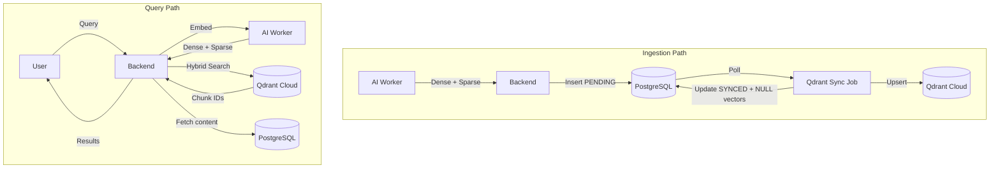

# Phase 5 Detailed Implementation Plan

**Qdrant Hybrid Search + AES-256 Security + OAuth UI** | **TDD Approach**

---

## Overview

| Part | Name | Description | Status |
|------|------|-------------|--------|
| **5A** | AES-256-GCM Encryption | Encrypt/decrypt Drive OAuth tokens | ✅ Done |
| **5B** | Neural Sparse Embeddings | Add SPLADE sparse vectors to AI Worker | ✅ Done |
| **5C** | Qdrant Integration | Collection setup, upsert, hybrid search | ✅ Done |
| **5D** | Outbox Pattern | Sync queue, cleanup, retry logic | ✅ Done |
| **5E** | Search Migration | Replace pgvector/tsvector with Qdrant | ✅ Done |
| **5F** | Per-User OAuth | OAuth flow with encrypted tokens | ✅ Done |
| **5G** | Qdrant Provider Indicator | Show "Powered by Qdrant" badge | ✅ Done |
| **5H** | Sync Status UI | Show PENDING/SYNCED/FAILED in Chunks | ✅ Done |
| **5I** | Settings Dashboard | System health status page | ✅ Done |
| **5J** | Analytics Enhancements | Sync queue metrics | ✅ Done |
| **5K** | Folder Picker | Google Drive Picker for folder selection | ✅ Done |
| **5L** | Sync Frequency UI | Dropdown presets instead of cron | ✅ Done |

---

## Architecture (Phase 5)

### Current → Target

```
┌─────────────────────────────────────────────────────────────────────┐
│                          CURRENT (Phase 4)                          │
├─────────────────────────────────────────────────────────────────────┤
│  AI Worker → Dense Vector (384d)                                    │
│  Backend   → Store in PostgreSQL (pgvector)                         │
│  Search    → pgvector + tsvector (BM25)                             │
│  Drive     → Plain text refresh_token                               │
└─────────────────────────────────────────────────────────────────────┘
                                ↓
┌─────────────────────────────────────────────────────────────────────┐
│                          TARGET (Phase 5)                           │
├─────────────────────────────────────────────────────────────────────┤
│  AI Worker → Dense (384d) + Sparse (BM25 indices/values)            │
│  Backend   → Stage in PostgreSQL → Sync to Qdrant → Cleanup         │
│  Search    → Qdrant Hybrid (RRF fusion)                             │
│  Drive     → AES-256-GCM encrypted refresh_token + OAuth            │
│  UI        → Folder Picker + Sync Frequency Dropdown                │
└─────────────────────────────────────────────────────────────────────┘
```

### Data Flow



---

## Part 5A: AES-256-GCM Encryption

### Implementation

**File:** `apps/backend/src/services/encryption.service.ts`

```typescript
interface EncryptedPayload {
  ciphertext: string;  // Base64 encoded
  iv: string;          // Base64 encoded (12 bytes)
  authTag: string;     // Base64 encoded (16 bytes)
}

class EncryptionService {
  constructor(keyHex: string);  // 32-byte hex (64 chars)
  encrypt(plaintext: string): EncryptedPayload;
  decrypt(payload: EncryptedPayload): string;
}
```

**Algorithm:**
- Cipher: AES-256-GCM (AEAD)
- Key: 32 bytes from `APP_ENCRYPTION_KEY` env
- IV: 12 bytes, random per encryption
- Auth Tag: 16 bytes (GCM default)

---

## Part 5B: Neural Sparse Embeddings

### Implementation

**File:** `apps/ai-worker/src/embedder.py`

```python
from fastembed import TextEmbedding, SparseTextEmbedding

class HybridEmbedder:
    def __init__(self):
        self.dense_model = TextEmbedding("BAAI/bge-small-en-v1.5")
        self.sparse_model = SparseTextEmbedding("Qdrant/bm25")
    
    def embed(self, texts: List[str]) -> List[HybridVector]:
        dense = list(self.dense_model.embed(texts))
        sparse = list(self.sparse_model.embed(texts))
        return [HybridVector(dense=d, sparse=s) for d, s in zip(dense, sparse)]
```

---

## Part 5C: Qdrant Integration

### Collection Schema

```javascript
{
  "collection_name": "ragbase_hybrid",
  "vectors": {
    "dense": { "size": 384, "distance": "Cosine" }
  },
  "sparse_vectors": {
    "sparse": { "index": { "on_disk": true } }
  }
}
```

### Hybrid Search (Query API)

```typescript
async hybridSearch(params: HybridSearchParams): Promise<SearchResult[]> {
  const response = await this.client.query(COLLECTION_NAME, {
    prefetch: [{ query: params.sparse, using: 'sparse', limit: params.topK * 2 }],
    query: params.dense,
    using: 'dense',
    limit: params.topK,
    with_payload: true,
  });
  return response.points;
}
```

---

## Part 5D: Outbox Pattern (Sync Queue)

### Schema

```prisma
model Chunk {
  syncStatus     SyncStatus  @default(PENDING)
  denseVector    Float[]?
  sparseIndices  Int[]?
  sparseValues   Float[]?
}

enum SyncStatus { PENDING, SYNCED, FAILED }
```

### Sync Processor

- Batch size: 100 chunks
- Retry: 3 attempts, exponential backoff
- After sync: NULL vectors in PostgreSQL

---

## Part 5E: Search Migration

Feature flag: `VECTOR_DB_PROVIDER=qdrant | pgvector`

```typescript
if (VECTOR_DB_PROVIDER === 'qdrant') {
  return qdrantSearchService.search(params);
} else {
  return pgvectorSearchService.search(params);
}
```

---

## Part 5F: Per-User OAuth Integration

### Backend Routes

**File:** `apps/backend/src/routes/oauth/google.route.ts`

| Route | Description |
|-------|-------------|
| `GET /oauth/google/start` | Redirect to Google consent |
| `GET /oauth/google/callback` | Exchange code, encrypt token, save |
| `GET /oauth/google/status` | Check if connected |
| `GET /oauth/google/access-token` | Get access token for Picker |
| `POST /oauth/google/disconnect` | Remove credentials |

### DriveOAuth Model

```prisma
model DriveOAuth {
  id                    String   @id @default("system")
  encryptedRefreshToken String
  tokenIv               String
  tokenAuthTag          String
  userEmail             String?
  connectedAt           DateTime
}
```

---

## Part 5G: Qdrant Provider Indicator

**File:** `apps/frontend/src/components/query/results-list.tsx`

Shows "Powered by Qdrant" badge when `provider === 'qdrant'`.

---

## Part 5H: Sync Status Indicator

**File:** `apps/frontend/src/api/endpoints.ts`

```typescript
interface ChunkListItem {
  syncStatus: 'PENDING' | 'SYNCED' | 'FAILED';
}
```

Chunks Explorer shows colored badges per chunk.

---

## Part 5I: Settings Dashboard

**File:** `apps/frontend/src/components/settings/SettingsPage.tsx`

Displays:
- Vector DB provider + status
- Qdrant connection + collection status
- AES-256 encryption configuration
- AI Worker status
- OAuth connection status

---

## Part 5J: Analytics Enhancements

**File:** `apps/frontend/src/components/analytics/AnalyticsPage.tsx`

Added:
- Sync queue metrics (PENDING/SYNCED/FAILED counts)
- Search performance by provider

---

## Part 5K: Google Drive Folder Picker

### Backend

**Route:** `GET /oauth/google/access-token`

Returns short-lived access token for Google Picker API.

### Frontend

**File:** `apps/frontend/src/hooks/useDrivePicker.ts`

```typescript
function useDrivePicker() {
  openPicker(): Promise<{ folderId: string; folderName: string } | null>
}
```

**File:** `apps/frontend/src/components/drive/AddFolderModal.tsx`

- Replaced folder ID input with "Select Folder from Drive" button
- Opens native Google Drive Picker popup
- Auto-populates folder ID and name

### Environment Variables

```bash
# Frontend .env
VITE_GOOGLE_PICKER_API_KEY=<your-picker-api-key>
VITE_GOOGLE_CLIENT_ID=<your-client-id>
```

### Google Cloud Console Setup

1. Enable **Google Picker API**
2. Create API Key with Picker API restriction
3. Add to frontend `.env`

---

## Part 5L: Sync Frequency UI

**File:** `apps/frontend/src/components/drive/SyncFrequencySelect.tsx`

Dropdown presets:

| Label | Cron |
|-------|------|
| Every 15 minutes | `*/15 * * * *` |
| Every hour | `0 * * * *` |
| Every 6 hours | `0 */6 * * *` |
| Every 12 hours | `0 */12 * * *` |
| Daily | `0 0 * * *` |
| Manual only | (empty) |

---

## Configuration Summary

### Environment Variables

```bash
# Backend .env
DATABASE_URL=postgresql://...
REDIS_URL=redis://localhost:6379

# Qdrant Cloud
QDRANT_URL=https://<cluster>.cloud.qdrant.io:6333
QDRANT_API_KEY=<your-api-key>
QDRANT_COLLECTION=ragbase_hybrid
VECTOR_DB_PROVIDER=qdrant

# Security
APP_ENCRYPTION_KEY=<64-char-hex>

# OAuth
GOOGLE_CLIENT_ID=<client-id>
GOOGLE_CLIENT_SECRET=<client-secret>
GOOGLE_REDIRECT_URI=http://localhost:3000/api/oauth/google/callback
GOOGLE_PICKER_API_KEY=<picker-api-key>
```

```bash
# Frontend .env
VITE_API_URL=http://localhost:3000/api
VITE_GOOGLE_PICKER_API_KEY=<picker-api-key>
VITE_GOOGLE_CLIENT_ID=<client-id>
```

### Dependencies

**AI Worker:** `fastembed>=0.3.0`

**Backend:** `@qdrant/js-client-rest ^1.12.0`

---

## Success Criteria

| Criteria | Status |
|----------|--------|
| AES encryption working | ✅ |
| Dense + Sparse embeddings | ✅ |
| Qdrant upsert/search | ✅ |
| Outbox sync pattern | ✅ |
| OAuth with encrypted tokens | ✅ |
| Provider indicator UI | ✅ |
| Sync status in Chunks | ✅ |
| Settings dashboard | ✅ |
| Analytics enhancements | ✅ |
| Folder Picker | ✅ |
| Sync frequency dropdown | ✅ |
| Zero regression | ✅ |
