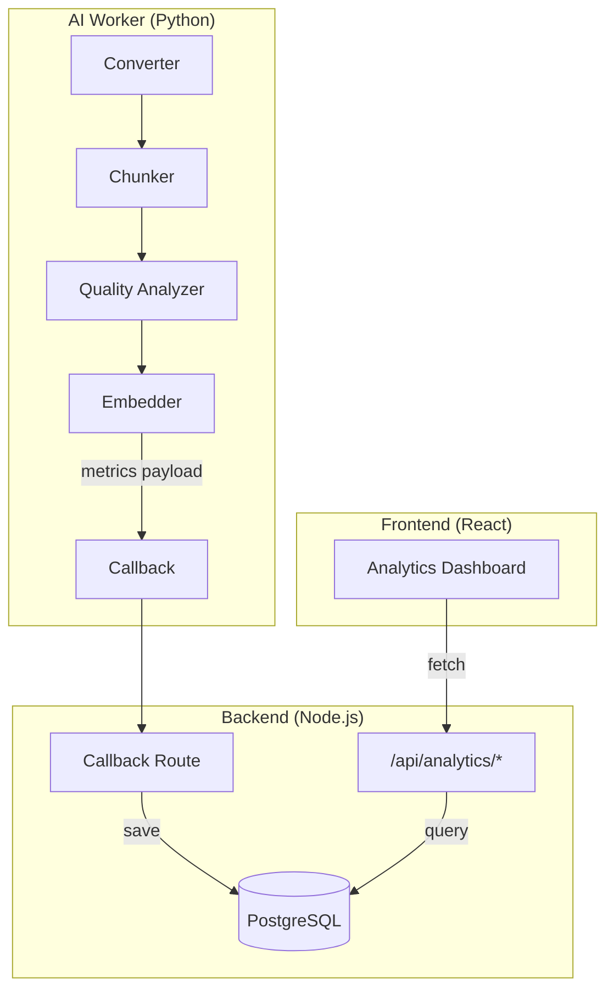

# RAGBase Analytics Dashboard

> **Status**: Planning  
> **Priority**: High  
> **Estimated Effort**: 12-16 hours

---

## 1. Overview

Build a custom, in-app analytics dashboard to track RAG pipeline performance and quality metrics. The dashboard will be integrated into the existing React frontend for end-users.

### Goals

- Track processing time breakdown per stage
- Monitor chunking efficiency and quality scores
- Provide insights for pipeline optimization
- Enable users to view their document processing metrics

---

## 2. Architecture



---

## 3. Metrics Specification

### 3.1 Processing Metrics (Per Document)

| Metric | Type | Description |
|--------|------|-------------|
| `enqueuedAt` | DateTime | When job was added to queue |
| `startedAt` | DateTime | When worker started processing |
| `completedAt` | DateTime | When processing finished |
| `queueTimeMs` | Int | Time waiting in queue (`startedAt - enqueuedAt`) |
| `conversionTimeMs` | Int | Raw file → Markdown conversion time |
| `chunkingTimeMs` | Int | Markdown → Chunks processing time |
| `embeddingTimeMs` | Int | Embedding generation time |
| `totalTimeMs` | Int | Processing time (`conversionTimeMs + chunkingTimeMs + embeddingTimeMs`) |
| `userWaitTimeMs` | Int | **End-to-end user perspective** (`queueTimeMs + totalTimeMs`) |
| `rawSizeBytes` | Int | Original file size |
| `markdownSizeChars` | Int | Output markdown length |

> [!TIP]
> When `queueTimeMs` is consistently high, consider scaling up workers.

### 3.2 Chunking Metrics

| Metric | Type | Description |
|--------|------|-------------|
| `totalChunks` | Int | Number of chunks created |
| `avgChunkSize` | Float | Average characters per chunk |
| `oversizedChunks` | Int | Chunks that required re-splitting |

### 3.3 Quality Metrics

| Metric | Type | Description |
|--------|------|-------------|
| `avgQualityScore` | Float | Average quality score (0-1) |
| `qualityFlags` | JSON | Count per flag type (TOO_SHORT, NO_CONTEXT, etc.) |
| `totalTokens` | Int | Total tokens for embeddings |

### 3.4 Search Metrics (Future Phase)

| Metric | Type | Description |
|--------|------|-------------|
| `searchLatencyMs` | Int | Query response time |
| `resultsReturned` | Int | Number of results returned |
| `searchType` | Enum | Vector/Keyword/Hybrid |

---

## 4. Database Schema

### 4.1 Migration from `processingMetadata`

Currently, `Document.processingMetadata` stores:
```json
{
  "pageCount": 10,
  "ocrApplied": true,
  "processingTimeMs": 5000
}
```

**Migration Plan**:
| Current (JSON) | Target (ProcessingMetrics) |
|----------------|---------------------------|
| `pageCount` | `pageCount` (dedicated field) |
| `ocrApplied` | `ocrApplied` (dedicated field) |
| `processingTimeMs` | `totalTimeMs` + breakdown fields |

> [!IMPORTANT]
> After migration, deprecate and eventually remove `processingMetadata` JSON field from Document model.

### 4.2 New ProcessingMetrics Model

```prisma
model Document {
  // ... existing fields ...
  
  // Add relation to ProcessingMetrics
  processingMetrics   ProcessingMetrics?
}

model ProcessingMetrics {
  id                String   @id @default(cuid())
  documentId        String   @unique
  document          Document @relation(fields: [documentId], references: [id], onDelete: Cascade)
  
  // Migrated from processingMetadata JSON
  pageCount         Int      @default(0)
  ocrApplied        Boolean  @default(false)
  
  // Queue & timing (for infrastructure monitoring)
  enqueuedAt        DateTime?
  startedAt         DateTime?
  completedAt       DateTime?
  queueTimeMs       Int      @default(0)  // startedAt - enqueuedAt
  
  // Processing time breakdown
  conversionTimeMs  Int      @default(0)
  chunkingTimeMs    Int      @default(0)
  embeddingTimeMs   Int      @default(0)
  totalTimeMs       Int      @default(0)  // Sum of above
  userWaitTimeMs    Int      @default(0)  // queueTimeMs + totalTimeMs
  
  // Size metrics
  rawSizeBytes      Int      @default(0)
  markdownSizeChars Int      @default(0)
  
  // Chunking efficiency
  totalChunks       Int      @default(0)
  avgChunkSize      Float    @default(0)
  oversizedChunks   Int      @default(0)
  
  // Quality summary (aggregated from chunks)
  avgQualityScore   Float    @default(0)
  qualityFlags      Json     @default("{}")  // {"TOO_SHORT": 2, "NO_CONTEXT": 1}
  totalTokens       Int      @default(0)
  
  createdAt         DateTime @default(now())
  
  @@index([createdAt])
}
```

---

## 5. API Endpoints

### Analytics Endpoints

| Endpoint | Method | Description |
|----------|--------|-------------|
| `/api/analytics/overview` | GET | Summary stats (total docs, avg time, avg quality) |
| `/api/analytics/processing` | GET | Processing time trends, breakdown by stage |
| `/api/analytics/quality` | GET | Quality score distribution, flag counts |
| `/api/analytics/documents` | GET | Per-document metrics (paginated) |
| `/api/analytics/documents/:id/chunks` | GET | Chunks of a specific document (for inspection) |

### Chunks Explorer Endpoints

| Endpoint | Method | Description |
|----------|--------|-------------|
| `/api/chunks` | GET | List all chunks (paginated, filterable) |
| `/api/chunks/:id` | GET | Single chunk detail |

### Query Parameters

**Analytics:**
- `period`: `24h` | `7d` | `30d` | `all` (default: `7d`)
- `page`, `limit`: For pagination

**Chunks Explorer:**
- `documentId`: Filter by specific document
- `quality`: `excellent` (≥0.85) | `good` (0.70-0.84) | `low` (<0.70)
- `flags`: `TOO_SHORT` | `TOO_LONG` | `NO_CONTEXT` | `FRAGMENT`
- `type`: `document` | `presentation` | `tabular`
- `search`: Full-text search in content
- `page`, `limit`: Pagination

### Response Examples

```json
// GET /api/analytics/overview?period=7d
{
  "totalDocuments": 1234,
  "avgProcessingTimeMs": 2340,
  "avgQualityScore": 0.85,
  "totalChunks": 15420,
  "periodStart": "2024-12-18T00:00:00Z",
  "periodEnd": "2024-12-25T00:00:00Z"
}
```

---

## 6. Dashboard UI Design

### 6.1 Main Layout - Pipeline Funnel View (Top-Down)

```
┌─────────────────────────────────────────────────────────────────────────┐
│  📊 Analytics Dashboard                              [24h] [7d] [30d]   │
├─────────────────────────────────────────────────────────────────────────┤
│                                                                          │
│  ┌───────────────────────────────────────────────────────────────────┐  │
│  │  ① UPLOAD / QUEUE                                                 │  │
│  │  ┌─────────────────────────────────────────────────────────────┐  │  │
│  │  │  📁 1,234 files uploaded                                    │  │  │
│  │  │  ⏱️ Avg Queue Time: 2.1s    │   ❌ 0 in queue               │  │  │
│  │  └─────────────────────────────────────────────────────────────┘  │  │
│  │                              ▼                                     │  │
│  └───────────────────────────────────────────────────────────────────┘  │
│                                                                          │
│  ┌───────────────────────────────────────────────────────────────────┐  │
│  │  ② CONVERSION (Raw → Markdown)                       [Details →] │  │
│  │  ┌─────────────────────────────────────────────────────────────┐  │  │
│  │  │  ✅ 1,200 success (97.2%)  │  ❌ 34 failed                  │  │  │
│  │  │  ⏱️ Avg Time: 3.2s         │  📊 Avg Size: 45KB → 38KB     │  │  │
│  │  │  ─────────────────────────────────────────────────────────  │  │  │
│  │  │  Failures: 20 CORRUPT | 14 PASSWORD_PROTECTED               │  │  │
│  │  └─────────────────────────────────────────────────────────────┘  │  │
│  │                              ▼                                     │  │
│  └───────────────────────────────────────────────────────────────────┘  │
│                                                                          │
│  ┌───────────────────────────────────────────────────────────────────┐  │
│  │  ③ CHUNKING (Markdown → Chunks)                      [Details →] │  │
│  │  ┌─────────────────────────────────────────────────────────────┐  │  │
│  │  │  📦 15,420 chunks created  │  📐 Avg Size: 850 chars        │  │  │
│  │  │  ⏱️ Avg Time: 0.8s         │  🔄 Oversized splits: 120      │  │  │
│  │  │  ─────────────────────────────────────────────────────────  │  │  │
│  │  │  Ratio: 12.8 chunks/doc                                     │  │  │
│  │  └─────────────────────────────────────────────────────────────┘  │  │
│  │                              ▼                                     │  │
│  └───────────────────────────────────────────────────────────────────┘  │
│                                                                          │
│  ┌───────────────────────────────────────────────────────────────────┐  │
│  │  ④ QUALITY ANALYSIS                                  [Details →] │  │
│  │  ┌─────────────────────────────────────────────────────────────┐  │  │
│  │  │  ⭐ Avg Score: 0.82        │  ✅ 12,500 Good (81%)          │  │  │
│  │  │  ─────────────────────────────────────────────────────────  │  │  │
│  │  │  ⚠️ Issues: TOO_SHORT (890) | NO_CONTEXT (730) | FRAG (320)│  │  │
│  │  └─────────────────────────────────────────────────────────────┘  │  │
│  │                              ▼                                     │  │
│  └───────────────────────────────────────────────────────────────────┘  │
│                                                                          │
│  ┌───────────────────────────────────────────────────────────────────┐  │
│  │  ⑤ EMBEDDING                                         [Details →] │  │
│  │  ┌─────────────────────────────────────────────────────────────┐  │  │
│  │  │  🔢 15,100 vectors indexed │  📊 189,240 tokens total       │  │  │
│  │  │  ⏱️ Avg Time: 1.5s         │  💰 Avg tokens/chunk: 125      │  │  │
│  │  └─────────────────────────────────────────────────────────────┘  │  │
│  └───────────────────────────────────────────────────────────────────┘  │
│                                                                          │
│  ─────────────────────────────────────────────────────────────────────  │
│  📈 TOTAL PIPELINE TIME: Avg 7.6s  │  User Wait: Queue + Processing    │
└─────────────────────────────────────────────────────────────────────────┘
```

### 6.1.1 Drill-Down Detail Views

Clicking [Details →] on any stage opens a detail panel:

**Conversion Details:**
- Time distribution chart (histogram)
- Failure breakdown by error type
- Size before/after comparison
- Per-format performance (PDF vs DOCX vs ...)

**Chunking Details:**
- Chunk size distribution
- Documents with most oversized splits
- Chunking strategy effectiveness

**Quality Details:**
- Score distribution (donut chart)
- Flag breakdown (bar chart)
- Low-quality chunks list (link to Chunks Explorer)

**Embedding Details:**
- Token usage over time
- Cost estimation (if applicable)
- Model performance

### Component Structure

```
src/components/analytics/
├── AnalyticsPage.tsx           # Main analytics dashboard
├── StatCards.tsx               # Metric summary cards (Tremor Card + Metric)
├── ProcessingChart.tsx         # Stacked area chart (Tremor AreaChart)
├── QualityDonutChart.tsx       # Score distribution (Tremor DonutChart)
├── QualityFlagsChart.tsx       # Issue breakdown (Tremor BarChart)
└── hooks/
    └── useAnalytics.ts         # Data fetching hooks

src/components/chunks/
├── ChunksExplorerPage.tsx      # Main chunks browser page
├── ChunkCard.tsx               # Individual chunk display
├── ChunkFilters.tsx            # Filter controls
├── ChunkDetailModal.tsx        # Full chunk detail view
└── hooks/
    └── useChunks.ts            # Data fetching hooks
```

### Tech Stack

- **UI Library**: [Tremor](https://www.tremor.so/) - React dashboard components
- **Styling**: TailwindCSS v4 (already installed)
- **Charts**: Built-in Tremor charts (AreaChart, BarChart, DonutChart)

### Key Tremor Components

| Component | Usage |
|-----------|-------|
| `Card`, `Metric`, `Text` | Stat cards with values |
| `BadgeDelta` | Trend indicators (↑ 12%, ↓ 5%) |
| `AreaChart` | Processing time breakdown |
| `DonutChart` | Quality score distribution |
| `BarChart` | Quality flags breakdown |
| `TabGroup` | Period selector (24h/7d/30d) |
| `Table` | Chunks list display |
| `Badge` | Quality flags indicators |
| `TextInput`, `Select` | Filter controls |

---

## 6.2 Chunks Explorer UI (Read-Only)

### Wireframe

```
┌────────────────────────────────────────────────────────────────────┐
│  [Documents] [Chunks] [Analytics] [Settings]                       │
├────────────────────────────────────────────────────────────────────┤
│  🔍 Search chunks...     [Quality: All ▼] [Document: All ▼]       │
│                          [Type: All ▼]    [Flags: All ▼]          │
├────────────────────────────────────────────────────────────────────┤
│  Showing 1-20 of 1,234 chunks                                      │
├────────────────────────────────────────────────────────────────────┤
│  ┌──────────────────────────────────────────────────────────────┐  │
│  │ 📄 report.pdf > Chunk #3                          [0.85] ✓   │  │
│  │ > Chapter 2 > Financial Overview                             │  │
│  │ "The quarterly revenue increased by 15% compared to..."      │  │
│  │ Tokens: 234 | Type: document                 [View Details]  │  │
│  └──────────────────────────────────────────────────────────────┘  │
│  ┌──────────────────────────────────────────────────────────────┐  │
│  │ 📊 data.xlsx > Chunk #1                 ⚠️ TOO_LONG  [0.70]  │  │
│  │ | Date | Revenue | Expenses |...                             │  │
│  │ Tokens: 512 | Type: tabular                  [View Details]  │  │
│  └──────────────────────────────────────────────────────────────┘  │
├────────────────────────────────────────────────────────────────────┤
│  [← Prev]                Page 1 of 62                    [Next →]  │
└────────────────────────────────────────────────────────────────────┘
```

### Features

| Feature | Description |
|---------|-------------|
| **Search** | Full-text search in chunk content |
| **Filter by quality** | Excellent (≥0.85) / Good (0.70-0.84) / Low (<0.70) |
| **Filter by document** | Dropdown to select specific document |
| **Filter by type** | document / presentation / tabular |
| **Filter by flags** | TOO_SHORT, NO_CONTEXT, etc. |
| **View Details** | Modal showing full content + all metadata |
| **Read-only** | No edit/delete actions (data integrity) |

---

## 7. Implementation Phases (TDD Approach)

> **Note**: No frontend tests per project decision. Focus on AI Worker unit tests, Backend integration tests, and E2E tests.

### Phase 1: Metrics Collection & Migration (4-5 hours)

**1a. Schema & Migration**
- [ ] Add `ProcessingMetrics` model to `schema.prisma`
- [ ] Add queue time fields: `enqueuedAt`, `startedAt`, `completedAt`, `queueTimeMs`, `userWaitTimeMs`
- [ ] Add relation from `Document` to `ProcessingMetrics`
- [ ] Run migration: `npx prisma migrate dev`
- [ ] Create data migration script for existing `processingMetadata` → `ProcessingMetrics`
- [ ] Mark `processingMetadata` as deprecated (comment in schema)

**1b. AI Worker Tests (Write First)**

```python
# tests/test_metrics.py
it('should capture conversion time in milliseconds')
it('should capture chunking time in milliseconds')
it('should capture embedding time in milliseconds')
it('should calculate total time as sum of stages')
it('should calculate raw size bytes from file')
it('should calculate markdown size in characters')
it('should include all metrics fields in callback payload')
it('should handle zero-duration stages gracefully')
```

**1c. AI Worker Implementation**
- [ ] Add timing instrumentation to `main.py` (conversion, chunking, embedding)
- [ ] Calculate `rawSizeBytes`, `markdownSizeChars`
- [ ] Extend callback payload with detailed metrics

**1d. Backend Tests (Write First)**

```typescript
// tests/callback-metrics.test.ts
it('should create ProcessingMetrics record on callback')
it('should calculate queueTimeMs from enqueuedAt and startedAt')
it('should calculate userWaitTimeMs as queueTimeMs + totalTimeMs')
it('should aggregate avgQualityScore from chunks')
it('should aggregate qualityFlags counts from chunks')
it('should store pageCount and ocrApplied')
it('should link ProcessingMetrics to Document')
```

**1e. Backend Implementation**
- [ ] Pass `enqueuedAt` timestamp from BullMQ job to AI Worker
- [ ] Update `callback-route.ts` to create `ProcessingMetrics` record
- [ ] Calculate `queueTimeMs` and `userWaitTimeMs`
- [ ] Aggregate chunk quality scores before saving

---

### Phase 2: API Development (4-5 hours)

**2a. Analytics API Tests (Write First)**

```typescript
// tests/analytics-api.test.ts

// Overview endpoint
it('should return total documents count')
it('should return average processing time')
it('should return average quality score')
it('should return total chunks count')
it('should filter by period 24h')
it('should filter by period 7d')
it('should filter by period 30d')
it('should return comparison with previous period')

// Processing endpoint
it('should return time breakdown by stage')
it('should return queue time separately')
it('should return processing trends over time')
it('should group by hour for 24h period')
it('should group by day for 7d/30d period')

// Quality endpoint
it('should return quality score distribution')
it('should return excellent/good/low counts')
it('should return quality flags breakdown')
it('should return top quality issues')

// Documents endpoint
it('should return paginated document metrics')
it('should include processing times per document')
it('should include quality scores per document')
it('should sort by processing time')
it('should sort by quality score')

// Document chunks endpoint
it('should return chunks for specific document')
it('should include quality metadata per chunk')
it('should order chunks by index')
```

**2b. Analytics API Implementation**
- [ ] Create `/api/analytics/overview` endpoint
- [ ] Create `/api/analytics/processing` endpoint
- [ ] Create `/api/analytics/quality` endpoint
- [ ] Create `/api/analytics/documents` endpoint
- [ ] Create `/api/analytics/documents/:id/chunks` endpoint
- [ ] Add aggregation queries with Prisma

**2c. Chunks Explorer API Tests (Write First)**

```typescript
// tests/chunks-api.test.ts
it('should return paginated chunks list')
it('should return default 20 items per page')
it('should filter by documentId')
it('should filter by quality excellent (>=0.85)')
it('should filter by quality good (0.70-0.84)')
it('should filter by quality low (<0.70)')
it('should filter by single quality flag')
it('should filter by multiple quality flags')
it('should filter by chunk type document')
it('should filter by chunk type presentation')
it('should filter by chunk type tabular')
it('should search content by keyword')
it('should return total count for pagination')
it('should return chunk detail by id')
it('should include all metadata in chunk detail')
it('should return 404 for non-existent chunk')
```

**2d. Chunks Explorer API Implementation**
- [ ] Create `/api/chunks` endpoint (paginated, filterable)
- [ ] Create `/api/chunks/:id` endpoint (single chunk detail)
- [ ] Add filters: quality, documentId, type, flags, search

---

### Phase 3: Dashboard UI (3-4 hours)

> No frontend tests per project decision.

**3a. Analytics Dashboard**
- [ ] Install Tremor: `pnpm add @tremor/react`
- [ ] Create `AnalyticsPage.tsx` with routing
- [ ] Implement Pipeline Funnel View (top-down stages)
- [ ] Implement stage detail panels (drill-down)
- [ ] Add period selector with `TabGroup`

**3b. Chunks Explorer**
- [ ] Create `ChunksExplorerPage.tsx` with routing
- [ ] Implement `ChunkCard.tsx` component
- [ ] Implement `ChunkFilters.tsx` (quality, document, type, flags, search)
- [ ] Implement `ChunkDetailModal.tsx` (full content + metadata)
- [ ] Add pagination

---

### Phase 4: E2E Tests & Polish (2-3 hours)

**4a. E2E Test Coverage**

```typescript
// tests/e2e/analytics.test.ts
it('should create ProcessingMetrics when document is processed')
it('should show new document in analytics overview')
it('should reflect correct queue time for processed document')
it('should show chunks in explorer after processing')
it('should filter chunks by quality correctly')
it('should display pipeline funnel with correct counts')
it('should update metrics when new document is added')
```

**4b. Performance & Polish**
- [ ] Add database indexes for analytics queries
- [ ] Add caching for overview endpoint (optional)
- [ ] Optimize aggregation queries
- [ ] Verify dashboard performance with large dataset

---

## 8. Future Enhancements

1. **Search Analytics**: Track query performance and result quality
2. **Export Reports**: Download PDF/CSV reports
3. **Alerts**: Notify when processing time spikes or quality drops
4. **Comparison**: Compare metrics across time periods
5. **Per-Format Breakdown**: Filter by PDF, DOCX, etc.

---

## 9. Open Questions

| Question | Options | Decision |
|----------|---------|----------|
| Data retention | 30d / 90d / Unlimited | TBD |
| Query strategy | Real-time / Pre-aggregated | TBD |
| Access control | All users / Scoped by user | TBD |

---

## 10. Dependencies

### New Package

```bash
pnpm add @tremor/react
```

> **Note**: Tremor is built on TailwindCSS. RAGBase already uses Tailwind v4.1.18 - fully compatible.

---

## 11. References

- [Tremor Documentation](https://www.tremor.so/docs)
- [Tremor Components](https://www.tremor.so/components)
- [Prisma Aggregations](https://www.prisma.io/docs/concepts/components/prisma-client/aggregation-grouping-summarizing)
