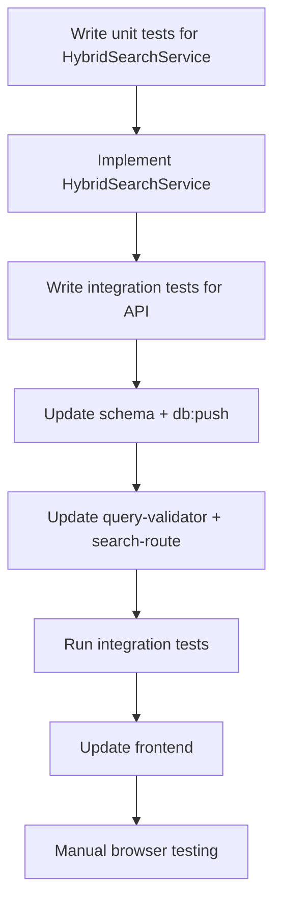

# Hybrid Search Implementation Plan

> **Status**: Complete

## Overview

Add two search modes to RAG query endpoint:
1. **Semantic (default)** - Vector similarity via pgvector (current behavior)
2. **Hybrid** - Combines vector + BM25 full-text search with RRF reranking

Hybrid weight (`alpha`) tunable: `0.0` = pure keyword, `1.0` = pure vector.

---

## Current State

- **Endpoint**: `POST /api/query`
- **Params**: `{ query, topK }`
- **Implementation**: Pure cosine similarity via pgvector
- **Schema**: `chunks.embedding` = `vector(384)`

---

## Proposed Changes

### Part A: Schema Update

> [!NOTE]
> Dev mode: No migration needed. Just update schema and run `pnpm db:push` to recreate database.

#### [MODIFY] [schema.prisma](file:///home/namtroi/RAGBase/apps/backend/prisma/schema.prisma)

Add `tsvector` column and GIN index to Chunk model:
```prisma
model Chunk {
  // ... existing fields
  searchVector  Unsupported("tsvector")  // For BM25 full-text search
  
  @@index([searchVector], type: Gin)  // GIN index for fast full-text search
}
```

#### Database Reset Command

```bash
pnpm --filter backend db:push --force-reset
```

#### Auto-populate Trigger (add to schema SQL)

The trigger to auto-populate `search_vector` from `content` will be added via a post-push script or raw SQL execution in the application startup.


### Part B: Backend - Hybrid Search Service

#### [NEW] [hybrid-search.ts](file:///home/namtroi/RAGBase/apps/backend/src/services/hybrid-search.ts)

```typescript
interface HybridSearchParams {
  queryEmbedding: number[];
  queryText: string;
  topK: number;
  alpha: number; // 0.0-1.0, weight for vector vs keyword
}

interface SearchResult {
  id: string;
  content: string;
  documentId: string;
  score: number;
  vectorScore: number;
  keywordScore: number;
  // ... metadata
}

export class HybridSearchService {
  /**
   * RRF (Reciprocal Rank Fusion) algorithm:
   * score = alpha * (1 / (k + vector_rank)) + (1-alpha) * (1 / (k + keyword_rank))
   * k = 60 (constant, standard value)
   */
  async search(params: HybridSearchParams): Promise<SearchResult[]>
}
```

**Algorithm**:
1. Execute vector search (top N, N > topK for better fusion)
2. Execute keyword search (BM25 via `ts_rank`)
3. Merge results using RRF
4. Return top K

---

### Part C: Backend - API Updates

#### [MODIFY] [query-validator.ts](file:///home/namtroi/RAGBase/apps/backend/src/validators/query-validator.ts)

```typescript
export const QuerySchema = z.object({
  query: z.string().trim().min(1).max(1000),
  topK: z.number().int().min(1).max(100).default(5),
  mode: z.enum(['semantic', 'hybrid']).default('semantic'),  // NEW
  alpha: z.number().min(0).max(1).default(0.7).optional(),   // NEW (0.7 = 70% vector)
});
```

#### [MODIFY] [search-route.ts](file:///home/namtroi/RAGBase/apps/backend/src/routes/query/search-route.ts)

- If `mode === 'semantic'`: use current vector-only logic
- If `mode === 'hybrid'`: use `HybridSearchService`
- Return additional fields: `vectorScore`, `keywordScore` (for debugging/tuning)

---

### Part D: Frontend Updates

#### [MODIFY] [search-form.tsx](file:///home/namtroi/RAGBase/apps/frontend/src/components/query/search-form.tsx)

Add mode selector and alpha slider:
```tsx
<select value={mode} onChange={...}>
  <option value="semantic">Semantic</option>
  <option value="hybrid">Hybrid</option>
</select>

{mode === 'hybrid' && (
  <input type="range" min="0" max="1" step="0.1" value={alpha} />
)}
```

#### [MODIFY] [results-list.tsx](file:///home/namtroi/RAGBase/apps/frontend/src/components/query/results-list.tsx)

Show `vectorScore` and `keywordScore` in debug mode (optional).

---

## Verification Plan

### Unit Tests

#### [NEW] [hybrid-search.test.ts](file:///home/namtroi/RAGBase/apps/backend/tests/unit/services/hybrid-search.test.ts)

| Test Case | Description |
|-----------|-------------|
| RRF calculation | Verify fusion formula correctness |
| Alpha=1.0 | Returns pure vector results |
| Alpha=0.0 | Returns pure keyword results |
| Alpha=0.7 | Weighted fusion |
| Empty results | Graceful handling |

**Run**: `pnpm --filter backend test -- tests/unit/services/hybrid-search.test.ts`

---

### Integration Tests

#### [MODIFY] [search-route.test.ts](file:///home/namtroi/RAGBase/apps/backend/tests/integration/routes/search-route.test.ts)

Add new test suite:

| Test Case | Description |
|-----------|-------------|
| `mode=semantic` | Backward compatible (default) |
| `mode=hybrid` | Returns hybrid results |
| `alpha` validation | 0-1 range enforced |
| Response includes scores | `vectorScore`, `keywordScore` present |
| Keyword match boost | Exact keyword match ranks higher in hybrid |

**Run**: `pnpm --filter backend test -- tests/integration/routes/search-route.test.ts`

---

### Manual Browser Testing

1. Start app: `pnpm dev:all`
2. Navigate to Search tab
3. Test semantic mode (default) - should work as before
4. Switch to Hybrid mode
5. Adjust alpha slider, observe result changes
6. Search with exact keyword → should rank higher vs semantic-only

---

## Implementation Order (TDD)



**Estimated time**: 4-5 hours

---

## Rollback Plan

If issues arise:
1. Keep `mode` param optional with `semantic` default
2. No breaking changes to existing API
3. Schema change is additive (new column), easy to reset with `db:push`
