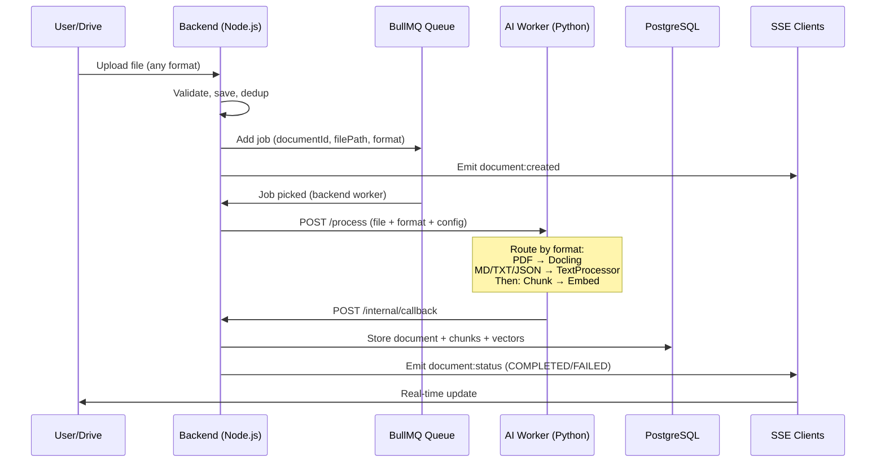
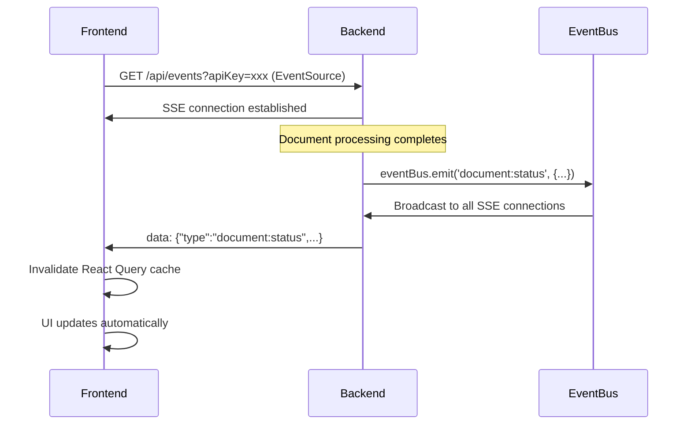

# Phase 2 Technical Specifications

**Python-First + Drive Sync + Real-time Updates** | **Implementation Reference**

---

## 1. Architecture

### 1.1 Overview Change

**Phase 1 (Dual Path):**
```
Fast Lane: JSON/TXT/MD → Node.js (embed + chunk) → DB
Heavy Lane: PDF → Queue → Python → Callback → Node.js (embed) → DB
```

**Phase 2 (Unified Path - IMPLEMENTED):**
```
All files → Queue → Python (process + chunk + embed) → Callback → Node.js → DB
                                                              ↓
                                                         EventBus (SSE)
                                                              ↓
                                                         Frontend
```

**Key Changes:**
- Python worker owns embedding + chunking for ALL formats
- Node.js only stores results and emits events
- Real-time updates via Server-Sent Events (SSE)

---

### 1.2 Data Flow



---

### 1.3 Internal Contracts (Python → Node.js)

#### 1.3.1 Dispatch Request: `POST /process`

Backend sends to AI worker:

```typescript
interface ProcessRequest {
  documentId: string;
  filePath: string;          // /uploads/{uuid}.{ext}
  format: 'pdf' | 'json' | 'txt' | 'md';  // NEW: format field
  config: {
    ocrMode: 'auto' | 'force' | 'never';
    ocrLanguages: string[];  // Default: ['en']
    chunkSize: number;       // Default: 1000
    chunkOverlap: number;    // Default: 200
  };
}
```

#### 1.3.2 Callback Payload: `POST /internal/callback`

AI worker returns:

```typescript
interface ProcessingCallback {
  documentId: string;
  success: boolean;
  result?: ProcessingResult;
  error?: ProcessingError;
}

interface ProcessingResult {
  processedContent: string;  // Full markdown output
  chunks: ChunkData[];       // Pre-chunked + embedded
  pageCount: number;
  ocrApplied: boolean;
  processingTimeMs: number;
}

interface ChunkData {
  content: string;
  index: number;
  embedding: number[];       // 384d vector (computed in Python)
  metadata: {
    charStart: number;
    charEnd: number;
    heading?: string;
    page?: number;           // PDF only
  };
}
```

**Backend Callback Handler:**
1. Accepts pre-computed embeddings from Python
2. Stores `processedContent` in Document table
3. Writes chunks + vectors to DB in single transaction
4. **NEW:** Emits SSE events (`document:status`)

---

### 1.4 SSE Real-time Updates (NEW)



**Event Types:**
- `document:created` - New document uploaded
- `document:status` - Processing completed/failed
- `sync:start` - Drive sync started
- `sync:complete` - Drive sync finished
- `sync:error` - Drive sync failed

**Implementation:**
- Backend: In-memory EventEmitter (`EventBus`)
- Endpoint: `GET /api/events?apiKey=xxx`
- Auth: Query parameter (EventSource doesn't support headers)
- Heartbeat: Every 30s to keep connection alive
- Frontend: Auto-reconnect with exponential backoff

---

### 1.5 Multi-format Processing (NEW)

**AI Worker Routing:**

```python
# apps/ai-worker/src/main.py
if format == "pdf":
    result = await pdf_processor.process(filePath, ocrMode)
else:
    result = await text_processor.process(filePath, format)
```

**TextProcessor Logic:**

| Format | Conversion to Markdown |
|--------|------------------------|
| `.md` | Return as-is |
| `.txt` | Wrap with filename heading |
| `.json` | Pretty print in code block |

All formats then: **Chunk → Embed → Callback**

---

## 2. API Endpoints

### 2.1 New Endpoints

#### `GET /api/events` (NEW - SSE)

Real-time event stream.

**Query Params:**
```typescript
interface SSEQuery {
  apiKey: string;  // Required (EventSource limitation)
}
```

**Response (200):**
```
Content-Type: text/event-stream
Cache-Control: no-cache
Connection: keep-alive

data: {"type":"document:status","payload":{...},"timestamp":"..."}

: heartbeat

data: {"type":"sync:complete","payload":{...},"timestamp":"..."}
```

**Errors:**
- `401`: Invalid API key

---

#### `GET /api/documents/:id/content`

Download processed markdown or structured JSON.

**Query Params:**
```typescript
interface ContentQuery {
  format: 'markdown' | 'json';
}
```

**Response (200):**
```typescript
// format=markdown
Content-Type: text/markdown
Body: <raw markdown string>

// format=json
interface ContentJsonResponse {
  id: string;
  filename: string;
  processedContent: string;
  chunks: {
    id: string;
    content: string;
    index: number;
    metadata: {
      charStart: number;
      charEnd: number;
      heading?: string;
    };
  }[];
  processingMetadata: {
    pageCount?: number;
    ocrApplied?: boolean;
    processingTimeMs: number;
  };
}
```

**Errors:**
- `400`: Invalid format
- `404`: Document not found
- `409`: Document not yet processed (status != COMPLETED)

---

#### Drive Sync Endpoints

```
POST   /api/drive/configs           - Add folder
GET    /api/drive/configs           - List folders
PATCH  /api/drive/configs/:id       - Update settings
DELETE /api/drive/configs/:id       - Remove folder
POST   /api/drive/sync/:configId/trigger - Manual sync
```

See Phase 2 ROADMAP for detailed specs.

---

### 2.2 Modified Endpoints

#### `POST /internal/callback` (Updated)

Accept pre-computed embeddings + processed content.

**New Fields:**
```typescript
interface ProcessingCallback {
  result?: {
    processedContent: string;    // NEW
    chunks: {
      embedding: number[];       // NEW: 384d vector
      // ... other fields
    }[];
  };
}
```

**Side Effects:**
- Stores results in DB
- **NEW:** Emits SSE event (`document:status`)

---

## 3. Database Schema

### 3.1 Document Model (Updated)

```prisma
model Document {
  id                  String    @id @default(uuid())
  filename            String
  mimeType            String
  fileSize            Int
  format              String
  lane                String    // Always 'heavy' in Phase 2
  status              String    @default("PENDING")
  filePath            String
  md5Hash             String    @unique
  retryCount          Int       @default(0)
  failReason          String?
  
  // Phase 2 Fields
  processedContent    String?   @db.Text
  processingMetadata  Json?
  sourceType          String    @default("MANUAL")
  driveFileId         String?   @unique
  driveConfigId       String?
  lastSyncedAt        DateTime?
  
  createdAt           DateTime  @default(now())
  updatedAt           DateTime  @updatedAt
  
  chunks              Chunk[]
  driveConfig         DriveConfig? @relation(fields: [driveConfigId], references: [id], onDelete: SetNull)
  
  @@index([status])
  @@index([sourceType])
  @@index([driveConfigId])
}
```

### 3.2 DriveConfig Model

```prisma
model DriveConfig {
  id            String    @id @default(uuid())
  folderId      String    @unique
  folderName    String
  syncCron      String    @default("0 */6 * * *")
  recursive     Boolean   @default(true)
  enabled       Boolean   @default(true)
  lastSyncedAt  DateTime?
  pageToken     String?
  syncStatus    String    @default("IDLE")
  syncError     String?
  createdAt     DateTime  @default(now())
  updatedAt     DateTime  @updatedAt
  
  documents     Document[]
  
  @@index([enabled])
}
```

---

## 4. Configuration

### 4.1 Environment Variables

**Backend:**
```bash
# Google Drive
DRIVE_SERVICE_ACCOUNT_KEY=/path/to/service-account.json
DRIVE_SYNC_CRON=0 */6 * * *
DRIVE_MAX_FILE_SIZE_MB=100
DRIVE_RECURSIVE=true
```

**AI Worker:**
```bash
# Embedding
EMBEDDING_MODEL=BAAI/bge-small-en-v1.5
EMBEDDING_DIMENSION=384

# Chunking
CHUNK_SIZE=1000
CHUNK_OVERLAP=200
```

### 4.2 Dependencies

**Python (AI Worker):**
```
sentence-transformers>=2.3.0
torch>=2.0.0  # CPU version
langchain>=0.3.0
langchain-text-splitters>=0.3.0
docling>=2.15.0
```

**Node.js (Backend) - REMOVED:**
```
fastembed  # No longer needed
```

---

## 5. Implementation Notes

### 5.1 SSE Authentication

**Challenge:** EventSource API doesn't support custom headers.

**Solution:** Pass API key as query parameter:
```typescript
const url = `/api/events?apiKey=${encodeURIComponent(apiKey)}`;
const eventSource = new EventSource(url);
```

Backend auth middleware checks both header and query param:
```typescript
const apiKey = request.headers['x-api-key'] || request.query.apiKey;
```

### 5.2 React Fast Refresh

**Challenge:** Fast Refresh only works when file exports only components.

**Solution:** Separate into 3 files:
- `contexts/EventContext.ts` - Context definition
- `hooks/use-events.ts` - Hook to consume context
- `providers/EventProvider.tsx` - Component only

### 5.3 DELETE Request Fix

**Issue:** Frontend sent `Content-Type: application/json` with empty body → Fastify rejected.

**Fix:** Only set Content-Type when body exists:
```typescript
if (!isFormData && hasBody) {
  headers['Content-Type'] = 'application/json';
}
```

---

## 6. Summary: Breaking Changes

| Component | Change | Migration Action |
|-----------|--------|------------------|
| **Callback** | New `processedContent` + `chunks[].embedding` | ✅ Updated handler |
| **Embedding** | Fastembed → sentence-transformers | ✅ Removed from backend |
| **Model** | all-MiniLM-L6-v2 → bge-small-en-v1.5 | ⏭️ Skipped (reset data) |
| **Fast Lane** | Removed | ✅ All files via queue |
| **Document** | 6 new columns | ✅ Migrated |
| **DriveConfig** | New table | ✅ Created |
| **SSE** | New real-time system | ✅ Implemented |
| **Multi-format** | All formats processed | ✅ TextProcessor added |

---

**Phase 2 Status: ✅ COMPLETE**
