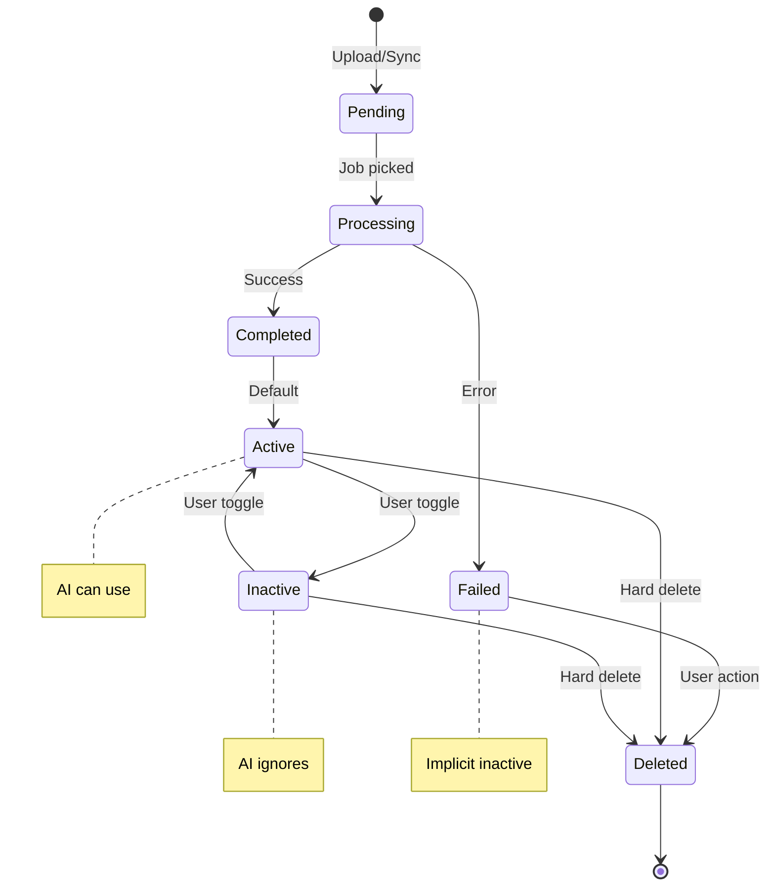
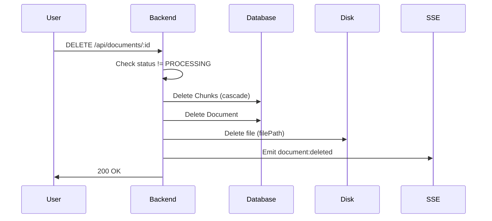

# Phase 3 Technical Specifications

**Data Management** | **Document Lifecycle & Admin Controls**

---

## 1. Overview

Phase 3 transforms the Documents view into a comprehensive data management interface, enabling users to manage thousands of files with proper lifecycle controls.

**Key Features:**
- Document lifecycle states (Availability + Connection)
- Hard delete functionality
- Bulk operations
- Drive re-link capability
- Enhanced filtering

---

## 2. Document Lifecycle Model

### 2.1 State Diagram



### 2.2 State Definitions

**Processing Status** (system-controlled):

| Status | Description | Transition |
|--------|-------------|------------|
| `PENDING` | Uploaded, waiting in queue | → PROCESSING |
| `PROCESSING` | AI Worker processing | → COMPLETED / FAILED |
| `COMPLETED` | Successfully processed | Terminal |
| `FAILED` | Processing failed | Can retry → PENDING |

**Availability State** (user-controlled):

| State | Description | AI Behavior |
|-------|-------------|-------------|
| `ACTIVE` | Normal operation | Included in search |
| `INACTIVE` | Hidden from AI | Excluded from search |

**Rules:**
- COMPLETED documents default to ACTIVE
- FAILED documents are implicitly INACTIVE (no chunks to search)
- User can toggle ACTIVE ↔ INACTIVE for COMPLETED documents
- PENDING/PROCESSING documents cannot be toggled

**Connection State** (system-controlled):

| State | Description | Source |
|-------|-------------|--------|
| `STANDALONE` | No Drive connection | Manual upload, or Drive disconnected |
| `LINKED` | Active Drive sync | Synced from Drive folder |

**Transitions:**
- Manual upload → STANDALONE
- Drive sync → LINKED
- Delete DriveConfig → LINKED becomes STANDALONE
- Re-add Drive folder → STANDALONE can become LINKED (if driveFileId matches)

---

## 3. Database Schema Changes

### 3.1 Document Model Update

```prisma
model Document {
  // ... existing fields
  
  // Phase 3: Data Management
  isActive        Boolean   @default(true) @map("is_active")
  connectionState String    @default("STANDALONE") @map("connection_state")
  
  @@index([isActive])
  @@index([connectionState])
}
```

**Migration:**
- Add `isActive` column (default: true)
- Add `connectionState` column
- Backfill: `sourceType == DRIVE && driveConfigId != null` → `LINKED`, else `STANDALONE`

### 3.2 Enum Values

```typescript
// Connection State
type ConnectionState = 'STANDALONE' | 'LINKED';

// Combined view state for UI
type DocumentViewState = 
  | 'pending'      // PENDING status
  | 'processing'   // PROCESSING status
  | 'active'       // COMPLETED + isActive=true
  | 'inactive'     // COMPLETED + isActive=false
  | 'failed';      // FAILED status
```

---

## 4. API Changes

### 4.1 New Endpoints

#### Toggle Availability

```typescript
// PATCH /api/documents/:id/availability
interface ToggleAvailabilityRequest {
  isActive: boolean;
}

interface ToggleAvailabilityResponse {
  id: string;
  isActive: boolean;
  updatedAt: string;
}

// Errors:
// 400: Document status is not COMPLETED
// 404: Document not found
```

#### Bulk Toggle Availability

```typescript
// PATCH /api/documents/bulk/availability
interface BulkToggleRequest {
  documentIds: string[];  // Max 100
  isActive: boolean;
}

interface BulkToggleResponse {
  updated: number;
  failed: { id: string; reason: string }[];
}
```

#### Hard Delete Document

```typescript
// DELETE /api/documents/:id
// Deletes: Document record + all Chunks + file on disk

interface DeleteResponse {
  id: string;
  deleted: true;
}

// Errors:
// 404: Document not found
// 409: Document is PROCESSING (cannot delete)
```

#### Bulk Delete Documents

```typescript
// POST /api/documents/bulk/delete
interface BulkDeleteRequest {
  ids: string[];  // Max 100
}

interface BulkDeleteResponse {
  deleted: number;
  failed: { id: string; reason: string }[];
```

#### Retry Failed Document

```typescript
// POST /api/documents/:id/retry
// Resets FAILED document to PENDING and re-queues

interface RetryResponse {
  id: string;
  status: 'PENDING';
}

// Errors:
// 400: Document status is not FAILED
// 404: Document not found
```

### 4.2 Updated Endpoints

#### List Documents (Enhanced Filtering)

```typescript
// GET /api/documents
interface ListQueryParams {
  // Existing
  status?: 'PENDING' | 'PROCESSING' | 'COMPLETED' | 'FAILED';
  driveConfigId?: string;
  limit?: number;      // Default: 20, Max: 100
  offset?: number;
  
  // New filters
  isActive?: boolean;
  connectionState?: 'STANDALONE' | 'LINKED';
  sourceType?: 'MANUAL' | 'DRIVE';
  search?: string;     // Filename search (case-insensitive)
  sortBy?: 'createdAt' | 'updatedAt' | 'filename' | 'fileSize';
  sortOrder?: 'asc' | 'desc';
}

interface ListResponse {
  documents: DocumentSummary[];
  total: number;
  // New: aggregated counts
  counts: {
    active: number;
    inactive: number;
    failed: number;
    pending: number;
    processing: number;
    completed: number;
  };
}

interface DocumentSummary {
  // Existing fields
  id: string;
  filename: string;
  status: DocumentStatus;
  sourceType: SourceType;
  chunkCount?: number;
  createdAt: string;
  updatedAt: string;
  
  // New fields
  isActive: boolean;
  connectionState: ConnectionState;
  fileSize: number;
  format: FileFormat;
}
```

#### Query (Respects Availability)

```typescript
// POST /api/query
// Now filters out:
// - Documents with isActive = false
// - Documents with status != COMPLETED

// SQL change:
WHERE d.status = 'COMPLETED' AND d.is_active = true
```

---

## 5. Re-link Logic

### 5.1 Sync Flow Update

When syncing a Drive folder, check for existing documents by `driveFileId` before MD5 dedup:

```typescript
async function syncFile(configId: string, driveFile: DriveFile) {
  // Step 1: Check for re-link
  const existingByDriveId = await prisma.document.findUnique({
    where: { driveFileId: driveFile.id }
  });
  
  if (existingByDriveId) {
    // Re-link to new config
    await prisma.document.update({
      where: { id: existingByDriveId.id },
      data: {
        driveConfigId: configId,
        connectionState: 'LINKED',
        lastSyncedAt: new Date()
      }
    });
    
    // Check if content changed
    if (existingByDriveId.md5Hash !== driveFile.md5Checksum) {
      await reprocessDocument(existingByDriveId.id, driveFile);
    }
    return { action: 'relinked' };
  }
  
  // Step 2: Existing MD5 dedup flow
  const existingByMd5 = await prisma.document.findUnique({
    where: { md5Hash: driveFile.md5Checksum }
  });
  
  if (existingByMd5) {
    return { action: 'skipped', reason: 'duplicate' };
  }
  
  // Step 3: Create new document
  // ... existing flow
}
```

### 5.2 DriveConfig Delete Update

When deleting a DriveConfig, update linked documents:

```typescript
// Before: Document.driveConfigId → null (via onDelete: SetNull)
// After: Also update connectionState

await prisma.document.updateMany({
  where: { driveConfigId: configId },
  data: { connectionState: 'STANDALONE' }
});

await prisma.driveConfig.delete({ where: { id: configId } });
```

---

## 6. Hard Delete Implementation

### 6.1 Delete Flow



### 6.2 File Cleanup

```typescript
async function hardDeleteDocument(documentId: string) {
  const doc = await prisma.document.findUnique({
    where: { id: documentId }
  });
  
  if (doc.status === 'PROCESSING') {
    throw new ConflictError('Cannot delete while processing');
  }
  
  // Transaction: delete from DB
  await prisma.$transaction([
    prisma.chunk.deleteMany({ where: { documentId } }),
    prisma.document.delete({ where: { id: documentId } })
  ]);
  
  // Cleanup file (non-blocking)
  await rm(doc.filePath).catch(console.error);
  
  // Emit event
  eventBus.emit('document:deleted', { id: documentId });
}
```

---

## 7. Frontend Changes

### 7.1 Document List (Data Grid)

**New Columns:**
- Status badge (icon + color)
- Availability toggle (switch)
- Connection state (icon: link/unlink)
- File size
- Actions dropdown

**New Controls:**
- Search input (filename)
- Filter dropdowns (status, availability, connection, source)
- Sort controls
- Bulk select checkbox
- Bulk action buttons (Toggle, Delete)

### 7.2 Status Badge Mapping

| State | Color | Icon |
|-------|-------|------|
| Pending | Gray | ⏳ |
| Processing | Blue (animated) | 🔄 |
| Active | Green | ✅ |
| Inactive | Yellow | 🔕 |
| Failed | Red | ❌ |

### 7.3 Bulk Operations UI

```
┌─────────────────────────────────────────────────────────┐
│ ☐ Select All (10)    [Set Active] [Set Inactive] [Delete] │
├─────────────────────────────────────────────────────────┤
│ ☑ document1.pdf    Active    Linked    1.2 MB    ...    │
│ ☑ document2.md     Inactive  Standalone 45 KB    ...    │
│ ☐ document3.json   Active    Linked    8.3 MB    ...    │
└─────────────────────────────────────────────────────────┘
```

**Delete Confirmation:**
- Show count of documents to delete
- List filenames (first 5 + "and X more")
- Require typing "DELETE" for bulk delete > 10 documents

---

## 8. SSE Events

### 8.1 New Events

```typescript
// Document deleted
interface DocumentDeletedEvent {
  type: 'document:deleted';
  payload: { id: string };
}

// Document availability changed
interface DocumentAvailabilityEvent {
  type: 'document:availability';
  payload: { 
    id: string; 
    isActive: boolean;
  };
}

// Bulk operation completed
interface BulkOperationEvent {
  type: 'bulk:completed';
  payload: {
    operation: 'delete' | 'toggle';
    count: number;
  };
}
```

---

## 9. Migration Plan

### 9.1 Database Migration

```sql
-- Add new columns
ALTER TABLE documents 
ADD COLUMN is_active BOOLEAN NOT NULL DEFAULT true,
ADD COLUMN connection_state VARCHAR(20) NOT NULL DEFAULT 'STANDALONE';

-- Create indexes
CREATE INDEX idx_documents_is_active ON documents(is_active);
CREATE INDEX idx_documents_connection_state ON documents(connection_state);

-- Backfill connection_state
UPDATE documents 
SET connection_state = 'LINKED' 
WHERE source_type = 'DRIVE' AND drive_config_id IS NOT NULL;
```

### 9.2 Backward Compatibility

- Existing documents get `isActive = true` (no change in behavior)
- Existing Drive documents get `connectionState = LINKED` if still connected
- Query endpoint automatically filters by new fields

---

## 10. Summary

| Feature | Endpoint | Method |
|---------|----------|--------|
| Toggle availability | `/api/documents/:id/availability` | PATCH |
| Bulk toggle | `/api/documents/bulk/availability` | PATCH |
| Hard delete | `/api/documents/:id` | DELETE |
| Bulk delete | `/api/documents/bulk` | DELETE |
| Retry failed | `/api/documents/:id/retry` | POST |
| Enhanced list | `/api/documents` | GET (updated) |

**Breaking Changes:** None (additive only)

---

**Phase 3 Status:** ✅ COMPLETE

