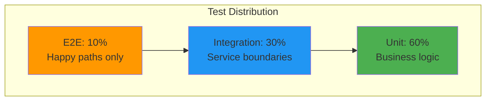

# RAGBase Testing Strategy

**Phase 5 Complete** | **TDD Methodology**

---

## 1. TDD Philosophy

### RED → GREEN → REFACTOR


**Why TDD?**
- Design-first thinking - forces clear interfaces
- Regression safety - changes don't break behavior
- Living documentation - tests show how code works
- Refactor confidence - change without fear

**Current Test Suite:**
- **Backend:** 52+ test files (unit + integration + e2e)
- **AI Worker:** 26+ test files (pytest)
- **Coverage target:** 70-90% depending on module

---

## 2. Test Pyramid



| Layer | Speed | Dependencies | What to Test |
|-------|-------|--------------|--------------|
| **Unit** | Fast (~ms) | None | Pure functions, validators, business logic |
| **Integration** | Medium (~100ms) | Testcontainers | API routes, DB, Queue |
| **E2E** | Slow (~seconds) | Docker Compose | Full pipeline, critical flows |

---

## 3. Test Organization

### Backend (52+ files)

```
apps/backend/tests/
├── unit/
│   ├── validators/
│   │   ├── availability-validator.test.ts
│   │   ├── callback-validator.test.ts
│   │   ├── file-format-detector.test.ts
│   │   ├── list-query-validator.test.ts
│   │   ├── query-validator.test.ts      # Hybrid search mode/alpha
│   │   └── upload-validator.test.ts
│   ├── services/
│   │   ├── encryption-service.test.ts    # AES-256-GCM (Phase 5)
│   │   ├── event-bus.test.ts
│   │   ├── hash-service.test.ts
│   │   ├── hybrid-search.test.ts        # RRF algorithm
│   │   ├── quality-gate-service.test.ts
│   │   ├── qdrant-service.test.ts       # Hybrid search (Phase 5)
│   │   └── sync-service-relink.test.ts
│   ├── models/
│   │   └── profile-model.test.ts        # ProcessingProfile
│   └── queue/
│       └── concurrency-config.test.ts
├── integration/
│   │   ├── routes/
│   │   ├── analytics-api.test.ts        # Analytics endpoints
│   │   ├── analytics-e2e.test.ts        # Analytics E2E
│   │   ├── callback-metrics.test.ts     # ProcessingMetrics
│   │   ├── callback-route.test.ts
│   │   ├── chunks-api.test.ts           # Chunks Explorer
│   │   ├── content-route.test.ts
│   │   ├── drive-oauth-routes.test.ts   # OAuth flow (Phase 5)
│   │   ├── list-route.test.ts
│   │   ├── profile-routes.test.ts       # ProcessingProfile CRUD
│   │   ├── search-route.test.ts         # Hybrid search integration
│   │   ├── sse-route.test.ts
│   │   ├── status-route.test.ts
│   │   ├── upload-route.test.ts
│   │   └── documents/
│   │       ├── availability-route.test.ts
│   │       ├── delete-route.test.ts
│   │       └── retry-route.test.ts
│   │   ├── queue/
│   │   ├── processing-queue.test.ts
│   │   ├── qdrant-sync-queue.test.ts    # Qdrant sync (Phase 5)
│   │   └── retry-handler.test.ts
│   ├── middleware/
│   │   └── auth-middleware.test.ts
│   └── production-readiness.test.ts
├── e2e/
│   ├── pdf-upload-flow.test.ts
│   ├── multi-format-flow.test.ts     # MD/TXT/JSON E2E
│   ├── query-flow.test.ts
│   └── error-handling.test.ts
├── fixtures/                            # Test files (10 formats)
├── mocks/
│   ├── bullmq-mock.ts
│   ├── embedding-mock.ts
│   └── python-worker-mock.ts
└── helpers/
    ├── api.ts
    ├── database.ts
    └── fixtures.ts
```

### AI Worker (26 files)

```
apps/ai-worker/tests/
├── conftest.py                          # Fixtures
│
├── # Converters (Phase 4)
├── test_base_converter.py
├── test_pymupdf_converter.py            # Fast PDF
├── test_pdf_converter.py                # Docling + OCR modes
├── test_csv_processor.py
├── test_html_processor.py
├── test_epub_processor.py
├── test_pptx_processor.py
├── test_xlsx_processor.py
├── test_text_processor.py               # TXT/MD/JSON
│
├── # Chunking (Phase 4)
├── test_document_chunker.py             # Header-based
├── test_presentation_chunker.py         # Slide-based
├── test_tabular_chunker.py              # Row-based
│
├── # Quality (Phase 4)
├── test_quality_analyzer.py             # Flags + scoring
├── test_auto_fix.py                     # Merge/split/inject
│
├── # Pre-processing (Phase 4)
├── test_sanitizer.py                    # Input cleanup
├── test_normalizer.py                   # Markdown normalization
│
├── # Core
├── test_embedder.py                     # Hybrid: dense + sparse (Phase 5)
├── test_callback.py
├── test_main.py
│
├── # Extensions
├── test_profile_config.py               # ProcessingProfile
├── test_metrics.py                      # Analytics metrics
├── test_error_handling.py               # Error boundaries
│
├── # E2E & Regression
├── e2e/
│   └── test_format_processing.py        # 10 format E2E
└── regression/
    └── test_existing_formats.py         # PDF/TXT/MD/JSON still work
```

---

## 4. Coverage by Phase

### Phase 1-3 (Core)

| Feature | Test File |
|---------|-----------|
| Upload/Validation | `upload-validator.test.ts`, `upload-route.test.ts` |
| SSE Events | `sse-route.test.ts`, `event-bus.test.ts` |
| Content Export | `content-route.test.ts` |
| Availability Toggle | `availability-route.test.ts` |
| Hard Delete | `delete-route.test.ts` |
| Retry Failed | `retry-route.test.ts` |
| Drive Re-link | `sync-service-relink.test.ts` |

### Phase 4 (10 Formats + Quality)

| Feature | Test Files |
|---------|-----------|
| **Converters** | `test_pymupdf_converter.py`, `test_csv/html/epub/pptx/xlsx_processor.py` |
| **Category Chunking** | `test_document/presentation/tabular_chunker.py` |
| **Quality Analysis** | `test_quality_analyzer.py`, `test_auto_fix.py` |
| **Pre-processing** | `test_sanitizer.py`, `test_normalizer.py` |
| **Format Regression** | `regression/test_existing_formats.py` |
| **Format E2E** | `e2e/test_format_processing.py` |

### Extensions

| Feature | Test Files |
|---------|-----------|
| **Analytics Dashboard** | `analytics-api.test.ts`, `callback-metrics.test.ts`, `test_metrics.py` |
| **Hybrid Search** | `hybrid-search.test.ts`, `search-route.test.ts`, `query-validator.test.ts` |
| **Processing Profiles** | `profile-routes.test.ts`, `profile-model.test.ts`, `test_profile_config.py` |
| **Chunks Explorer** | `chunks-api.test.ts` |

### Phase 5 (Production Security + Qdrant)

| Feature | Test Files |
|---------|-----------|
| **OAuth 2.0 Flow** | `drive-oauth-routes.test.ts` |
| **AES-256-GCM Encryption** | `encryption-service.test.ts` |
| **Qdrant Sync Queue** | `qdrant-sync-queue.test.ts` |
| **Qdrant Service** | `qdrant-service.test.ts` |
| **Hybrid Embeddings** | `test_embedder.py` (dense + sparse) |
| **Vector Cleanup** | `qdrant-sync-queue.test.ts` (nullify after sync) |

---

## 5. Test Gaps (TODO)

> [!NOTE]
> Gaps reviewed Jan 1, 2026. Most gaps addressed in Phase 5.

### Backend

| Gap | Priority | Status |
|-----|----------|--------|
| ~~Drive OAuth with encryption~~ | ~~High~~ | ✅ Covered in Phase 5 |
| ~~Qdrant sync flow~~ | ~~High~~ | ✅ Added qdrant-sync-queue.test.ts |
| ~~Profile cascade delete~~ | ~~High~~ | ✅ Covered in profile-model.test.ts |
| ~~Analytics period filtering~~ | ~~Medium~~ | ✅ Added 24h/7d/30d/all tests |
| ~~Chunks multi-filter~~ | ~~Medium~~ | ✅ Added quality+type+search tests |
| ~~E2E multi-format~~ | ~~Medium~~ | ✅ Added MD/TXT/JSON flows |
| Search document/format filters | Low | API lacks support (future) |

### AI Worker

| Gap | Priority | Status |
|-----|----------|--------|
| ~~Docling PDF converter~~ | ~~Medium~~ | ✅ Added test_pdf_converter.py |
| ~~OCR mode variations~~ | ~~Medium~~ | ✅ Covered in test_pdf_converter.py |
| ~~Error boundary tests~~ | ~~Medium~~ | ✅ Added test_error_handling.py |
| ~~Hybrid embeddings~~ | ~~High~~ | ✅ Updated test_embedder.py (Phase 5) |
| Large file handling | Low | Future (streaming) |

---

## 6. Test Commands

**Backend:**
```bash
pnpm --filter backend test:unit        # Fast (~5s)
pnpm --filter backend test:integration # Needs Docker (~30s)
pnpm --filter backend test:e2e         # Full stack (~60s)
pnpm --filter backend test:coverage    # With report
```

**AI Worker:**
```bash
cd apps/ai-worker
pytest                              # All tests
pytest tests/test_quality_analyzer.py -v  # Specific file
pytest --cov=src --cov-report=html  # Coverage report
```

**All Tests:**
```bash
pnpm test                           # Runs test-all.sh
```

---

## 7. Mock Strategy

### What to Mock

| Mock | Don't Mock |
|------|-----------|
| External APIs (AI worker HTTP) | Database (use Testcontainers) |
| Slow operations (embeddings) | Your own code |
| Non-deterministic behavior | Third-party libs |
| Google Drive API | Redis (use Testcontainers) |

### Key Mocks

| Mock | Location | Purpose |
|------|----------|---------|
| `python-worker-mock.ts` | Backend | Fake AI worker responses (Phase 5: hybrid vectors) |
| `embedding-mock.ts` | Backend | 384d dense + SPLADE sparse zero vectors |
| `bullmq-mock.ts` | Backend | Queue without Redis |
| `qdrant-mock.ts` | Backend | Fake Qdrant responses (Phase 5) |

---

## 8. Testing Anti-Patterns (Avoid)

| ❌ Bad | ✅ Good |
|--------|---------|
| Test implementation details | Test behavior/output |
| Test Prisma/Zod behavior | Test your business logic |
| Mock everything | Use Testcontainers for real DB |
| Duplicate test logic | Centralize in helpers/fixtures |
| Test after implementation | Write tests first (TDD) |

---

## 9. Key Decisions

| Decision | Rationale |
|----------|-----------|
| Testcontainers | Real PostgreSQL + Redis (not Qdrant in tests) |
| Vitest | Fast, native ESM, Jest-compatible |
| Mock AI worker | Fast, deterministic integration tests |
| Mock Qdrant | Avoid external dependency in CI |
| Pytest | Python standard, good fixtures |
| 70-90% coverage | Balance speed vs quality |

---

**Latest Test Run:** All tests passed (Jan 1, 2026)
- Backend: Unit ✅, Integration ✅, E2E ✅
- AI Worker: 26+ tests ✅
- Phase 5: OAuth ✅, Encryption ✅, Qdrant Sync ✅

**Documentation:**
- [architecture.md](./architecture.md) - System design
- [api.md](./api.md) - API contracts
